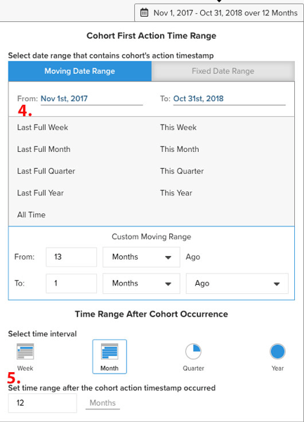

# `Cohort Report Builder for Non-Date-Based Cohorts`

此 [`Cohort Report Builder`](../dev-reports/cohort-rpt-bldr.md) 在幫助商家研究不同用戶子集隨時間的變化如何行為方面非常出色。 過去， `Cohort Report Builder` 已針對使用者分組最佳化，使用 `cohort date` （例如，指定月份首次購買的客戶集）。 此 `Non-Date Based Cohort` 功能現在可讓您透過類似的活動或屬性將使用者分組。 查看此功能的幾個使用案例。

## 使用案例

這不是完整清單，但以下是一些可使用此功能完成的潛在分析：

* 檢查從中收購的客戶 [!DNL Google] vers [!DNL Facebook]
* 分析首次購買美國和加拿大的客戶
* 查看從各種廣告促銷活動獲得的客戶的行為

## 如何建立分析

1. 按一下 **[!UICONTROL Report Builder]** 在左側標籤或 **[!UICONTROL Add Report** > **Create Report]** 在任何控制面板中。

1. 在 `Report Builder Selection` 按一下 **[!UICONTROL Create Report]** 旁邊 `Visual Report Builder` 選項。

### 新增量度

既然你在 `Report Builder`，新增您要執行分析的量度(範例： `Revenue` 或 `Orders`)。

>[!NOTE]
>
>原生 [!DNL Google Analytics] 量度與 `Cohort Report Builder`. 此範例的目標是查看透過不同GA來源取得之首次訂購客戶的收入隨時間變化。

### 切換 `Metric View` to `Cohort`

這會開啟一個新視窗，供您設定同類群組報表的詳細資訊。

建立同類群組報表需要五個規格：

1. 如何將同類群組
1. 選取同類群組
1. 動作時間戳記
1. 同類群組首次動作時間範圍
1. 同類群組發生次數後的時間範圍

{:width=&quot;200&quot; height=&quot;224&quot;}

{:width=&quot;400&quot; height=&quot;554&quot;}

#### 1.分組 `cohorts`

`Cohorts` 依行為特徵分組，在此範例中 `Customer's first order GA source`. 此處可用的選項是已指定為 `groupable` （針對量度）。

#### 2.選擇同類群組

您可以顯示給定特性的所有結果。 因為這可能導致許多 `cohorts`，您可以選取 `cohorts` (對應於 `Customer's first order GA source`)。

<!--{: width="300" height="338"}-->

#### 3. `Action timestamp`

這可讓您選擇建立量度的欄以外的日期欄。 以下是選取套用至指定的時間範圍 `action timestamp`.

#### 4. `Cohort first action time range`

以下是您選取包含 `cohorts action timestamp` （因此，在2017年11月至2018年10月期間首次訂購的客戶）。 這可以是移動日期範圍或固定日期範圍。

#### 5. `Time range after cohort occurrence`

您想要查看 `cohorts` 依月、周或年的時段而定？ 這裡是您進行這些選取的地方。 在該區段下方，您將選取 `time range` 在 `cohort action timestamp` 已發生。 例如，這會顯示在動作時間範圍內下第一筆訂單的客戶的12個月資料。

<!--{: width="400" height="557"}-->

### 其他附註

* [!UICONTROL Filters]:當您切換 `Standard` 和 `Cohort` 檢視
* 請參閱 [`Perspectives`](../../data-analyst/dev-reports/cohort-rpt-bldr.md).
