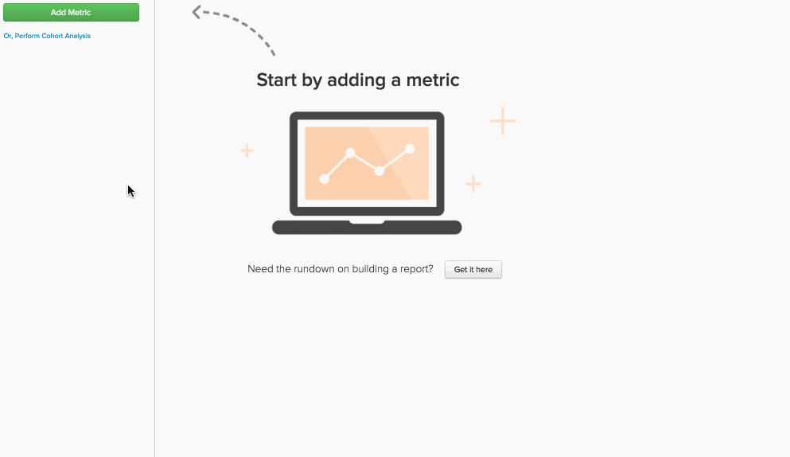
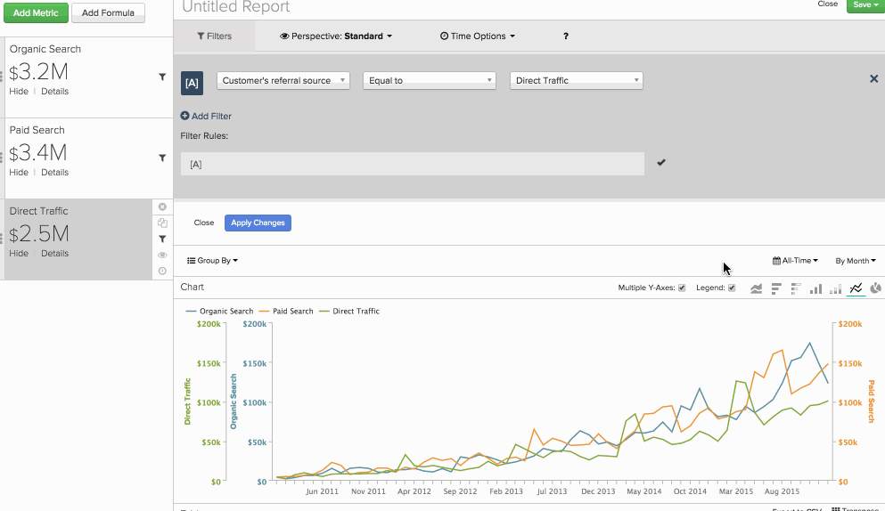

# 建立 `Qualitative Cohort Analysis`

你知道 [!DNL Adwords] — 獲得的客戶區段比從有機搜索獲得的客戶增加其LTV? 你有沒有想過 `cohort` 在同一份報表中並排分析不同的客戶區段？ 若是，則a `qualitative cohort analysis` 幫助你回答這些問題。

本文深入探討什麼是定性同類群組、為何您可能有興趣建立此分析，以及如何在中建立此分析 [!DNL MBI].

## 內容 `qualitative cohorts`不管怎樣？ {#whatare}

`Cohort` 一般地，分析可以廣義地定義為對在其生命週期中具有相似特徵的用戶組的分析。 它可讓您識別不同使用者群組的行為趨勢。

請參閱 [同類群組分析](https://www.cohortanalysis.com/).

最多 `cohort` 分析 [!DNL MBI] 依共同日期將使用者分組（例如，指定月份首次購買的所有客戶集）。 A `qualitative cohort` 有點不同：它是由非基於時間的特性所定義的用戶組。 有些範例包括：

* 從廣告促銷活動取得的所有使用者集
* 其首次購買包含抵用券（或未包含抵用券）的所有使用者集
* 特定年齡的所有使用者的集合

## 這和正常情況有何不同 `cohort` 建造者？ {#different}

此 [`Cohort Analysis Builder`](../dev-reports/cohort-rpt-bldr.md) 使用基於時間的特徵對同類群組進行優化。 這非常適合用來分析，著重於特定的使用者區段（例如，透過付費搜尋促銷活動取得的所有使用者）。 在 `Cohort Analysis Builder`，您可以(1)專注於該特定使用者群組，以及(2) `cohort` 日期（如其首次訂購日期）。

不過，如果您想分析同一同類群組報表中多個使用者區段的同類群組行為(`paid` 搜尋比較 `organic` 搜尋與直接流量（也許是？），這個更進階的分析可以在 `Report Builder`.

## 我應該傳送哪些資訊以支援設定分析？ {#support}

建立 `qualitative cohort` 報表 `Report Builder` 涉及Adobe分析團隊建立 [進階計算欄](../data-warehouse-mgr/creating-calculated-columns.md) 在必要的表格上。

若要建置這些檔案，請提交 [支援票證](https://experienceleague.adobe.com/docs/commerce-knowledge-base/kb/troubleshooting/miscellaneous/mbi-service-policies.html?lang=en) （並參考本文！） 以下是您需要知道的事項：

* 此 `metric` 您想要使用及其使用的表格來執行同類群組分析(範例： `Revenue`，內建於 `orders` 表格)。

* 此 `user segments` 您想要定義資訊，以及該資訊在資料庫中的位置(範例：不同值 `User's referral source`，原生於 `users` 並重新定位到 `orders`)。

* 此 `cohort date` 您希望分析使用(範例：the `User's first order date` 時間戳記)。 此範例可讓我們查看每個區段並詢問 `How does a user's revenue grow in the months following their first order date?`.

* 此 `time interval` 以檢視分析結果(範例： `weeks`, `months`，或 `quarters` 在 `User's first order date`)。

Adobe分析團隊回應上述指示後，您就有幾個新的進階計算欄可建立您的報表！ 然後，您可以依照下列指示執行此操作。

## 建立定性同類群組分析 {#create}

首先，您想要新增您有興趣組合的量度，每個 `cohort` 你在分析。 在此範例中，您要查看累積 `Revenue` 在客戶首次訂購後的幾個月內進行，依 `User's referral source`. 這表示您會針對每個區段新增一個 `Revenue` 特定區段的量度和篩選：

其次，您應對報表的時間選項進行兩項變更：

1. 設定 `time interval` to `None`. 這是因為您最終會以時間間隔為維度分組，而非使用一般的時間選項。

1. 設定 `time range` 到您希望報表涵蓋的時段。

在此範例中，您會查看 `all time` 檢視 `Revenue`. 在此之後，您最後應該會看到一連串的點：

第三，您可以調整以設定 `cohorts`. 根據 `cohort date` 和 `time interval` 指定給Adobe分析團隊時，您的帳戶中會執行 `cohort` 約會。 在此範例中，自訂維度稱為 `Months between this order and customer's first order date`. 使用此維度時，您應：

* `Group by` 維度與 `group by` 選項

* 選取 `dimension` 你感興趣的

* 使用 `Show top/bottom option`，選取您感興趣的前X個月，然後依 `Months between this order and customer's first order date` 維度

現在，您可以看到每一行 `cohort` 你指定的。 現在查看此示例 — 您看到 `Revenue` 由每個轉介來源的使用者貢獻， `grouped by` 其首次訂購與任何後續訂購之間的月數。 範例也新增 `Cumulative perspective` 查看 `cohorts'` 匯總增長 — 查看結果表以了解更詳細的粒度。

這告訴我們什麼？ 此處是特定轉介來源 `Paid search` 在客戶的購買期限的第一個月中很有價值，但無法以重複的收入來保留其客戶群。 同時 `Direct Traffic` 從較低的金額開始，隨後幾個月的收入實際上以類似的速度增長。

不管你怎麼解開， `cohort` 「分析」是分析工具箱中的一種功能強大的工具。 這類分析可產生一些關於您業務的有趣見解，與傳統 `time-based cohorts` 可能不會，因此您可以做出更佳的資料導向決策。
