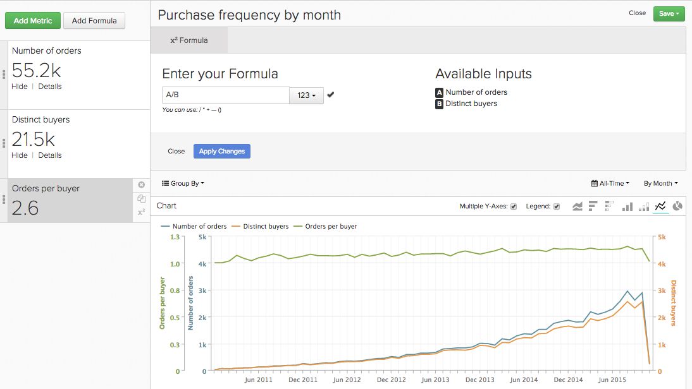
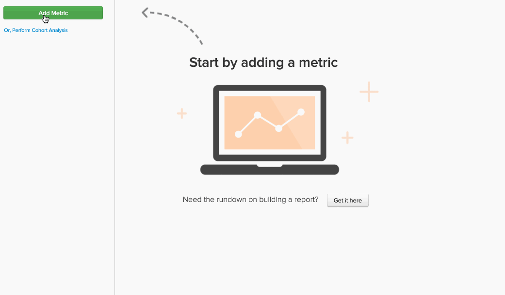
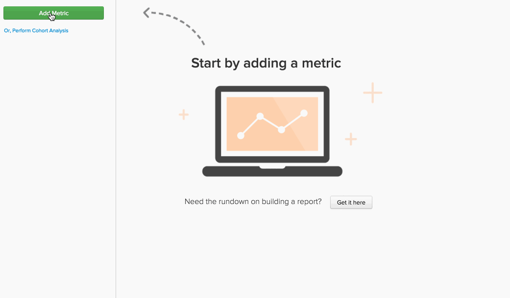
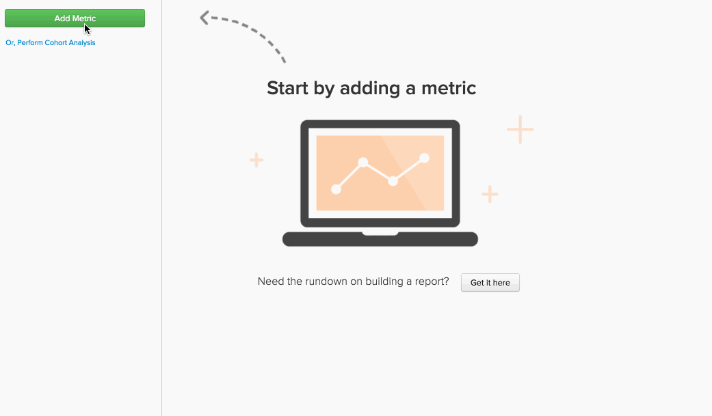

# 公式 `Report Builder`

在 [`Report Builder`](../../tutorials/using-visual-report-builder.md)，可以使用 [定義度量](../../data-user/reports/ess-manage-data-metrics.md) 你的賬戶。 將這些指標與公式相結合，可以從資料中獲取更多見解。 本主題深入介紹如何在 `Report Builder`  — 讓我們跳進去！

## 什麼是 `formula`? {#what}

在 `Report Builder`的 `formula` 只是一個或多個基於某些數學邏輯的度量的組合。 一個典型示例如下所示：

在此示例中，您使用 `Number of orders metric (A)` 和 `Distinct buyers metric (B)`，目標是回答：我的買家每個月平均下多少訂單？ 公式的參數為：

* `Definition`:在這裡，您對輸入度量應用數學。 在此示例中，將訂單數除以不同採購員數可告訴我們平均訂單數。 因此，定義是(A/B)。

* `Format`:您的公式是返回數字、時段還是幣種金額？ 公式定義旁邊是一個下拉清單，您可以使用它指定返回的格式。 在這個例子中，這是一個數字。

* `Miscellaneous`:公式的時間戳、分組、透視和篩選器都由其輸入度量繼承。 這裡沒什麼可做的！

## 如何使用 `formulas` 在我的報告裡？ {#how}

現在您已經介紹了基本知識，請看一些示例。

### 示例：我想知道我的收入中有多少是第一次訂單的。

在此示例中，您使用 `Revenue` 和 `Revenue (first time orders)` 度量。 將 `Revenue (first time orders)(B)` 度量 `Revenue metric (A)` 將返回格式設定為 `Percent`，您可以找到可歸屬於首次訂單的收入百分比。

### 示例：我想知道，當我提供和不提供 `promo code`。

在此示例中，您使用 `Revenue` 和 `Number of orders` 度量。 這個問題的答案包括兩步 — 分裂 `Revenue (A)` 的 `Number of orders (B)` 將返回格式設定為 `Currency`。 接下來，您只允許公式結果(`Avg. Revenue per order`)顯示結果並按 `Promo code`。

### 示例：我想知道我新客戶的UTM來源的分佈。

找到這個問題的答案需要幾個步驟：

1. 首先，您添加了 `New Customers` 度量，然後按 `utm_source - all`。 這是度量 `A`或 `New Customers (grouped)`。

1. 接下來，你複製了 `New Customers (grouped)` 並將其設定為使用獨立維。 度量 `B` - `New customers (ungrouped)`  — 顯示新客戶總數。

1. 隱藏兩個度量後，將公式定義設定為 `A/B`。 這將 `New customers (grouped)` 的 `New Customers (ungrouped)`。

1. 接下來，將結果格式設定為 `Percent`。

在此示例中，您使用 `Stacked Columns` 透視以按月顯示結果。 這使我們能夠按月比較新客戶的分佈。

## 收尾 {#wrapup}

在上面的示例中，您是否注意到 `timestamp`。 `groupings`。 `perspectives`, `filters` 是從其輸入度量中繼承的嗎？ 請記住，公式可用於使用 `perspectives` 和 [獨立時間選項](../../tutorials/time-options-visual-rpt-bldr.md){:target=&quot;_blank&quot;}，正如度量可以做到的。

如果您對在中使用公式有任何其他問題 `Report Builder`。 [聯繫人支援](https://experienceleague.adobe.com/docs/commerce-knowledge-base/kb/troubleshooting/miscellaneous/mbi-service-policies.html)。
