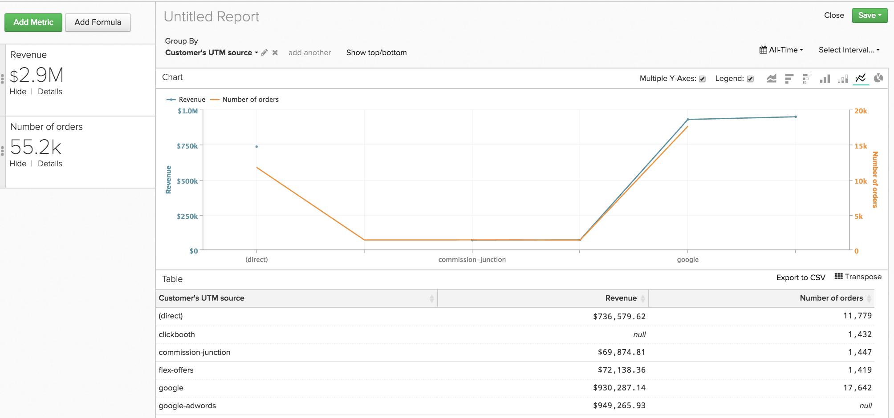
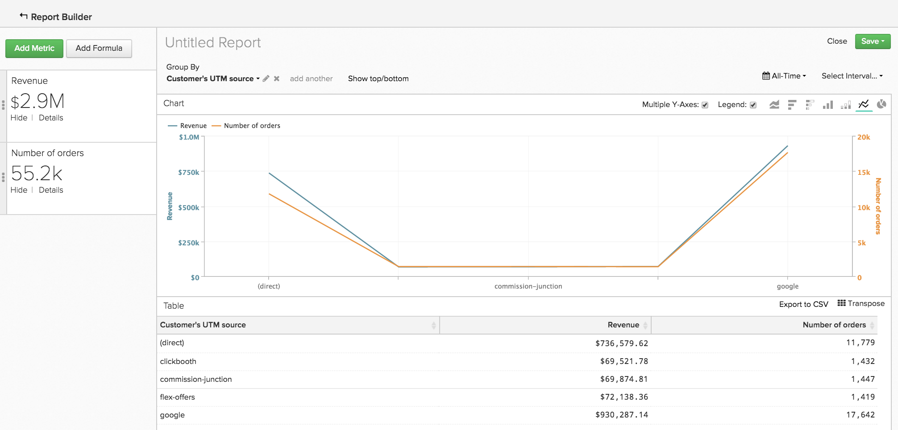
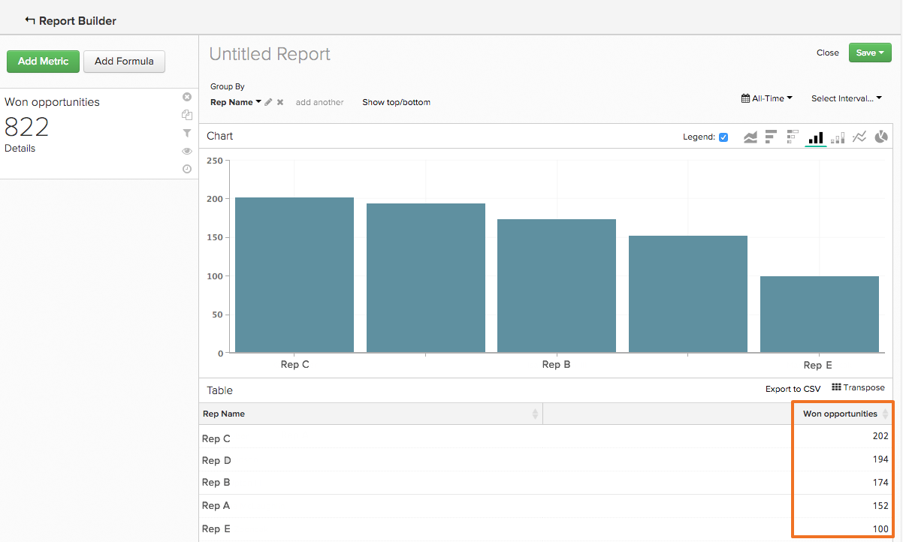
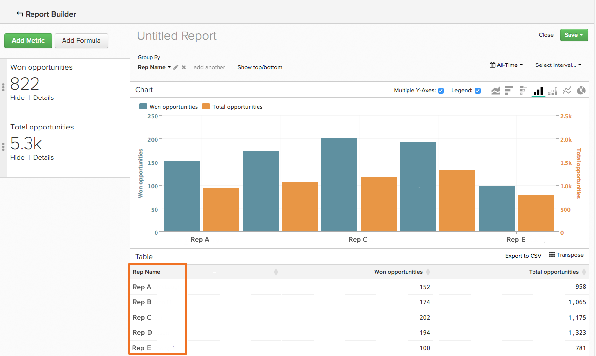

# 使用`Show Top/Bottom`功能排序資料

您可在`Visual Report Builder`中完成比建立該趨勢隨時間變化的分析更多的工作。 例如，您可以建置報表來顯示贏取和行銷管道的價值，但也可以建置報表來只顯示前五名績效者。 同樣地，您可以建立報表，顯示哪些州產生最多收入，藉此重新調整行銷工作的重點。

可以在同時使用`Group By`和`Time Interval of None`的報表中完成這種資料排序和排序。 當這兩個元素都在報表中時，`Show Top/Bottom`功能會顯示在圖表預覽上方。 此功能可讓您根據您設定的引數，檢視頂端（最高至最低）和底部（最低至最高）的資料點。

## 我該如何使用此功能？ {#how}

按一下&#x200B;**[!UICONTROL Show Top/Bottom link]**&#x200B;以設定顯示和排序引數。 文字方塊中的數字可以是整數（如`5`）或`ALL`。 接著，您可以選擇依量度或分組來排序報表。

例如，如果您想顯示帶來最多收入的五個反向連結來源，以下是您的做法：

1. 將`Revenue`量度新增至報表。

1. 新增`Group By`以依據轉介來源劃分量度。

1. 將`Time Interval`設為`None`。

1. 在`Show Top/Bottom`設定中，將顯示設定為`5`，這樣報表中只會包含具有前五個總收入金額的反向連結來源。

>[!NOTE]
>
>由於報表沒有`Time Interval`，值（在此例中是前五個反向連結來源）可能會隨著時間變更。 如果某個反向連結來源的收入超過另一個反向連結來源，則來源顯示的順序會變更。

## 使用多個量度有什麼改變？ {#multiplemetrics}

當報表中有多個量度時，使用此功能會變得複雜，因為每個量度只能依其本身或依其中一個群組排序。

假設您同時使用`Revenue`和`Number of orders`量度建立報告，並按轉介來源分組。 `Revenue`只能依`Revenue`或轉介來源排序，`Number of orders`只能依`Number of orders`或轉介來源排序。

這表示雖然您可以只顯示前`5`個產生收入的轉介來源的`Revenue`，但無法同時顯示前`5`個產生收入的轉介來源的訂單數。 簡單地說：有多個量度時，最好依分組排序每個量度。

以下是圖表範例，此圖表會單獨排序`Revenue`量度，而非依分組排序。 如您所見，若未依分組排序量度，會建立奇怪（且最終無用）的報告：

如果您已依分組排序這兩個量度，圖表將如下所示：

## 依預設值如何排序？ {#defaultsorting}

當一個具有`Group by`且`Time Interval`為`None`的報表中僅包含一個量度時，`Visual Report Builder`中的預設順序是根據量度顯示最高值。 在此執行個體中，如果符合您的需求，可能就不需要使用`Show Top/Bottom`功能。

此範例會檢視您的銷售代表已結束的商機數量。 此表格會根據量度從最高自動排序到最低，在此案例中為`Won Opportunities`。

不過，新增第二個量度時，預設會根據分組排序頂端。 新增量度和群組後，預設排序會依據第一個群組，然後是第二個群組，以此類推。

## 正在結束 {#wrapup}

雖然這裡介紹一些基本功能，但此功能有許多有趣的用途。

請思考一下先前的銷售代表與商機範例。 移除`Time Interval`、套用`Group By`並根據分組來排序資料，可讓我們取得每個代表的成功機會數的詳細圖片。 此外，使用`Show Top/Bottom`功能可讓我們發現哪些是表現最好的人。
