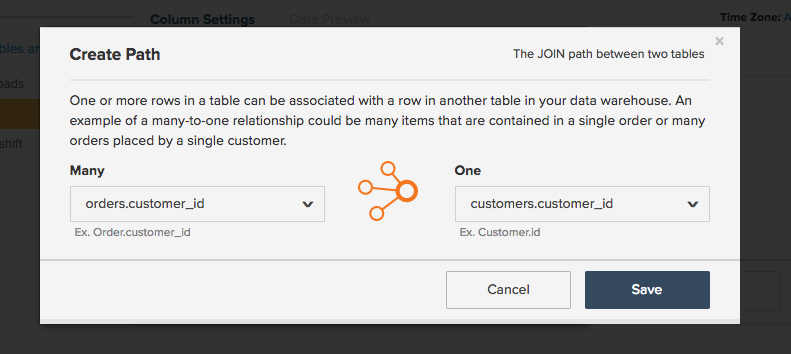
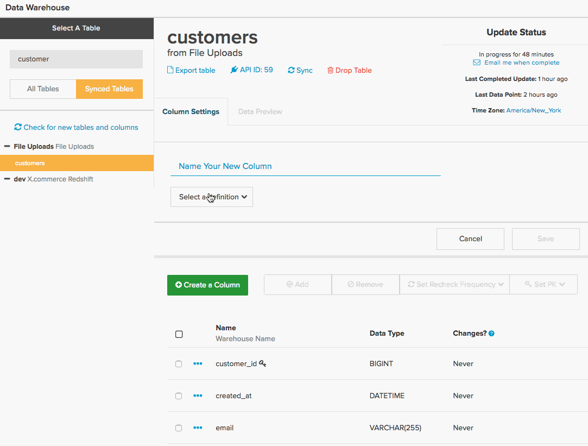
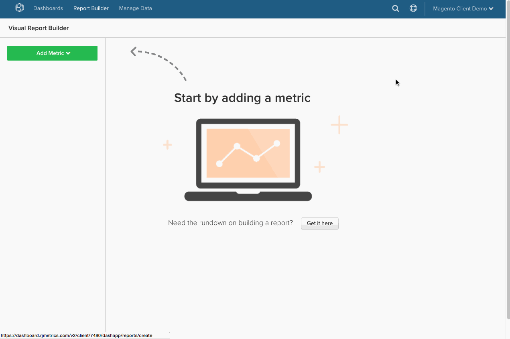
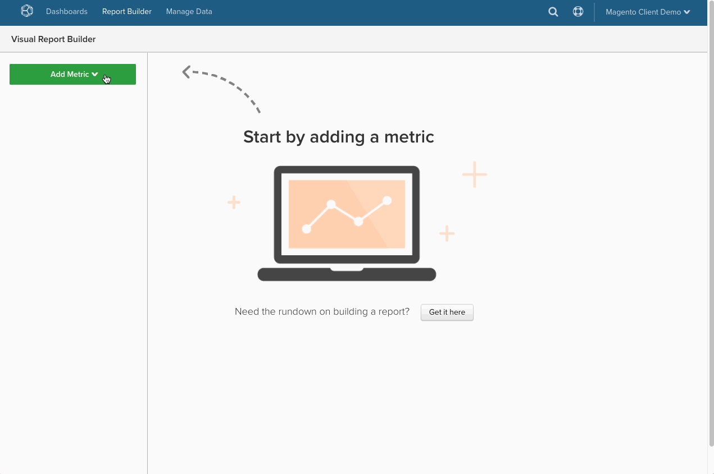

# 在MBI中轉換SQL查詢

有人想知道SQL查詢如何轉譯為 [計算欄](../data-warehouse-mgr/creating-calculated-columns.md), [量度](../../data-user/reports/ess-manage-data-metrics.md)，和 [報告](../../tutorials/using-visual-report-builder.md) 在 [!DNL MBI]？如果您是大量SQL用戶，請了解SQL在 [!DNL MBI] 可讓您在 [Data Warehouse管理員](../data-warehouse-mgr/tour-dwm.md) 最好地利用 [!DNL MBI] 平台。

在本文結尾，您會發現 **翻譯矩陣** 針對SQL查詢子句和 [!DNL MBI] 元素。

首先，查看一般查詢：

|  |  |
|--- |--- |
| `SELECT` |  |
| `a,` | 報表 `group by` |
| `SUM(b)` | `Aggregate function` （欄） |
| `FROM c` | `Source` 表格 |
| `WHERE` |  |
| `d IS NOT NULL` | `Filter` |
| `AND time < X`   `AND time >= Y` | 報表 `time frame` |
| `GROUP BY a` | 報表 `group by` |

此範例涵蓋大部分的翻譯案例，但有一些例外。 從 `aggregate` 函式。

## 匯總函式

匯總函式(例如 `count`, `sum`, `average`, `max`, `min`)，以 **量度匯總** 或 **欄匯總** in [!DNL MBI]. 差異因素是執行匯總是否需要連接。

請參閱上述各項的範例。

## 量度匯總 {#aggregate}

聚合時需要度量 `within a single table`. 比如， `SUM(b)` 來自上述查詢的匯總函式極可能以加總欄的量度表示 `B`. 

請查看 `Total Revenue` 量度的定義 [!DNL MBI]. 查看下面嘗試翻譯的查詢：

|  |  |
|--- |--- |
| `SELECT` |  |
| `SUM(order_total) as "Total Revenue"` | `Metric operation` （欄） |
| `FROM orders` | `Metric source` 表格 |
| `WHERE` |  |
| `email NOT LIKE '%@magento.com'` | 量度 `filter` |
| `AND created_at < X`  `AND created_at >= Y` | 量度 `timestamp` （和報告） `time range`) |

按一下「 」，導覽至量度產生器 **[!UICONTROL Manage Data** > **&#x200B;量度&#x200B;**> **建立新量度]**，您必須先選取適當的 `source` 表格，在此例中為 `orders` 表格。 接著會設定量度，如下所示：

## 欄匯總

從另一個表中合併列時，需要計算列。 例如，您可能有一個欄位建置在 `customer` 表 `Customer LTV`，這會加總與該客戶關聯的所有訂單在 `orders` 表格。

此匯總的查詢可能如下所示：

|  |  |
|--- |--- |
| `Select` |  |
| `c.customer_id` | 匯總所有者 |
| `SUM(o.order_total) as "Customer LTV"` | 匯總操作（列） |
| `FROM customers c` | 聚合所有者表 |
| `JOIN orders o` | 聚合源表 |
| `ON c.customer_id = o.customer_id` | 路徑 |
| `WHERE o.status = 'success'` | 匯總篩選器 |

在 [!DNL MBI] 需要使用Data Warehouse管理器，您可在 `orders` 和 `customers` 表格，然後建立名為 `Customer LTV` 在客戶的桌子上。

查看如何在 `customers` 和 `orders`. 最終目標是在 `customers` 表格，請先導覽至 `customers` 表格，然後按一下 **[!UICONTROL Create a Column** > **&#x200B;選取定義&#x200B;**> **SUM]**.

接下來，您需要選擇源表。 如果路徑存在於 `orders` 表格，只需從下拉式清單中選取。 不過，如果您要建立新路徑，請按一下 **[!UICONTROL Create new path]** 螢幕如下：

在此，您需要仔細考慮要連接的兩個表之間的關係。 在這種情況下，可能 `Many` 與 `One` 客戶，因此 `orders` 表格列於 `Many` 側，而 `customers` 在 `One` 側。

>[!NOTE]
>
>在 [!DNL MBI], *路徑* 等於 `Join` 中。

儲存路徑後，所有人都會設定建立 `Customer LTV` 欄目！ 請查看下列項目：

既然你已經建立了 `Customer LTV` 欄 `customers` 表格，您可以建立 [量度匯總](#aggregate) 使用此欄（例如，尋找每位客戶的平均LTV）。 您也可以 `group by` 或 `filter` 計算欄，使用 `customers` 表格。

>[!NOTE]
>
>對於後者，每當您建立新的計算欄時，就必須 [將維度新增至現有量度](../data-warehouse-mgr/manage-data-dimensions-metrics.md) 之前，請以 `filter` 或 `group by`.

請參閱 [建立計算列](../data-warehouse-mgr/creating-calculated-columns.md) 和Data Warehouse管理員。

## `Group By` 條款

`Group By` 查詢中的函式通常表示在 [!DNL MBI] 作為欄，用於劃分或篩選視覺化報表。 例如，請讓我們重新造訪 `Total Revenue` 查詢，但此時會依 `coupon\_code` 以便更清楚了解哪些優惠券能產生最多的收入。

從以下查詢開始：

|  |  |
|--- |--- |
| `SELECT coupon_code,` | 報表 `group by` |
| `SUM(order_total) as "Total Revenue"` | `Metric operation`（欄） |
| `FROM orders` | `Metric source` 表格 |
| `WHERE` |  |
| `email NOT LIKE '%@magento.com'` | 量度 `filter` |
| `AND created_at < '2016-12-01'`   `AND created_at >= '2016-09-01'` | 量度 `timestamp` （和報告） `time range`) |
| `GROUP BY coupon_code` | 報表 `group by` |

>[!NOTE]
>
>與您之前開始的查詢相較，唯一的差異是新增「抵用券\_code」作為群組依據。_

使用相同 `Total Revenue` 量度，您現在可以建立依抵用券代碼劃分的收入報表了！ 請查看下方的gif圖，其中顯示如何設定此視覺化報表，查看9月至11月的資料：

## 公式

有時，查詢可能涉及多個聚合，以計算不同列之間的關係。 例如，您可以透過下列兩種方式之一，計算查詢中的平均訂單值：

* `AVG('order\_total')` 或
* `SUM('order\_total')/COUNT('order\_id')`

前一種方法將涉及建立新量度，以對 `order\_total` 欄。 不過，假設您已設定量度以計算 `Total Revenue` 和 `Number of orders`.

退一步，查看 `Average order value`:

|  |  |
|--- |--- |
| `SELECT` |  |
| `SUM(order_total) as "Total Revenue"` | 量度 `operation` （欄） |
| `COUNT(order_id) as "Number of orders"` | 量度 `operation` （欄） |
| `SUM(order_total)/COUNT(order_id) as "Average order value"` | 量度 `operation` （欄）/量度操作（欄） |
| `FROM orders` | 量度 `source` 表格 |
| `WHERE` |  |
| `email NOT LIKE '%@magento.com'` | 量度 `filter` |
| `AND created_at < '2016-12-01'`  `AND created_at >= '2016-09-01'` | 量度時間戳記（和報表時間範圍） |

現在，假設您已設定量度來計算 `Total Revenue` 和 `Number of orders`. 由於這些量度存在，您只需開啟 `Report Builder` 並使用 `Formula` 功能：

## 包裝

如果您是大量SQL用戶，請思考如何在中轉換查詢 [!DNL MBI] 可讓您建立計算欄、量度和報表。

如需快速參考，請查看下方的矩陣。 這將顯示SQL子句的對等項 [!DNL MBI] 元素，以及元素如何對應至多個元素，具體取決於在查詢中使用元素的方式。

## MBI元素

|**`SQL Clause`**|**`Metric`**|**`Filter`**|**`Report group by`**|**`Report time frame`**|**`Path`**|**`Calculated column inputs`**|**`Source table`**| |—|—|—|—|—|—|—|—|—|—| |`SELECT`|X|-|X|-|-|-|X|-| |`FROM`|-|-|-|-|-|-|-|-|-||-|X| |`WHERE`|-|X|-|-|-|-|-|-|-| |`WHERE` （含時間元素）|-|-|-|-|X|-|-|-|-|-| |`JOIN...ON`|-|X|-|-|X|X|-| |`GROUP BY`|-|-|X|-|-|-|-|-|-|
