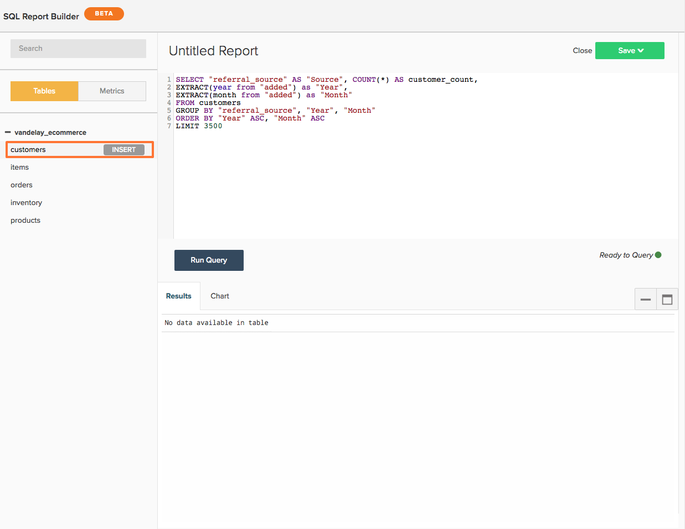

# 使用 `SQL Report Builder`

>[!NOTE]
>
>需要 [管理權限](../../administrator/user-management/user-management.md) 來建立和編輯SQL圖表。 `Standard` 使用者可以在控制面板上重新排列這些圖表， `Read-only` 使用者擁有與傳統圖表相同的體驗。 此外， `Read-only` 用戶無權訪問查詢的文本。

查看我們的 [訓練影片](https://experienceleague.adobe.com/docs/commerce-knowledge-base/kb/how-to/mbi-training-video-sql-report-builder.html?lang=en) 了解更多。

`SQL`，或結構化查詢語言，是一種用於與資料庫通信的寫程式語言。 在 [!DNL MBI], SQL可用來查詢或擷取資料倉庫中的資料。 查看控制面板上的報表 — 在幕後，每個報表都由SQL查詢提供支援。

您可以使用 [`SQL Report Builder`](../dev-reports/sql-rpt-bldr.md) 若要直接查詢您的資料倉庫，請檢視結果，然後將結果轉換為圖表。 您可以開始使用 `SQL Report Builder` 瀏覽至 **[!UICONTROL Report Builder** > **SQL Report Builder]**.

查看我們的 [訓練影片](https://experienceleague.adobe.com/docs/commerce-knowledge-base/kb/how-to/mbi-training-video-sql-report-builder.html?lang=en) 了解更多。

此 `SQL Report Builder` 可讓您直接查詢資料倉庫、檢視結果，並快速將其轉換為圖表。 使用SQL來建立報表的最佳步驟，是您不需要等待更新週期來反覆查看您建立的欄。 如果結果看起來不太正確，您可以快速編輯並重新運行查詢，直到符合您的期望。

在本文中，我們會引導您使用 `SQL Report Builder`. 了解您的方式後，請查看我們的SQL以取得視覺效果教學課程，或嘗試最佳化您所撰寫的部分查詢。

以下是本文所涵蓋內容的概觀：

1. [寫入查詢](#writing)

1. [運行查詢和查看結果](#runquery)

1. [建立視覺效果](#createviz)

1. [儲存報表](#save)

## SQLReport Builder整合

在目前的世界狀況下， [[!DNL Google Analytics]](../importing-data/integrations/google-analytics.md) 是唯一無法與 [`SQL Report Builder`](../dev-reports/sql-rpt-bldr.md). 我們正在著手將此功能納入後續版本。

若要開始建立新SQL報表，請按一下 **[!UICONTROL Report Builder]** 或 **[!UICONTROL Add Report]** 在任何控制面板的頂端。 在 `Report Picker` 按一下 **[!UICONTROL SQL Report Builder]** 以開啟SQL編輯器。

## 開始使用

若要編輯報表，請按一下齒輪()圖示，然後按一下 **[!UICONTROL Edit]**.

## 寫入查詢 {#writing}

>[!NOTE]
>
>`SQL Report Builder` 查詢區分大小寫。 請務必在撰寫查詢時使用正確的大小寫，否則可能會出現非預期的結果或錯誤。

遵循 [查詢優化指南](../../best-practices/optimizing-your-sql-queries.md)，在SQL編輯器中寫入查詢。

>[!IMPORTANT]
>
>**SQL報表中的度量**  — 將度量插入SQL報表時， `current definition` 的值。

如果量度未來會更新，則會顯示SQL報表 *不會* 反映變更。 您必須手動編輯報表，變更才會生效。

使用側欄頂端的按鈕，您可以在可供 `SQL Report Builder`. 如果您在清單中看不到要尋找的項目，請嘗試使用側欄頂端的搜尋列來搜尋。

您也可以使用SQL編輯器中的側欄，將滑鼠游標暫留在查詢上並按一下，將度量、表格和欄直接插入查詢中 **[!UICONTROL Insert]**:

>[!NOTE]
>
>任何 [SELECT函式](https://www.postgresql.org/docs/9.5/sql-select.html#SQL-SELECT-LIST)，或SQLReport Builder支援的不變動資料的任何函式。 這包括但不限於AVG、COUNT、COUNT DISTINCT、MIN/MAX和SUM。

此外，支援任何JOIN類型，但建議僅使用INNER JOIN，因為它是JOIN類型中最便宜的。

## 運行查詢和查看結果 {#runquery}

完成查詢後，按一下 **[!UICONTROL Run Query]**. 結果將顯示在SQL編輯器下的表中：

如果結果中有某些內容看起來不正確，您可以編輯查詢並重新運行該查詢，直到您滿意為止。

你有時可能會看到 [編輯器下方的訊息，其中包含EXPLAIN](../../best-practices/optimizing-your-sql-queries.md). 如果您看到其中一個，表示您的查詢尚未運行，需要進行一些微調。

編輯完查詢後，您可以移至建立視覺效果或將工作儲存至控制面板。

## 建立視覺效果 {#createviz}

若要使用查詢結果建立視覺效果，請按一下 **[!UICONTROL Chart]** 標籤 `Results` 框。 在此索引標籤中，您將選取：

* 此 `Series`，或您要測量的欄，例如 **已售項目**.
* 此 `Category`，或您要用來劃分資料的欄，例如 **贏取來源**.
* 此 `Labels`，或X軸值。

以下提供視覺效果程式的外觀：

如需如何建立視覺效果的詳細說明，請參閱 [從SQL查詢建立視覺效果教學課程](../../tutorials/create-visuals-from-sql.md){:target=&quot;_blank&quot;}。

## 儲存報表 {#save}

您必須為報表命名，才能儲存您的工作。 請記得遵循 [命名的最佳實務准則](../../best-practices/naming-elements.md){:target=&quot;_blank&quot;}，並選擇清楚傳達報表內容的項目！

按一下 **[!UICONTROL Save]** 在SQL編輯器的右上角，並選取報表 `Type` (`Chart` 或 `Table`)。 要總結，請選取要儲存報表的控制面板，然後按一下 **[!UICONTROL Save to Dashboard]**.

### 分析您的資料

#### `SQL Report Builder`

[`The SQL Report Builder`](../dev-reports/sql-rpt-bldr.md) 可讓您直接查詢資料倉庫、檢視結果，並快速將其轉換為報表。 使用SQL還允許您 [要利用不可用的SQL函式](https://docs.aws.amazon.com/redshift/latest/dg/c_SQL_functions.html) 在 `Visual` 或 `Cohort` Report Builder，因此您可以進一步控制資料。

我們要提到，使用SQL建立的計算列不依賴於更新週期，這意味著您可以按需要迭代，並立即查看結果。

>[!NOTE]
>
>這只會套用至欄的結構，不會套用資料的時效性。 新資料仍取決於已成功完成的更新週期。

| **這是最好的……** | **這對……** |
|---|---|
| 中級/進階分析師 | 初學者 — 您需要了解SQL。 |
| 對SQL的了解 | 簡單分析 — 撰寫查詢可能比只使用視覺Report Builder更有效。 |
| 建立一次性使用的計算欄 | 與他人共用 — 考慮您的對象：他們懂SQL嗎？ 若非如此，報表的建立方式可能會令他們困惑。 |
| 資料包含 `one-to-many` 關係 |  |
| 測試新欄或分析 |  |

#### 資料庫與SQL編輯器結果

大部分時間、結果差異可歸因於更新週期。 若 [!DNL MBI] 正在將資料從資料庫複製到Data Warehouse的過程中，即使使用同一查詢，您也可能會看到不同的結果。

連線問題也可能導致差異。 導覽至 `Connections` 按一下 **[!DNL Manage Data** > **Connections]**)以檢出 — 相關資料庫整合是否有錯誤？ 如果是，您可能需要 [重新驗證整合](https://experienceleague.adobe.com/docs/commerce-knowledge-base/kb/how-to/mbi-reauthenticating-integrations.html?lang=en) 讓事情重新開始。

如果所有整合皆連線成功，而您未處於更新週期的中間，則可能會有其他問題。

#### 刪除SQL報表是否也會從我的Data Warehouse中刪除基礎列？

否，無論您是如何建置欄，您的Data Warehouse不會遺失任何欄。

使用 `Data Warehouse Manager` 如果刪除使用報表或查詢，則不受影響。

使用 `SQL Report Builder` 不會儲存至您的Data Warehouse。

#### `Report Builder` vers `SQL Report Builder`

此 `SQL Report Builder` 為您在建立和建構圖表時提供更大的彈性 — 例如，您可以選取應顯示在上的值 `X` 和 `Y` 軸。 有關在 `SQL Report Builder`，請查看 [從SQL查詢建立視覺效果](../../tutorials/create-visuals-from-sql.md) 教學課程。

#### `Cohort Report Builder` {#cohortrb}

不同於 `Visual Report Builder`, [`Cohort Report Builder`](../dev-reports/cohort-rpt-bldr.md) 僅用於單一用途 — 分析及識別一段時間內類似使用者群組的行為趨勢。 使用同類群組Report Builder不需要任何SQL知識，因此如果您剛開始使用，可以毫不猶豫地直接深入探討。

| **這是最好的……** | **這對……** |
|---|---|
| 中級/進階分析師 | 初學者 — 您需要定義同類群組的實務。 |
| 識別一段時間的行為趨勢 | 定性分析 — 可以 [完成](../dev-reports/create-qual-cohort-analysis.md)，但需要我們的協助。 |

## 在更新週期後重建查詢

您不必重建查詢。 使用 [`SQL Report Builder`](../dev-reports/sql-rpt-bldr.md) 會像傳統 `Report Builder`. SQL圖表的更新過程完全相同 — 更新資料後，將重新計算並重新顯示圖表中的值。

>[!NOTE]
>
>刪除SQL報表/查詢時，不會從Data Warehouse中刪除基礎列。 無論您是如何建立欄，您都不會遺失任何欄。

* 如果刪除使用Data Warehouse管理員的報表或查詢，則使用「報表管理員」建立的欄將不受影響。

* 使用SQLReport Builder建立的列不會保存到Data Warehouse。

## 包裝 {#wrapup}

如果您想嘗試更具挑戰性的項目，何不嘗試撰寫針對視覺效果最佳化的查詢？ 看看我們的 [從SQL查詢建立視覺效果教學課程](../../tutorials/create-visuals-from-sql.md){:target=&quot;_blank&quot;}以開始使用。
