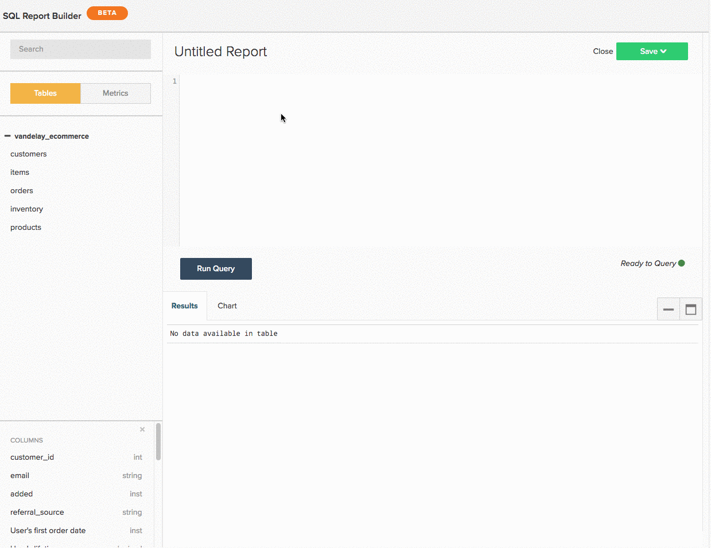

# 使用 [!DNL SQL Report Builder]

>[!NOTE]
>
>需要 [管理員許可權](../../administrator/user-management/user-management.md) 建立和編輯SQL圖表。 `Standard` 使用者可以在儀表板上重新排列這些圖表，並且 `Read-only` 使用者擁有與傳統圖表相同的體驗。 此外， `Read-only` 使用者無權存取查詢的文字。

請參閱 [訓練影片](https://experienceleague.adobe.com/docs/commerce-knowledge-base/kb/how-to/mbi-training-video-sql-report-builder.html) 以深入瞭解。

[!DNL SQL]或結構化查詢語言，是用於與資料庫通訊的程式設計語言。 在 [!DNL Commerce Intelligence]， [!DNL SQL] 用於查詢或擷取您Data Warehouse中的資料。 檢視控制面板上的報表 — 在幕後，每個報表都由 [!DNL SQL] 查詢。

您可以使用 [[!DNL SQL Report Builder]](../dev-reports/sql-rpt-bldr.md) 若要直接查詢您的Data Warehouse，請檢視結果，並將其轉換為圖表。 您可以開始使用建立報告 [!DNL SQL Report Builder] 按一下 **[!UICONTROL Report Builder** > **[!DNL SQL Report Builder]]**.

請參閱 [訓練影片](https://experienceleague.adobe.com/docs/commerce-knowledge-base/kb/how-to/mbi-training-video-sql-report-builder.html) 以深入瞭解。

此 [!DNL SQL Report Builder] 可讓您直接查詢Data Warehouse、檢視結果，並快速將其轉換為圖表。 使用的最佳部分 [!DNL SQL] 若要建立報表，您不需要等待更新週期來重複您建立的欄。 如果結果看起來不正確，您可以快速編輯並重新執行查詢，直到符合您的預期為止。

本主題將引導您使用 [!DNL SQL Report Builder]. 在您瞭解如何應對後，請檢視 [!DNL SQL] 視覺效果教學課程，或嘗試最佳化您編寫的某些查詢。

本文章內容涵蓋：

1. [撰寫查詢](#writing)

1. [執行查詢並檢視結果](#runquery)

1. [建立視覺效果](#createviz)

1. [儲存報告](#save)

## [!DNL SQL Report Builder] 整合

[[!DNL Google Analytics]](../importing-data/integrations/google-analytics.md) 是唯一無法與搭配使用的整合 [[!DNL SQL Report Builder]](../dev-reports/sql-rpt-bldr.md). 此功能正在開發中。

若要開始建立 [!DNL SQL] 報表，按一下 **[!UICONTROL Report Builder]** 或 **[!UICONTROL Add Report]** 任何控制面板頂端的。 在 [!DNL Report Picker] 熒幕，按一下 **[!UICONTROL SQL Report Builder]** 以開啟 [!DNL SQL] 編輯者。

## 開始使用

若要編輯報表，請按一下齒輪()圖示中的「 」圖示 [!DNL SQL]以圖表為基礎的點按 **[!UICONTROL Edit]**.

## 撰寫查詢 {#writing}

>[!NOTE]
>
>[!DNL SQL Report Builder] 查詢區分大小寫。 在撰寫查詢時，請務必使用正確的大小寫，否則可能會出現非預期的結果或錯誤。

遵循 [查詢最佳化准則](../../best-practices/optimizing-your-sql-queries.md)，在中撰寫查詢 [!DNL SQL] 編輯者。

>[!IMPORTANT]
>
>**中的量度 [!DNL SQL] 報告**  — 將量度插入SQL報表時， `current definition` 使用的量度的。

如果未來更新測量結果，SQL報表會顯示 *不會* 反映變更。 您必須手動編輯報告，變更才會生效。

您可以使用側邊欄頂端的按鈕，在表格清單與可用於的量度之間切換 [!DNL SQL Report Builder]. 如果您在清單中看不到要尋找的內容，請嘗試使用側邊欄頂端的搜尋列來搜尋。

您也可以使用中的側欄 [!DNL SQL] 編輯器可將量度、表格和欄直接插入查詢，方法是將滑鼠游標停留在量度、表格和欄上，然後按一下 **[!UICONTROL Insert]**：

![將表格插入 [!DNL SQL] 編輯者。](../../assets/SQL_RB_Insert_Table.png)

>[!NOTE]
>
>任何 [SELECT函式](https://www.postgresql.org/docs/9.5/sql-select.html#SQL-SELECT-LIST)SQLReport Builder支援PostgreSQL支援的任何函式（或任何不會變異資料的函式）。 這包含但不限於AVG、COUNT、COUNT DISTINCT、MIN/MAX和SUM。

此外，任何 `JOIN` 支援型別，但Adobe建議僅使用INNER JOIN，因為這是最便宜的 `JOIN` 型別。

## 執行查詢並檢視結果 {#runquery}

當您完成查詢的撰寫時，請按一下 **[!UICONTROL Run Query]**. 結果會顯示在SQL編輯器下方的表格中：

如果結果中出現錯誤，您可以編輯查詢並重新執行，直到滿意為止。

您有時可能會看到 [編輯器下含有EXPLAIN的訊息](../../best-practices/optimizing-your-sql-queries.md). 如果您看到其中一項，表示您的查詢尚未執行，需要微調。

編輯完查詢後，您可以繼續建立視覺效果或儲存工作到控制面板。

## 建立視覺效果 {#createviz}

若要使用查詢結果建立視覺效果，請按一下 **[!UICONTROL Chart]** 索引標籤中的 `Results` 窗格。 在此索引標籤中，您選取：

* 此 `Series`，或您要測量的欄，例如 **已售出專案**.
* 此 `Category`，或您要用來劃分資料區段的欄，例如 **贏取來源**.
* 此 `Labels`或X軸值。

以下為視覺化程式外觀的快速檢視：

如需如何建立視覺效果的詳細逐步解說，請參閱 [從SQL查詢教學課程建立視覺效果](../../tutorials/create-visuals-from-sql.md){： target=&quot;_blank&quot;}。

## 儲存報告 {#save}

您必須先為報表命名，才能儲存作業。 請記得遵循 [命名的最佳實務准則](../../best-practices/naming-elements.md){： target=&quot;_blank&quot;}，然後選擇能清楚傳達報表內容的內容！

按一下 **[!UICONTROL Save]** 位於的右上角 [!DNL SQL] 編輯並選取報告 `Type` (`Chart` 或 `Table`)。 若要總結，請選取要儲存報告的儀表板，然後按一下 **[!UICONTROL Save to Dashboard]**.

### 分析您的資料

#### [!DNL SQL Report Builder]

[[!DNL SQL Report Builder]](../dev-reports/sql-rpt-bldr.md) 讓您能夠直接查詢Data Warehouse、檢視結果，並快速將其轉換為報表。 使用 [!DNL SQL] 也可讓您 [使用 [!DNL SQL] 無法使用的函式](https://docs.aws.amazon.com/redshift/latest/dg/c_SQL_functions.html) 在 `Visual` 或 `Cohort` Report Builder，讓您更能掌控資料。

計算欄建立方式： [!DNL SQL] 不依賴更新週期，這表示您可以視需要重複這些週期，並立即檢視結果。

>[!NOTE]
>
>這僅適用於欄的結構，不適用於資料的時效性。 新的資料仍取決於成功完成的更新週期。

| **這是最適合……** | **這個不太適合……** |
|---|---|
| 中級/進階分析師 | 初學者 — 您需要知道 [!DNL SQL]. |
| 此 [!DNL SQL] 精明 | 簡單分析 — 撰寫查詢可能比單純使用 [!UICONTROL Visual Report Builder]. |
| 建立一次性使用的計算欄 | 與他人共用 — 考慮您的對象：他們是否瞭解 [!DNL SQL]？ 如果沒有，他們可能會對報告的建置方式感到困惑。 |
| 資料與 `one-to-many` 關係 |  |
| 測試新欄或分析 |  |

#### 資料庫與SQL編輯器結果

大多數情況下，結果的差異可歸因於更新週期。 若 [!DNL Commerce Intelligence] 正在將資料庫中的資料複製到Data Warehouse中，即使使用相同的查詢，您也可能會看到不同的結果。

連線問題也可能導致不一致。 導覽至 `Connections` 按一下以建立頁面 **[!DNL Manage Data** > **Connections]** 以檢查它 — 有問題的資料庫整合是否有錯誤？ 若是如此，您可能需要 [重新驗證整合](https://experienceleague.adobe.com/docs/commerce-knowledge-base/kb/how-to/mbi-reauthenticating-integrations.html) 讓事情再次執行。

如果所有的整合都已成功連線，而且您並未處於更新週期中，則可能有其他錯誤。

#### 刪除 [!DNL SQL] 報表也會從我的Data Warehouse刪除基礎欄嗎？

否，無論如何建立，Data Warehouse中的欄都不會遺失。

使用建立的欄 `Data Warehouse Manager` 如果您刪除使用它們的報表或查詢，則不受影響。

使用建立的欄 [!DNL SQL Report Builder] 不會儲存至您的Data Warehouse。

#### `Report Builder` 與 `SQL Report Builder`

此 [!DNL SQL Report Builder] 讓您在建立及建構圖表時擁有更多彈性，例如，您可以選取應顯示在 `X` 和 `Y` 軸。 如需有關在中建立圖表的詳細資訊 [!DNL SQL Report Builder]，檢視 [建立視覺效果來源 [!DNL SQL] 查詢](../../tutorials/create-visuals-from-sql.md) 教學課程。

#### `Cohort Report Builder` {#cohortrb}

不喜歡 [!DNL Visual Report Builder]，則 [[!DNL Cohort Report Builder]](../dev-reports/cohort-rpt-bldr.md) 旨在用於單一目的 — 分析和識別類似使用者群組在一段時間內的行為趨勢。 使用 [!DNL Cohort Report Builder] 不需要任何 [!DNL SQL] 精明，如果您剛開始使用，可以毫不猶豫地直接開始使用。

| **這是最適合……** | **這個不太適合……** |
|---|---|
| 中級/進階分析師 | 初學者 — 您需要實務定義同類群組。 |
| 識別一段時間的行為趨勢 | 定性分析 — 可以是 [完成](../dev-reports/create-qual-cohort-analysis.md)，但需要Adobe協助。 |

## 在更新週期後重建查詢

您不需要重新建立查詢。 使用建立的報表 [[!DNL SQL Report Builder]](../dev-reports/sql-rpt-bldr.md) 會像在傳統檔案中建立的檔案一樣儲存 `Report Builder`. 的更新程式 [!DNL SQL] 圖表相同 — 更新資料後，圖表中的值將重新計算並重新顯示。

>[!NOTE]
>
>刪除時 [!DNL SQL] report/query，它不會從Data Warehouse中刪除基礎欄。 無論如何建立欄，都不會遺失任何欄。

* 如果您刪除使用欄的報表或查詢，則使用「Data Warehouse管理員」建立的欄不會受到影響。

* 使用SQLReport Builder建立的欄不會儲存至您的Data Warehouse。

## 正在結束 {#wrapup}

如果您想要嘗試更具挑戰性的事情，為什麼不嘗試編寫針對視覺效果最佳化的查詢？ 檢視 [建立視覺效果來源 [!DNL SQL] 查詢教學課程](../../tutorials/create-visuals-from-sql.md){： target=&quot;_blank&quot;}開始使用。
