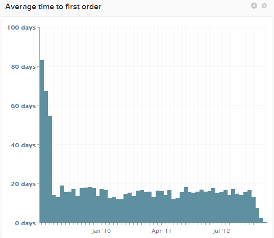

# 首次購買的平均時間報告

許多Adobe客戶都有名為的量度和圖表 `Average time to first purchase`，顯示群組使用者註冊日期與首次購買日期之間的平均時間。 當時間更接近目前時，資料幾乎總是會向下傾斜。

這是因為這些較新的客戶尚未有機會產生任何在其加入日期起超過一個月的購買。 由於從未購買過的使用者完全不包括在內（直到他們確實購買過），因此這會使較新客戶群組的平均價格下降。

有幾種其他方法可檢視此量度，但會引入較少偏差。 探索一個範例。

## 範例：執行 `cohort` 第一筆訂單分析

您的電腦上可能有一個圖表 `Users` 儀表板已命名 `Time to first order cohort`. 此報表使用 `Distinct buyers` 量度，使用者分組依據 `cohort` 註冊的周數或月數，並顯示比率(介於 `0` 和 `1`)在註冊後數週或數月內首次購買的使用者。

圖表可能會顯示，對於2014年12月註冊的使用者， `0.56` (或 `56%`)在第2個月前（例如2015年1月）做了第一筆訂單。

同類群組分析可很好地顯示一段時間內的使用者啟用率。 如果此圖表開始平面化或停滯，而您仍無法完全轉換至購買者，則可能是時候透過電子郵件行銷活動啟用其餘的使用者。
