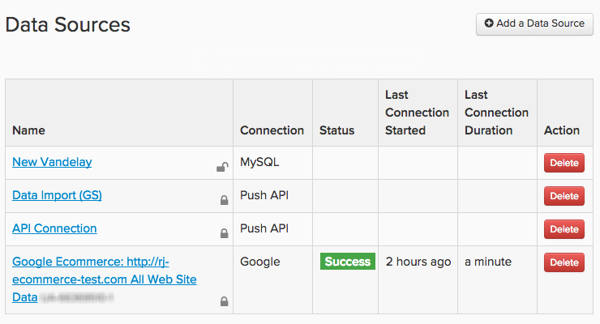
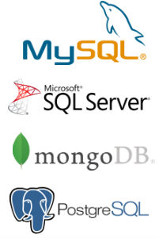

# 連線您的資料

在[!DNL Adobe Commerce Intelligence]中，資料來源稱為`integrations`。 成功連線`integration`之後，您就可以在Data Warehouse管理員中瀏覽可供同步的資料表。

使用`Connections`頁面新增及管理整合，按一下&#x200B;**[!UICONTROL Manage Data** > **Connections]**&#x200B;即可存取該頁面。 在這裡，您會看到：

* 與您帳戶連線的所有整合專案清單

* 整合型別

* 狀態（[!DNL Google Analytics]和[!DNL Data Import API]個連線的狀態列位為空白）

* 上次執行連線測試（`Last Connection Started`欄）的時間

## 整合型別

有四種方式可將您的資料匯入[!DNL Commerce Intelligence]：連線資料庫、連線SaaS整合、上傳`.csv`檔案或使用Adobe API。

## 資料庫整合

[!DNL Commerce Intelligence]支援SQL和NoSQL資料庫，例如[MySQL](../../importing-data/integrations/mysql-via-ssh-tunnel.md)、[Microsoft SQL](../integrations/microsoft-sql-server.md)、[MongoDB](../integrations/mongodb-via-ssh-tunnel.md)和[PostgreSQL](../integrations/postgresql.md)。

雖然您可以使用資料庫認證直接將資料庫連線至[!DNL Commerce Intelligence]，但Adobe建議您使用SSH通道等經驗證的加密方法。 這可確保您的資料在進入Data Warehouse時保持安全和安全。

視連線方法和資料庫型別而定，可能需要一些技術專業才能完成設定。

## `SaaS`整合

spree-commerce-logo.png

`SaaS`整合是[[!DNL Google Adwords]](../integrations/google-adwords.md)、[[!DNL Salesforce]](../integrations/salesforce.md)和[[!DNL Zendesk]](../integrations/zendesk.md)之類的服務。 由於協力廠商資料位於供應商的伺服器上，因此您無法像使用資料庫中的資料一樣直接存取這些資料。

通常，在[!DNL Commerce Intelligence]中設定整合就像直接輸入您的帳戶認證一樣容易。 有些服務可能需要API金鑰才能完成授權。 請檢視[整合區段](../integrations/integrations.md)，瞭解如何產生您需要的任何認證的相關指示。

## 檔案上傳

不確定如何將補充來源的資料匯入Data Warehouse？ [使用`File Upload`功能](../connecting-data/using-file-uploader.md)是提取您日常決策不需要的資料的好方法。 依照格式化規則，您可以快速將`.csv`個檔案上傳到您的Data Warehouse中，並將其與其他資料來源聯結。

## [!DNL Commerce Intelligence] `Import API`

若您想從您自己的來源自動擷取資料，可以使用[!DNL Commerce Intelligence] `Import API`。 基本上，如果不在資料庫或`SaaS`整合中，`Import API`函式就是您的最佳選擇。

使用API需要一點技術專業知識 — 熟悉編寫和維護小型Ruby或PHP指令碼的人絕非合格人士。

若要深入瞭解開始使用`Import API`，請檢視[開發人員網站](https://developer.adobe.com/commerce/services/reporting/)和[如何產生API金鑰](https://developer.adobe.com/commerce/services/reporting/import-api/)。

## 新增整合

若要新增整合，請按一下&#x200B;**[!UICONTROL Manage Data** > **Connections]**，然後按一下&#x200B;**[!UICONTROL Add a New Data Source]**。 按一下要新增之整合的圖示，然後依照說明主題中的指示進行設定：

* [整合常見問題集](https://support.magento.com/hc/en-us/sections/360003161871-Integration-FAQ)
* [可用 ](../integrations/integrations.md)
* [合併您的表格](../../../best-practices/consolidating-your-tables.md)
* [限制對資料庫的存取](../../../administrator/account-management/restrict-db-access.md)

**沒有看見您想要的整合？**&#x200B;必須啟用部分整合，才會在您的帳戶中顯示。 如果您正在尋找[!DNL Facebook]之類的專案，但它並未列出，請[提交支援票證](https://experienceleague.adobe.com/docs/commerce-knowledge-base/kb/troubleshooting/miscellaneous/mbi-service-policies.html?lang=zh-Hant)。

**如果您看到整合的錯誤狀態**，請參閱[疑難排解小節](https://support.magento.com/hc/en-us/sections/360003078151)以取得說明。
