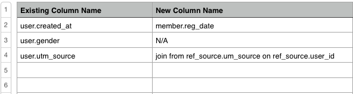

# 資料移轉

遷移到新的資料庫架構、伺服器或報告資料庫不必帶來壓力。 我們的 **[!DNL Adobe Commerce Services - Analytics]** 團隊提供移轉協助 — 我們承擔所有重擔，因此您不必擔心。

為確保移轉過程盡可能順暢，我們請您在提交移轉請求時盡可能詳細說明。 本文提供提交請求並開始移轉所需的一切。 為我們提供您需求的完整圖片，將可確保您的專案限定範圍正確，且預估準確。

## 快速入門 {#started}

在深入探討之前，您應先了解下列問題的答案：

* **新資料庫是否在新伺服器上？** 在提交請求之前，請在 **[!UICONTROL Manage Data** > **Connections]**. 如果您需要重新整理有關如何執行此操作的資訊，請前往 [`Integrations`](../integrations/integrations.md) 區段，並找到您所使用之資料庫類型的指示。
* **您的所有歷史資料都存在於新資料庫中嗎？還是需要遷移？** 我們可以在遷移過程中整合歷史資料和新資料。 即使您不需要整合，我們仍要求您在您的請求中告知我們。

在您獲得上述答案後，我們需要了解移轉類型：新資料庫是否 [`same`](#sameschema) 結構，或是 [`different`](#newschema) 綱要？ 在以下各節中，您會找到各種移轉類型的詳細指示。

## 使用相同架構遷移到新資料庫 {#sameschema}

提交請求時，請告知資料庫架構未更改，並且已在中設定連接 [!DNL MBI].

如果資料庫有新名稱，請將其納入請求中，以便您的控制面板能正確移轉。

如果資料庫名稱未更改，則遷移完成。 下次完整更新完成後，控制面板和報表會重新整理。 我們要求您仍與我們聯繫，以便我們能夠在移轉可能導致的任何問題前保持領先。

## 使用不同架構遷移到新資料庫 {#newschema}

>[!IMPORTANT]
>
>如果新資料庫中某些資料列沒有相等的列，則在過程中有可能丟失某些分析。

若要成功完成此類型的移轉，現有資料欄必須與新資料庫中的等值項目相符。 這並非您必須執行的操作，但為我們執行比對有助於加快請求的週轉時間並降低遷移價格。

如果您自行完成相符作業，請依照下列指示，將完成的試算表附加至您的請求：

1. 查看當前與Data Warehouse同步的所有表和列(**[!UICONTROL Manage Data** > **Data Warehouse]**)。
1. 在試算表中，為每個要遷移到新資料庫的表建立一個頁簽。
1. 在每個索引標籤中，為所有需要移轉的現有欄建立一欄。 建議您將其命名為 `Existing column name`.
1. 您也需要為試算表的每個索引標籤中新資料庫中的欄等效項目設定另一欄。 建議您將欄命名為 `New column name`.
1. 輸入現有列及其等效項。 如果現有列沒有新的對等項，只需輸入 `N/A`.

   此外，如果有新方法可計算新資料庫中的相同資訊，請在 [`New column name`] 欄。

以下是範例：

>[!NOTE]
>
>如果新資料庫中某些資料列沒有相等的列，則在過程中有可能丟失某些分析。

## 如何提交請求？ {#submitreq}

你可以通過 [提交支援請求](../../../guide-overview.md).

如果您按照上一節中的步驟建立符合欄的試算表，請別忘了附加。

## 接下來呢？ {#wrapup}

決定專案的範圍時，您與執行移轉的商務服務團隊的分析師會進行一些合作。 變更的複雜性以及您和分析人員的回應能力，會直接影響移轉所需的時間。 在我們確定詳細資訊後，將制定時間表並向您發送工作說明。
