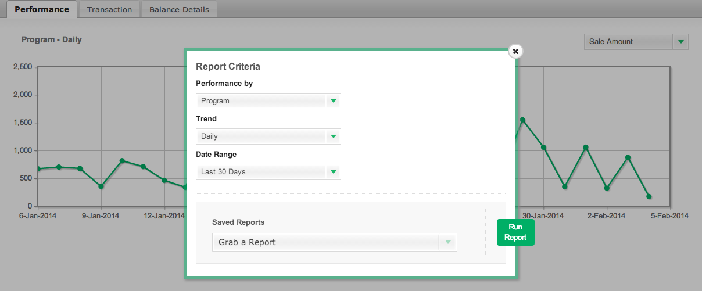

# 匯入[!DNL CJ Affiliate]資料

若要將[!DNL CJ Affiliate (Commission Junction)]資料匯入[!DNL Adobe Commerce Intelligence]，只要依照下列步驟將結果檔案附加至[支援票證](https://experienceleague.adobe.com/docs/commerce-knowledge-base/kb/troubleshooting/miscellaneous/mbi-service-policies.html?lang=zh-Hant)即可。 Adobe會設定您帳戶的資料表，並允許您繼續獨立上傳資料。

## 匯出[!DNL CJ Affiliate]資料

1. 在您的[!DNL CJ Affiliate]帳戶中，移至`Reports`標籤。

1. 在`Performance`索引標籤中，選取`Report Options`。

1. 將`Performance By`設定為等於`Program`、`Trend`設定為等於`Daily`，且`Date Range`設定為等於稽核的日期範圍。

   <!--{:.zoom}-->

1. 選取`Run Report`。

1. 在`File Format`下拉式清單中，選取`CSV`。  按一下&#x200B;**[!UICONTROL Download]**。

   <!--{:.zoom}-->

1. 下載檔案之後，您可以[將檔案](../connecting-data/using-file-uploader.md)上傳至您的[!DNL Commerce Intelligence] Data Warehouse。

   這會在您的[!DNL Commerce Intelligence] Data Warehouse中建立表格，供您繼續定期上傳新資料至。 上傳檔案時，請遵循[使用檔案上傳程式](../connecting-data/using-file-uploader.md)中列出的格式要求。
