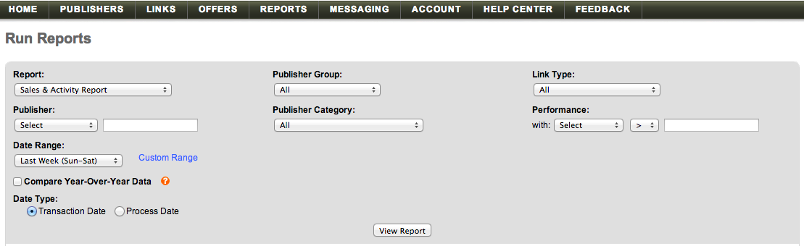

# 匯入[!DNL Linkshare]資料

若要將您的[!DNL Linkshare]資料帶入[!DNL Adobe Commerce Intelligence]，您必須執行下列兩件事：

1. [匯出Linkshare資料於 ](#export)
1. [將試算表上傳至 [!DNL Commerce Intelligence]](../connecting-data/using-file-uploader.md)

## 從Linkshare匯出資料 {#export}

1. 在您的[!DNL Linkshare]帳戶中，移至&#x200B;**[!UICONTROL Reports** > **Run Reports].**

1. 在`Report`下拉式清單中，選取&#x200B;**[!UICONTROL Sales & Activity Report]**。

1. 將所有其他下拉式清單選項保留為預設選項。

1. 在`Date Range`下拉式清單中，選取與您在`Sun - Sat`中的`Mon - Sun`設定相符的任何選項(`Start of Week`、[!DNL Commerce Intelligence])。

1. 清除`Compare Year-Over-Year Data`核取方塊。

1. 在`Data Type`下，選取`Transaction Date`。

   

1. 按一下&#x200B;**[!UICONTROL View Report]**。

1. 按一下&#x200B;**[!UICONTROL Download]**。

   此時，已下載一個`.csv`檔案。

下載檔案後，您可以使用[!DNL Commerce Intelligence]功能[`File Upload`將其上傳至](../connecting-data/using-file-uploader.md)。
