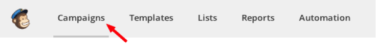
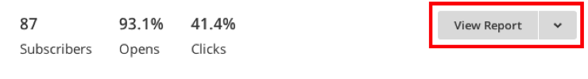
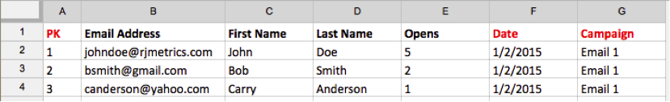
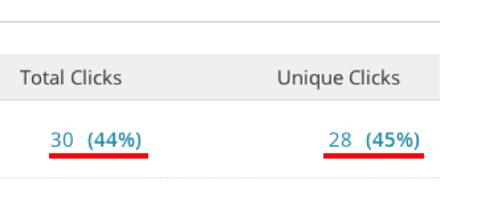
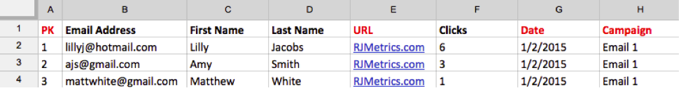
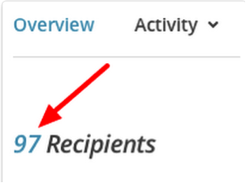
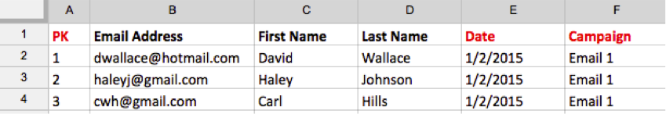

# 匯入[!DNL Mailchimp]資料

若要全面瞭解您的行銷活動，您可以將[!DNL Mailchimp]電子郵件行銷活動資料匯入[!DNL Commerce Intelligence]。 若要完成匯入，您必須針對每個[!DNL Mailchimp]行銷活動執行下列動作：

## 匯出開啟的資料 {#opens}

1. 登入[!DNL Mailchimp]後，移至`Campaigns`標籤。

   

1. 按一下行銷活動名稱旁的&#x200B;**[!UICONTROL View Report]**。

   

1. 按一下&#x200B;**[!UICONTROL Opened]**&#x200B;數字。

   

1. 按一下&#x200B;**[!UICONTROL Export]**&#x200B;並儲存`.csv`檔案。

   您必須新增`primary key`、`date (mm/dd/yyyy)`和`campaign name`欄至此檔案。 請確定每一列的`primary keys`都是唯一的。

   

## 匯出點按資料 {#clicks}

1. 導覽回促銷活動的`View Report`畫面。

1. 按一下`Clicked`的數字。

   

1. 按一下`Total Clicks`或`Unique Clicks`資料行下的數字。

   

1. 按一下&#x200B;**[!UICONTROL Export]**&#x200B;並儲存`.csv`檔案。

   您必須新增`Primary Key`、`date (mm/dd/yyyy)`、`campaign name`和`URL`欄至此檔案。 您不需要新增完整URL，只要讓您知道已點按哪些內容即可。

   

1. 對電子郵件中按下的每個URL重複步驟3和4，完成後，將所有資料合併到相同的`.csv`檔案中。

## 匯出已傳送的資料 {#sent}

1. 進入`Campaigns`的[!DNL Mailchimp]標籤。

1. 按一下行銷活動名稱旁的&#x200B;**[!UICONTROL View Report]**。

1. 按一下`Recipients`旁邊的數字。

   

1. 按一下&#x200B;**[!UICONTROL Export]**&#x200B;並儲存`.csv`檔案。

   您必須新增`Primary Key`、`date (mm/dd/yyyy)`和`campaign name`欄至此檔案。

   

## 準備檔案以上載至[!DNL Commerce Intelligence] {#upload}

每個檔案 — `Opens`、`Clicks`和`Sent` — 都應該以個別檔案的形式上傳到[!DNL Commerce Intelligence]。 Adobe建議您使用此命名慣例來命名檔案： `MailChimp\_ACTION\_DATE`。 以`ACTION`、`Open`或`Click`取代`Sent`，並以匯出日期取代`DATE`。

當您準備好上傳檔案時，請使用[`File Upload`功能](../connecting-data/using-file-uploader.md)將資料帶入您的Data Warehouse。
