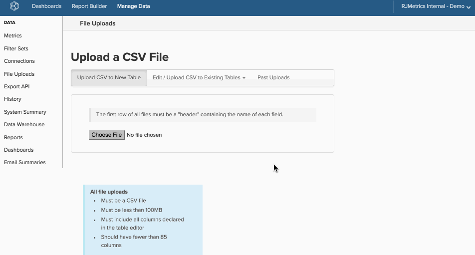
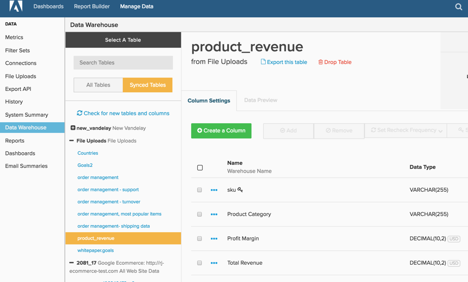

# 使用檔案上傳程式

>[!NOTE]
>
>需要[管理員許可權](../../../administrator/user-management/user-management.md)。

[!DNL Adobe Commerce Intelligence]的強大不僅是因為其視覺化功能，還因為它可讓您將所有資料放入單一Data Warehouse中。 即使資料位於您的資料庫和整合之外，也可以使用Data Warehouse管理員中的檔案上傳工具將其匯入[!DNL Commerce Intelligence]。

以廣告促銷活動為例。 如果您同時執行線上和離線行銷活動，且僅分析來自線上整合的資料，則無法取得整體資訊。 上傳包含離線行銷活動資料的試算表，可讓您分析兩組資料，並更深入瞭解您的行銷活動績效。

## 限制和需求 {#require}

1. **唯一支援的檔案上傳格式為`CSV`或`comma separated values`**。 如果您使用Excel，可以使用「另存新檔」功能將檔案儲存為`.csv`格式。
1. **`CSV`檔案必須使用`UTF-8 encoding`**。 在大多數情況下，這不是問題。 如果您在上傳檔案時發生此錯誤，[請參閱此支援文章](https://experienceleague.adobe.com/docs/commerce-knowledge-base/kb/troubleshooting/miscellaneous/resolving-utf-8-errors-for-csv-file-uploads.html?lang=zh-Hant)。
1. **檔案不能大於100MB**。 如果檔案大於此值，請將表格分割為多個區塊，然後另存為個別檔案。 您可以在載入初始檔案後附加資料。
1. **所有資料表都必須有`primary key`**。 表格中至少要有一欄可用作`primary key`，或表格中每一列的唯一識別碼。 任何指定為`primary key`的資料行都可以&#x200B;*永不*&#x200B;為Null。 `primary key`可以簡單到只新增為每一列提供數字的資料行，也可以串連為兩個資料行，組成唯一值的資料行（例如，`campaign name`和`date`）。

   如果欄（或欄）被指定為唯一的，但存在重複專案，則不會匯入重複的列。

## 格式化資料以供上傳 {#formatting}

在您可以將資料上傳到[!DNL Commerce Intelligence]之前，請根據本節中的准則檢查其格式。

### 標題列 {#header}

為確保欄標示和正確匯入，請確定試算表的第一列是說明每欄資料的標題。

資料行名稱必須是唯一的，而且只能包含字母、數字、空格和這些符號： `$ % # /`。 如果欄名稱包含逗號，則檔案上傳時會將其分割為兩欄。 此外，Adobe建議檔案中的欄數少於85欄，以便最佳化更新速度。

### 含逗號的資料 {#commas}

因為檔案必須是`CSV`格式，使用逗號可能會導致上傳資料時發生問題。 `CSV`個檔案使用逗號來表示新值，因此名稱為`Campaigns`、`August`之類的欄會讀取為兩個欄（`Campaigns`和`August`）而不是一個欄，將您的所有資料移動一列。 Adobe建議儘可能避免使用逗號。 您可以使用`Data Preview`檢視更新完成時資料是否正確顯示。

### 日期

包含日期的任何資料集都必須使用[標準日期格式](https://dev.mysql.com/doc/refman/5.7/en/datetime.html) `YYYY-MM-DD HH:MM:SS`或`MM/DD/YYYY`。

### 特殊字元

部分特殊字元不被接受。 例如，管道符號`& # 1 2 4`會解譯為建立欄，並在上傳檔案時造成錯誤。

### 小數位數

貨幣值應選取資料型別`Decimal Number`，而這些欄會自動四捨五入到Data Warehouse中的兩位小數。 如果您不想將小數點數字四捨五入或精確度大於此值，您應該選取`Non-Currency Decimal Number`資料型別。

### 百分比

百分比必須以小數形式輸入。 例如：

| **右：** | **錯誤：** |
|-----|-----|
| `.05` | `5%` |
| `.23` | `23` |

{style="table-layout:auto"}

### 開頭和/或結尾為零的值 {#zeroes}

檔案中的某些值（例如郵遞區號和ID）可能會以零開頭或結尾。 若要確保正確保留並上傳零，您可以變更格式型別（例如，[從數字變更為文字](https://support.microsoft.com/en-us/office/format-numbers-as-text-583160db-936b-4e52-bdff-6f1863518ba4?ui=en-us&rs=en-us&ad=us)）或強制數字格式化。

使用`US ZIP codes`作為如何變更數字格式的範例。 在[!DNL Excel]中，反白包含`ZIP codes`和[的資料行，並將數字格式](https://support.microsoft.com/en-us/office/display-numbers-as-postal-codes-61b55c9f-6fe3-4e54-96ca-9e85c38a5a1d?ui=en-us&rs=en-us&ad=us)變更為`ZIP code`。 您也可以選取自訂數字格式，並在`Type`視窗中輸入`00000`。 請記住，如果某些程式碼格式為`00000`，而其他程式碼為`00000-0000`，則此方法可能會出現問題。

`Type`可以是[不同的格式，以容納其他資料型別](https://support.microsoft.com/en-us/office/keeping-leading-zeros-and-large-numbers-1bf7b935-36e1-4985-842f-5dfa51f85fe7?correlationid=e1d4c2d3-cd5d-4a14-999d-437800274a90&ui=en-us&rs=en-us&ad=us)，例如ID。 例如，如果`ID`的長度是9位數，`Type`可以是`000000000`或`000-000-000`。 這會將`123456`變更為`000-123-456`。

如需[!DNL Google Docs]和[!DNL Apple Numbers]資源，請參閱此頁面底部的[相關](#related)清單。

## 正在上傳資料 {#uploading}

現在您的試算表已正確格式化且[!DNL Commerce Intelligence]易用，請將其新增至您的Data Warehouse。

1. 若要開始，請移至&#x200B;**[!UICONTROL Data** > **File Uploads]**。

1. 按一下「**[!UICONTROL Upload to New Table]**」標籤。

1. 按一下&#x200B;**[!UICONTROL Choose File]**&#x200B;並選取檔案。 按一下&#x200B;**[!UICONTROL Open]**&#x200B;開始上傳。

   上傳完成後，檔案中找到的欄[!DNL Commerce Intelligence]清單隨即顯示。

1. 檢查欄名稱和資料型別是否正確。 具體來說，請檢查任何日期欄是否讀為日期而非數字。

   >[!NOTE]
   >
   >`datatype`很重要，請勿略過此步驟！

1. 使用索引鍵圖示下的核取方塊，選取組成表格`primary key`的欄（或欄）。

1. 命名表格。

1. 按一下&#x200B;**[!UICONTROL Save Table]**。

*成功！儲存表格後，*&#x200B;訊息會顯示在畫面頂端。

如果您需要視覺效果，請檢視整個程式：

上傳的表格會顯示在Data Warehouse Manager中表格清單的&#x200B;**檔案上傳**&#x200B;區段（在「所有表格」和「同步表格」選項中）下：

## 更新資料或將資料附加至現有表格 {#appending}

有新資料要新增至您已上傳的檔案嗎？ 沒問題 — 您可以輕鬆地更新及附加[!DNL Commerce Intelligence]中的資料。

1. 若要開始，請移至&#x200B;**[!UICONTROL Manage Data** > **File Uploads]**。

1. 按一下&#x200B;**[!UICONTROL Edit/Upload `.csv`至現有表格]**&#x200B;索引標籤。

1. 在下拉式清單中，按一下要更新或附加的表格名稱。

1. 使用下拉式清單來選取處理重複列的選項：

   | 選項 | 說明 |
   |---|---|
   | `Overwrite old row with new row` | 如果一列在現有表格和新檔案中具有相同的主索引鍵，這會以新資料覆寫現有資料。 這是用於值隨時間變化的欄（例如「狀態」欄）的方法。 現有資料會遭到覆寫，並以新資料更新。 含有不在現有表格中的主鍵的列會新增為新列。 |
   | `Retain old row; discard new row` | 如果一列在現有表格和新檔案中具有相同的主索引鍵，這會忽略新資料。 |
   | `Purge all existing rows first and ignore duplicate keys within the file` | 這會刪除任何現有資料，並以檔案中的新資料取代。 只有在您不需要現有表格中的任何資料時，才使用此選項。 |

1. 按一下&#x200B;**[!UICONTROL Choose File]**&#x200B;並選取檔案。

1. 按一下&#x200B;**[!UICONTROL Open]**&#x200B;開始上傳。

   上傳完成後，[!DNL Commerce Intelligence]將會驗證檔案中的資料結構。 *成功！儲存表格後，*&#x200B;訊息會顯示在畫面頂端。

## 資料可用性 {#availability}

就像計算欄一樣，在下個更新週期完成之後，檔案上傳中的資料就可供使用。 如果檔案上傳期間正在進行更新，則資料要等到下次更新後才能使用。 更新週期完成後，您可以導覽至Data Warehouse中的`Data Preview`索引標籤，以確保檔案正確上傳且資料如預期顯示。

## 正在結束 {#wrapup}

本主題僅說明使用匯入資料的基本知識，但您可能想要執行更進階的動作。 請參閱相關文章，以取得格式化及匯入財務、電子商務、廣告支出及其他型別資料的指引。

此外，檔案上傳並非將您的資料傳入[!DNL Commerce Intelligence]的唯一方法。 [資料匯入API](https://developer.adobe.com/commerce/services/reporting/import-api/)函式可讓您將任意資料推送到[!DNL Commerce Intelligence] Data Warehouse。

## 相關 {#related}

* [格式化及匯入財務資料](../../../best-practices/format-import-financial-data.md)
* [匯入離線/其他廣告支出資料](../connecting-data/import-offline-ad-data.md)
* [必須有[!DNL Google ECommerce]個資料](../integrations/google-ecommerce-data.md)

## 協力廠商資源

* [Numbers資料格式化指南](http://www.dummies.com/how-to/content/how-to-choose-a-number-format-in-your-numbers-spre.html)
* [[!DNL Google Docs] 資料格式化指南](https://support.google.com/docs/answer/56470?hl=en)
