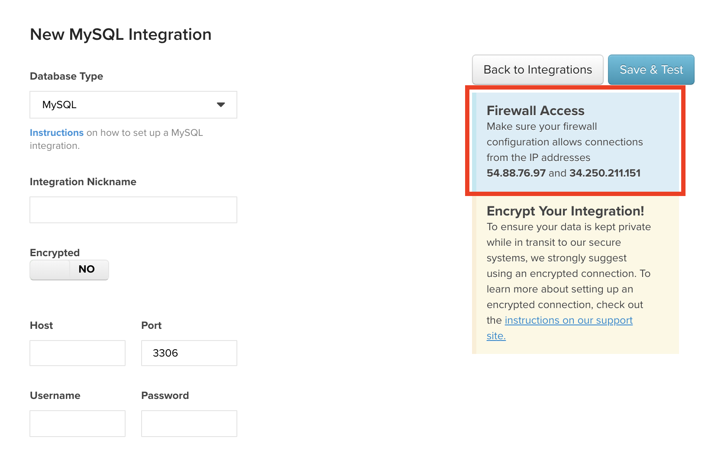

# 連線[!DNL Amazon RDS]

[!DNL Amazon Relational Database Services (RDS)]是在您可能已經熟悉的資料庫引擎上執行的Managed資料庫服務：

* [[!DNL MySQL]](../integrations/mysql-via-a-direct-connection.md)
* [[!DNL Microsoft SQL]](../integrations/microsoft-sql-server.md)
* [[!DNL PostgreSQL]](../integrations/postgresql.md)

根據您使用的資料庫型別以及您是否使用加密連線（例如[!DNL RDS]），連線[`SSH tunnel for MySQL`](../integrations/mysql-via-ssh-tunnel.md)執行個體的步驟會有所不同，但以下是基本資訊。

## 授權[!DNL Commerce Intelligence]存取您的資料庫

在每個資料庫的認證頁面(**[!UICONTROL Manage Data** > **Integrations]**)上，您會看到一個方塊，其中包含您必須授權才能將R[!DNL RDS]連線至[!DNL Commerce Intelligence]的IP位址： `54.88.76.97`與`34.250.211.151`。 請檢視`MySQL credentials`頁面，其中您醒目提示IP位址方塊：

若要讓[!DNL Commerce Intelligence]成功連線至您的[!DNL RDS]執行個體，您必須透過AWS管理主控台將這些IP位址新增至適當的資料庫安全性群組。 這些IP位址可以新增至現有群組，或者您可以建立一個IP位址 — 重要的是，群組已獲得存取您要連線至[!DNL Commerce Intelligence]的執行個體的授權。

新增[!DNL Commerce Intelligence] IP位址時，請務必在位址結尾新增`/32`，以指示[!DNL Amazon]它是確切的IP位址。 別擔心，AWS介面會明確說明此為必要專案。

## 建立`Linux`的[!DNL Commerce Intelligence]使用者 {#linux}

>[!NOTE]
>
>只有在您使用加密連線時，才需要執行此步驟。 如需如何執行此動作的說明，請參閱您使用之資料庫的設定主題（例如：MySQL）。 `Linux`使用者允許我們建立`SSH tunnel`，這是透過網際網路傳送資料最安全的方法。

## 建立[!DNL Commerce Intelligence]的資料庫使用者

根據您使用的資料庫，這是流程中的步驟會有所差異的部分。 您的想法是相同的，不過您會為[!DNL Commerce Intelligence]建立一個使用者，用來存取您的資料庫。 有關建立資料庫[!DNL Commerce Intelligence]使用者的指示，請參閱您使用之資料庫的設定主題。

## 在[!DNL Commerce Intelligence]中輸入連線資訊

在您授予[!DNL Commerce Intelligence]執行個體的存取權並為我們建立使用者之後，您最後需要做的就是在[!DNL Commerce Intelligence]中輸入連線資訊。

按一下`MySQL`，即可透過`Microsoft SQL`頁面(`PostgreSQL`)存取`Integrations`、**[!UICONTROL Manage Data** > **Integrations]**&#x200B;和&#x200B;**[!UICONTROL Add Integration]**&#x200B;的認證頁面。 顯示整合清單時，按一下您要用來移至證明資料頁面的資料庫圖示。 如果您目前無法存取所需的整合，請聯絡您的Adobe客戶團隊。

若要完成連線的建立，您需要下列資訊：

* RDS執行個體的公用位址：這可以在[!DNL AWS]管理主控台中找到。
* 您的資料庫執行個體使用的連線埠：有些資料庫有預設的連線埠，會自動填入`Port`欄位。 此資訊也可在資料庫的設定檔案中找到。
* 您為[!DNL Commerce Intelligence]建立的使用者使用者名稱和密碼。

如果您使用加密連線，請將資料庫認證頁面上的`Encrypted`切換變更為`Yes`。 這會顯示一個額外表單來設定加密：

