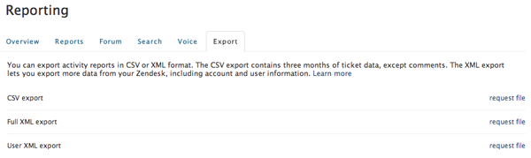

# 稽核Zendesk資料

發現您的內容有異常 [[!DNL Zendesk] 資料](../integrations/exp-zendesk-data.md)？ 若要查明問題，您需要探索資料。 這可透過匯出 [!DNL Zendesk] 資料下載至可下載的檔案。

## 啟用資料匯出

目前並未針對所有使用者啟用資料匯出 [!DNL Zendesk] 帳戶。 若要啟用此功能， [提交支援票證](https://experienceleague.adobe.com/docs/commerce-knowledge-base/kb/troubleshooting/miscellaneous/mbi-service-policies.html)，提及您的 [!DNL Zendesk] 子網域名稱。

>[!NOTE]
>
>僅限 `Enterprise` 和 `Plus` 計畫目前可存取此功能。

啟用資料匯出後，只有特定電子郵件網域中的管理員可以從匯出資料 [!DNL Zendesk] 帳戶。 此電子郵件網域通常與您的電子郵件網域相同。 [!DNL Zendesk]. 系統會使用帳戶擁有者的電子郵件網域作為預設網域，但如有需要，您可以變更網域。

## 匯出至可下載的檔案

1. 按一下側邊欄中的管理員圖示（齒輪標誌），然後選擇 **[!UICONTROL Manage** > **Reports]**.
1. 按一下 **[!UICONTROL Export]** 標籤。
1. 按一下 **[!UICONTROL Request file]** 「完整XML匯出」旁邊，如下圖所示。

   此時，組建開始；完成時您會透過電子郵件收到通知。
   

1. 按一下電子郵件通知中的連結，下載包含報表的zip檔案。

   此下載連結的有效期至少為三天。

此程式會建置XML檔案，其中包含目前儲存於您目前檔案中的所有資訊 [!DNL Zendesk] 帳戶，包括票證資料（含註解）、使用者資料和帳戶資料。 此時，您可以 [提交支援票證](https://experienceleague.adobe.com/docs/commerce-knowledge-base/kb/troubleshooting/miscellaneous/mbi-service-policies.html) （請務必附加此檔案！） 以便進一步瞭解您的資料。 如果檔案太大，請將它與 [!DNL Commerce Intelligence] 團隊透過 [!DNL Dropbox] 或 [!DNL Google Drive].

有關詳細資訊 [!DNL Zendesk] 檔案匯出，請參閱官方檔案 [[!DNL Zendesk] 匯出檔案](https://support.zendesk.com/hc/en-us/articles/4408886165402-Exporting-data-to-a-JSON-CSV-or-XML-file).
