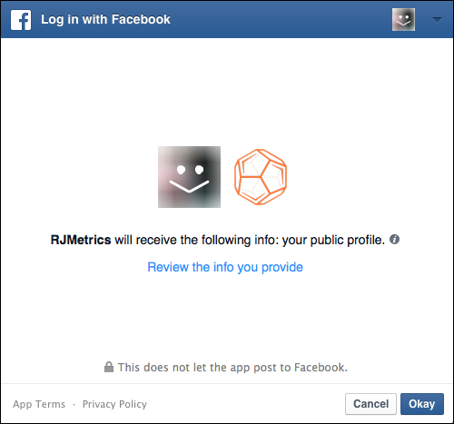
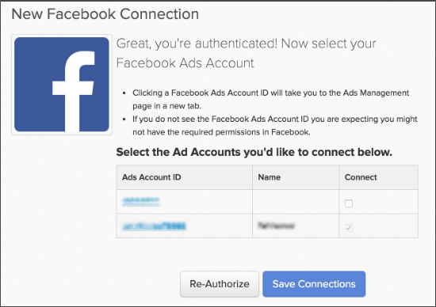

# Connect [!DNL Facebook Ads]

>[!NOTE]
>
>需要 [管理員許可權](../../../administrator/user-management/user-management.md).

您完成了調查、建立了廣告，並在以下日期發起了促銷活動： [!DNL Facebook]. 現在是時候分析您的廣告支出資料，看看您的錢是否有效花掉了。 使用您的廣告支出資料，您可以 [將您的廣告成本與客戶期限值(CLV)結合，以評估行銷活動ROI](../../../data-analyst/analysis/roi-ad-camp.md) 從您的行銷活動取得的使用者數量。

正在連線您的 [!DNL Facebook Ad] 資料目標 [!DNL Commerce Intelligence] 是一個簡單的三個步驟程式：

1. [新增 [!DNL Facebook] 作為中的資料來源 [!DNL Commerce Intelligence]](#stepone)
1. [允許 [!DNL Commerce Intelligence] 存取您的 [!DNL Facebook Ads] 資料](#steptwo)
1. [選取 [!DNL Facebook Ads] 用於提取資料的帳戶](#stepthree)

## 新增 [!DNL Facebook] 作為中的資料來源 [!DNL Commerce Intelligence] {#stepone}

1. 若要新增 [!DNL Facebook] 與您的整合 [!DNL Commerce Intelligence]帳戶，導覽至 `Connections` 頁面於 **[!UICONTROL Manage Data** > **Integrations]**.
1. 按一下 **[!UICONTROL Add Integration]**，位於右側。
1. 按一下 [!DNL Facebook] 圖示。 這會顯示 [!DNL Facebook] 授權頁面。
1. 按一下 **[!UICONTROL Authorize]**.

## 允許 [!DNL Commerce Intelligence] 存取您的 [!DNL Facebook Ads] 資料 {#steptwo}

按一下 **[!DNL Facebook Authorize]**，會顯示一個小型快顯視窗：

請依照一系列步驟允許 [!DNL Commerce Intelligence] 若要從您的公開設定檔存取資料， [!DNL Facebook Ads] 和，相關統計資料。 按一下 **[!UICONTROL OK]** 執行這些步驟以繼續。

## 選取 [!DNL Facebook Ads] 用於提取資料的帳戶 {#stepthree}

1. 驗證完成後，系統會提示您選取 [!DNL Facebook Ads] 您要提取資料的來源。 按一下「 」中的「 」核取方塊，選取所需的帳戶。 `Connect` 欄。

   

1. 按一下 **[!UICONTROL Save Connections]**.

   如果連線成功， *連線成功！* 訊息會顯示在頁面頂端。

## 接下來呢？ {#next}

請確定您正在追蹤 [!DNL Facebook] 中的行銷活動 [!DNL Google Analytics]. 這可確保 `utm\_campaign` 中的欄位 [!DNL Google Analytics] 已正確填入您的 [!DNL Facebook] 行銷活動。

## 相關

* [重新驗證整合](https://experienceleague.adobe.com/docs/commerce-knowledge-base/kb/how-to/mbi-reauthenticating-integrations.html)
* [連線您的 [!DNL Google Adwords] 帳戶](../integrations/google-ecommerce.md)
* [透過以下方式追蹤訂單反向連結來源： [!DNL Google eCommerce]](../integrations/google-ecommerce.md)
* [追蹤資料庫中的使用者反向連結來源](../../analysis/google-track-user-acq.md)
* [追蹤資料庫中的使用者裝置、瀏覽器和作業系統資料](../../analysis/track-usr-dev-browser.md)
* [探索您最有價值的贏取來源和管道](../../analysis/most-value-source-channel.md)
* [提高廣告行銷活動的ROI](../../analysis/roi-ad-camp.md)
* [如何 [!DNL Google Analytics] UTM歸因是否有效？](../../analysis/utm-attributes.md)
