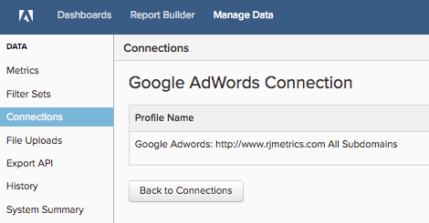

# 連線 [!DNL Google Adwords]

>[!NOTE]
>
>需要 [管理員許可權](../../../administrator/user-management/user-management.md).

您做了調查，製作了廣告，啟動了 [!DNL Google] 行銷活動。 現在，您可以分析廣告支出資料，看看您的錢是否花得有效率。 使用您的廣告支出資料，您可以 [將您的廣告成本與客戶期限值(CLV)結合，以評估行銷活動ROI](../../analysis/roi-ad-camp.md) 從您的行銷活動取得的使用者數量。

輸入您的網站以開始 [!DNL Google Adwords] 憑證進入 [!DNL Commerce Intelligence].

1. 前往 `Connections` 頁面於 **管理資料>整合**.
1. 按一下 **新增整合**，位於畫面的右上角。
1. 按一下 **[!DNL Google Adwords]** 圖示。 如此將可開啟 [!DNL Google Adwords] 證明資料頁面。
1. 輸入您的 [!DNL Google Analytics] 認證。 授權程式完成後，您將被重新導向回 [!DNL Commerce Intelligence].
1. 設定檔ID清單隨即顯示。 檢查您要連線的設定檔 [!DNL Commerce Intelligence].

   

1. 變更會自動儲存，因此請按一下 **[!UICONTROL Back to Connections]** 完成時。

如果您有多個設定檔，並且需要一些協助來識別哪一個，請參閱 `Connecting Multiple Google Analytics profiles` 一節。

## 正在連線多個 [!DNL Google Analytics] 設定檔

您可能有多個網站連線至單一 [!DNL Google Analytics] 帳戶，由其自身識別 [!DNL Google Analytics] 設定檔ID。 在此情況下，您可以選擇將您的所有設定檔ID包含在 [!DNL Commerce Intelligence]. 在設定檔選取步驟中，核取您要包含的設定檔ID。

**若要識別特定網站的Google Analytics設定檔ID：**

1. 登入 [!DNL Google Analytics]
1. 前往特定網站的 [!DNL Google Analytics] 儀表板
1. 檢視URL — 設定檔ID對應至下列八個數字 `p` 行尾：

   `www.google.com/analytics/web/#home/a11345062w43527078p**XXXXXXXX**`

## 正在中斷連線 [!DNL Google Adwords]

1. 造訪您的 [!DNL Google] [帳戶設定](https://www.google.com/account/about/?hl=en) 頁面。
1. 在 `Security` 區段，按一下 **[!UICONTROL edit]** 旁邊 `Authorizing` 應用程式和網站。
1. 按一下 **[!UICONTROL revoke access]**.

## 相關

* [重新驗證整合](https://experienceleague.adobe.com/docs/commerce-knowledge-base/kb/how-to/mbi-reauthenticating-integrations.html)
* [透過以下方式追蹤訂單轉介來源 [!DNL Google ECommerce]](../integrations/google-ecommerce.md)
* [追蹤資料庫中的使用者反向連結來源](../../analysis/google-track-user-acq.md)
* [探索您最有價值的贏取來源和管道](../../analysis/most-value-source-channel.md)
* [提高廣告行銷活動的ROI](../../analysis/roi-ad-camp.md)
* [如何 [!DNL Google Analytics] UTM歸因工作？](../../analysis/utm-attributes.md)
