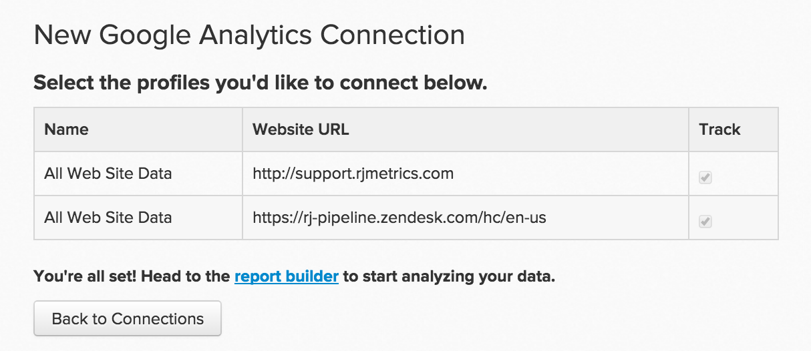

# 連線[!DNL Google Analytics]

>[!NOTE]
>
>需要[管理員許可權](../../../administrator/user-management/user-management.md)。

[!DNL Google Analytics]是網際網路上使用最廣泛的網頁分析服務。 在您的網站上實作[!DNL Google Analytics]可讓您追蹤訪客如何使用您的網站、哪些內容吸引人、訪客的退出地點等等。 在[!DNL Commerce Intelligence]中分析這些量度，連同其他資料片段，可改善您網站的整體健康狀況和可用性。

在[!DNL Google Analytics]中輸入您的[!DNL Commerce Intelligence]認證以開始使用：

1. 移至&#x200B;**[!UICONTROL Manage Data** > **Integrations]**。

1. 按一下畫面右側的&#x200B;**[!UICONTROL Add Integration]**。

1. 按一下[!DNL Google Analytics]圖示。 這會開啟[!DNL Google Analytics]認證頁面。

1. 輸入您的[!DNL Google Analytics]認證。 授權程式完成後，您將被重新導向回[!DNL Commerce Intelligence]。

1. 設定檔ID清單隨即顯示。 檢查您要連線至[!DNL Commerce Intelligence]的設定檔。 如果您有多個設定檔，並且需要一些協助來識別哪一個，請參閱下面的「連線多個[!DNL Google Analytics]設定檔」一節。

   在URL <!--{: width="600px"}-->Google Analytics管理頁面

1. 變更會自動儲存，因此完成時請按一下&#x200B;**返回連線**。

## 正在連線多個[!DNL Google Analytics]設定檔

您可能有多個網站連線至單一[!DNL Google Analytics]帳戶，並以其自己的[!DNL Google Analytics]設定檔ID識別。 在此情況下，您可以選擇在[!DNL Commerce Intelligence]中包含您的所有設定檔ID。 在設定檔選取步驟中，檢查您要包含的設定檔ID。

若要識別特定網站的[!DNL Google Analytics]設定檔識別碼：

1. 登入[!DNL Google Analytics]
1. 前往特定網站的[!DNL Google Analytics]儀表板
1. 檢視URL — 設定檔ID對應至行尾在`p`之後的八個數字：

   `www.google.com/analytics/web/#home/a11345062w43527078p**XXXXXXXX**/`

## 正在從[!DNL Google Analytics]中斷連線[!DNL Commerce Intelligence] {#disconnect}

1. 造訪您的[!DNL Google Analytics] [帳戶設定](https://accounts.google.com/)頁面。
1. 在`Security`區段下，按一下&#x200B;**[!UICONTROL edit]**&#x200B;應用程式和網站旁的`Authorizing`。
1. 按一下&#x200B;**[!UICONTROL revoke access]**&#x200B;旁的[!DNL Commerce Intelligence]。

## 相關：

* [正在重新驗證整合](https://experienceleague.adobe.com/docs/commerce-knowledge-base/kb/how-to/mbi-reauthenticating-integrations.html)
* [正在連線 [!DNL Google Adwords]](../integrations/google-adwords.md)
* [分析網站活動和客戶轉換率](../../analysis/web-act-cust-conversion.md)
* [使用 [!DNL Google Analytics] Cookie追蹤使用者贏取資料](../../analysis/google-track-user-acq.md)
