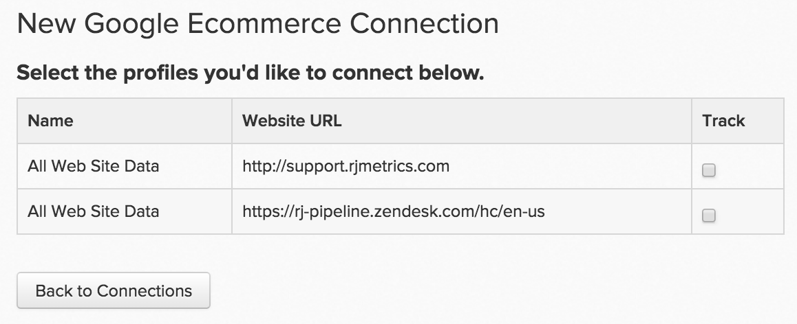

# Connect [!DNL Google ECommerce]

>[!NOTE]
>
>需要 [管理員許可權](../../../administrator/user-management/user-management.md).

您擁有穩定的流量和訂單流，這表示您能夠有效地觸及和吸引客戶。 但您最有價值的轉介管道為何？ 從某個來源取得的客戶平均期限值相對於從另一個來源取得的客戶為何？ 透過連線您的訂單反向連結來源資料來源 [!DNL Google ECommerce] 至 [!DNL Commerce Intelligence]，您可以建立分析來協助您識別 [最有價值的行銷管道](../../../data-analyst/analysis/most-value-source-channel.md).

輸入您的 [!DNL Google ECommerce] 憑證進入 [!DNL Commerce Intelligence]：

1. 前往 `Connections` 頁面於 **[!UICONTROL Admin** > **Connections]**.

1. 按一下 **[!UICONTROL Add a New Source]**，位於熒幕右側 `Data Sources` 表格。

1. 按一下 [!DNL Google ECommerce] 圖示。 如此將可開啟 [!DNL Google ECommerce] 認證頁面。

1. 輸入您的 [!DNL Google Analytics] 認證。 授權程式完成後，您會被重新導向回 [!DNL Commerce Intelligence].

1. 設定檔ID清單隨即顯示。 檢查您要連線的設定檔 [!DNL Commerce Intelligence].

   如果您有多個設定檔，並且需要一些幫助來識別哪一個，請參閱**連線多個 [!DNL Google Analytics] 下方的設定檔區段。

   <!--{: width="500"}-->

1. 變更會自動儲存，因此請按一下 **[!UICONTROL Back to Connections]** 完成時。

## 連線多個 [!DNL Google Analytics] 設定檔至 [!DNL Commerce Intelligence]

您可能有多個網站連線至單一 [!DNL Google Analytics] 帳戶，由其自身識別 [!DNL Google Analytics] 設定檔ID。 在此情況下，您可以選擇將您的所有設定檔ID納入 [!DNL Commerce Intelligence]. 檢查您要在設定檔選取步驟中包含的設定檔ID。

識別特定網站的 [!DNL Google Analytics] 設定檔ID：

1. 登入 [!DNL Google Analytics].
1. 前往特定網站的 [!DNL Google Analytics] 儀表板。
1. 檢視URL — 設定檔ID對應至下列八個數字 `p` 行尾。

   `www.google.com/analytics/web/#home/a11345062w43527078p**XXXXXXXX**/`

## 中斷連線 [!DNL Google ECommerce] 從 [!DNL Commerce Intelligence] {#disconnect}

1. 造訪您的 [!DNL Google Analytics] [帳戶設定](https://www.google.com/account/about/?hl=en) 頁面。
1. 在 `Security` 區段，按一下 **[!UICONTROL edit]** 旁邊 `Authorizing` 應用程式和網站。
1. 按一下 **[!UICONTROL revoke access]** 旁邊 [!DNL Commerce Intelligence].

## 相關：

* [預期 [!DNL Google ECommerce] 資料](../integrations/google-ecommerce-data.md)
* [重新驗證整合](https://experienceleague.adobe.com/docs/commerce-knowledge-base/kb/how-to/mbi-reauthenticating-integrations.html)
* [設定 [!DNL Google ECommerce] 追蹤](https://support.google.com/analytics/answer/1009612?hl=en)
* [探索您最有價值的贏取來源和管道](../../analysis/most-value-source-channel.md)
* [提高廣告行銷活動的ROI](../../analysis/roi-ad-camp.md)
