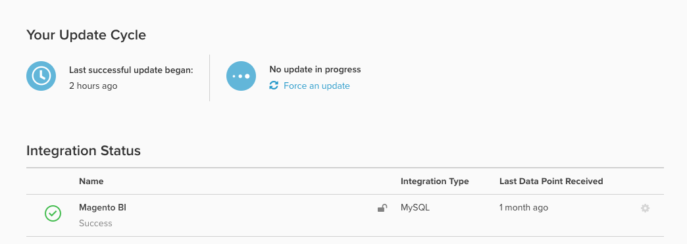

# 資料庫結果vs [!DNL SQL Editor]個結果

您可能會好奇`Last successful update began`頁面中的`Integrations`欄位是什麼：

## 瞭解`timestamp`欄位

它會顯示您帳戶上`timestamp`次成功更新週期&#x200B;_的開始_ （在您的帳戶上設定的時區）。

- 如果任何同步資料表在上次更新週期期間發生問題，此時間戳記為&#x200B;*未更新*。
- 因此，在某些情況下，報表已更新為新資料，但&#x200B;*上次成功更新的開始*&#x200B;仍為滯後。

## 識別「真正的」最後一個資料點

特定整合的最新資料點由每個整合右側的`Last Data Point Received`時間戳記決定。 該時間戳記是指Data Warehouse成功從該來源接收資料點的最後時間，無論該來源是資料庫、API或協力廠商整合。

若要檢查來自&#x200B;*特定資料表*&#x200B;的資料是否新鮮，Adobe建議建立快速的[[!DNL SQL] 報告](../../dev-reports/sql-rpt-bldr.md)，對您帳戶上最重要的資料表執行`MAX(timestamp)`。 將此時間戳記與`Last Data Point`做比較，會指出問題是否會影響整個帳戶或資料表的子集。 Adobe建議針對三至四個重要的常用表格執行此作業。

- 如果`MAX(timestamp)`值比`Last Data Point Received`更新，則表示資料表的子集受到影響，但整體帳戶的更新週期是穩定的。
- 如果`MAX(timestamp)`值等於或早於`Last Data Point Received`，表示帳戶的更新週期受到影響。 在這種情況下，[提交支援票證](https://experienceleague.adobe.com/docs/commerce-knowledge-base/kb/troubleshooting/miscellaneous/mbi-service-policies.html?lang=zh-Hant)。
