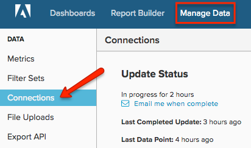

# 連線[!DNL Microsoft SQL]伺服器

>[!NOTE]
>
>需要[管理員許可權](../../../administrator/user-management/user-management.md)。

本主題說明如何在四步驟程式中將[!DNL Microsoft SQL]資料庫連線至[!DNL Commerce Intelligence]。 此程式需要伺服器連線和SQL的相關技術專業知識，並且可能需要團隊開發人員的支援。

[!DNL Commerce Intelligence]支援[!DNL Amazon RDS]、[!DNL EC2]、[!DNL Microsoft SQL Azure]和其他大部分的雲端伺服器提供者。 若您對特定主機有任何疑問，[請提交支援票證](https://experienceleague.adobe.com/docs/commerce-knowledge-base/kb/troubleshooting/miscellaneous/mbi-service-policies.html)，讓我們提供此資訊。

您的系統需要對資料庫執行SELECT查詢。 這項作業最初是為了取得資料庫結構的快照，然後定期超時以保持資料最新。 您的更新是漸進式的，而Adobe會限制更新頻率和時間，以防止伺服器上出現任何不想要的負載。

最佳方法是透過TCP/IP連線到您的資料庫伺服器。 建立僅能執行SELECT查詢的使用者（以及選擇性地僅能選取您指定之資料表中的資料）。 您必須針對要連線到[!DNL Commerce Intelligence]的每個伺服器執行此作業。

## 正在連線`Microsoft SQL`至[!DNL Commerce Intelligence]：

1. 請確定您的伺服器允許透過TCP/IP和混合模式驗證進行連線。

1. 請確定您的防火牆允許伺服器的專用IP連線。

   您可以在`Settings`頁面的連線區段中，找到用來連線至伺服器的IP位址。

1. 建立用來登入資料庫伺服器的使用者。 您有兩個選項；透過`UI`或透過`query`：
   * `UI`
   * [`Query`](http://sqlserverplanet.com/security/add-user) （第二個範例）

1. 在&#x200B;**[!UICONTROL Manage Data** > **Connections]**&#x200B;底下的[!DNL Commerce Intelligence]中輸入伺服器IP位址、使用者名稱和密碼。

   

1. 按一下&#x200B;**[!UICONTROL Add a Data Source]**。

1. 選取以連線`Microsoft SQL`資料庫，並在新`Connections`頁面的欄位中輸入您的認證。

   如果您使用`Windows Azure`，也必須指定資料庫名稱。
