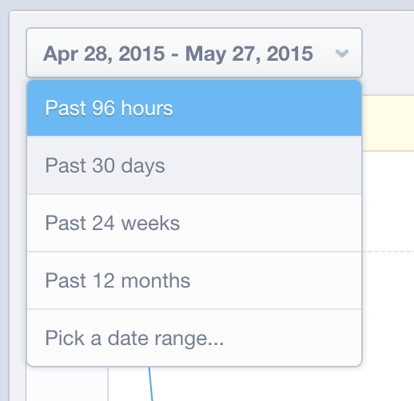

# 中的資料驗證 `Mixpanel`

當 [!DNL MBI] 第一次連線至 [!DNL Mixpanel] 資料，您的客戶經理或分析師可能會要求您提供來自Mixpanel的資料匯出，以供驗證之用。 這可讓您確認已同步所有可直接在記憶體取的相同資料 [!DNL Mixpanel].

## 資料匯出程式： `Events`

1. 造訪您的 `Segmentation` 區段和檢視 `Your Top Events`.

   

1. 選擇 `Past 96 Hours` 時間範圍

   

1. 捲動至報表的右下部，然後匯出 `.csv` 檔案：

   

1. 傳送 `.csv` 檔案傳送給您正在進行此驗證程式的客戶經理或分析師。
