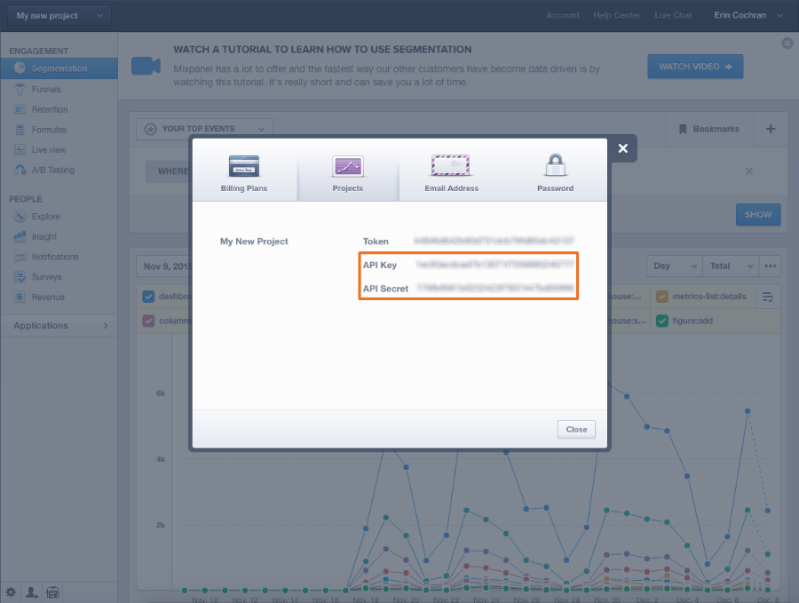

# Connect [!DNL Mixpanel]

>[!NOTE]
>
>需要 [管理員許可權](../../../administrator/user-management/user-management.md).

替換為 [!DNL Mixpanel]，您可以分析使用者如何導覽及使用您的網站和應用程式。 仔細檢視使用者行為資料可制定更聰明的設計和開發決策，也就是說整體產品更好。 正在連線 [!DNL Mixpanel] 至 [!DNL Commerce Intelligence] 可讓您分析使用者的行為以及該行為如何轉化為收入。

正在連線您的 [!DNL Mixpanel] 資料目標 [!DNL Commerce Intelligence] 簡單的三個步驟程式：

1. [開啟 [!DNL Mixpanel] 認證頁面於 [!DNL Commerce Intelligence]](#stepone)
1. [擷取您的 [!DNL Mixpanel] API認證](#steptwo)
1. [輸入您的 [!DNL Mixpanel] 中的API認證 [!DNL Commerce Intelligence]](#stepthree)

若要完成此程式，您需要開啟兩個瀏覽器視窗或標籤，一個用於 [!DNL Commerce Intelligence] 另一個則供您使用 [!DNL Mixpanel] 帳戶。

## 開啟 [!DNL Mixpanel] 證明資料頁面 {#stepone}

開始使用：

1. 前往 `Connections` 頁面於 **[!DNL Manage Data** > **Connections]**.

1. 按一下 **[!UICONTROL Add a New Source]**，位於熒幕右側 `Data Sources` 表格。

1. 按一下 [!DNL Mixpanel] 圖示和認證頁面開啟。

暫時保持此頁面開啟，並切換至瀏覽器視窗，使用 [!DNL Mixpanel] 帳戶。

## 正在擷取 [!DNL Mixpanel] API認證 {#steptwo}

如果您尚未登入 [!DNL Mixpanel] 帳號之前，請先執行此動作，然後執行下列動作：

1. 按一下 **[!UICONTROL Account]** 右上角。

1. 在顯示的對話方塊中，按一下 **[!UICONTROL Projects]**.

1. 顯示您的API認證：

請保持此開啟，您需要它來結束此工作。

## 輸入您的 [!DNL Mixpanel] 中的API認證 [!DNL Commerce Intelligence] {#stepthree}

1. 複製 `API Key` 和 `Secret` 到 [!DNL Mixpanel] 認證頁面於 [!DNL Commerce Intelligence].
1. 按一下 **[!UICONTROL Connect to Mixpanel]** 以完成設定。

如果連線成功， _成功！_ 訊息會顯示在頁面頂端。

### 相關

* [預期 [!DNL Mixpanel] 資料](../integrations/mixpanel-data.md)
* [重新驗證整合](https://experienceleague.adobe.com/docs/commerce-knowledge-base/kb/how-to/mbi-reauthenticating-integrations.html)
