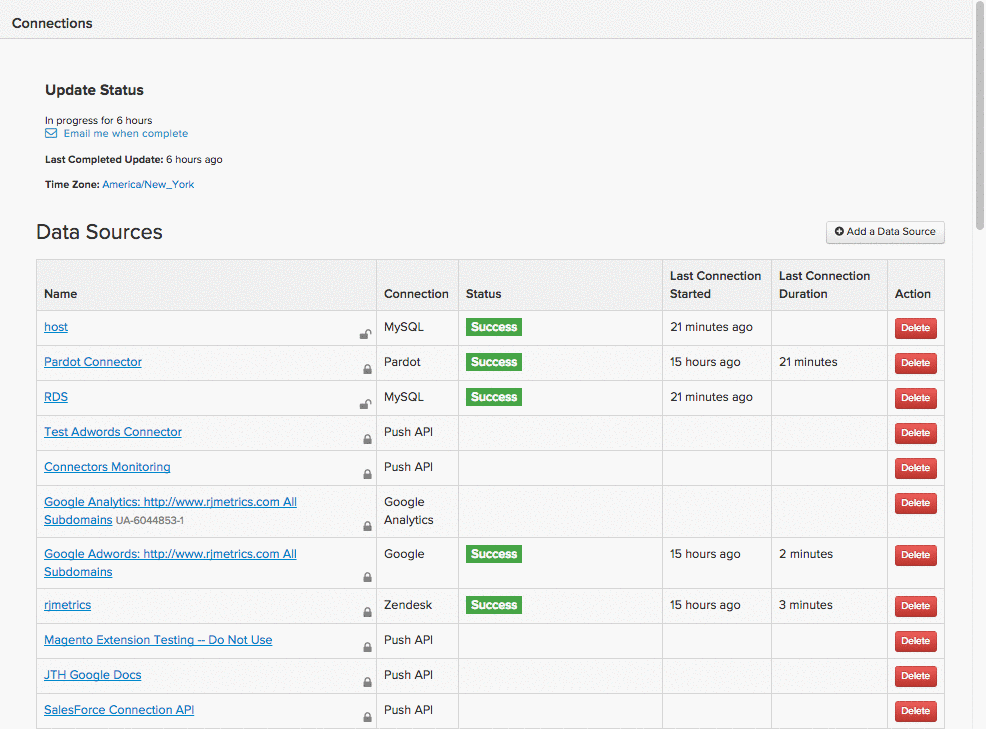
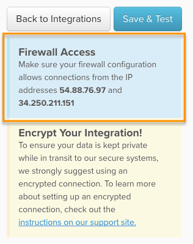

# 透過SSH通道連線[!DNL MongoDB]

若要透過SSH通道將您的[!DNL MongoDB]資料庫連線至[!DNL Commerce Intelligence]，您必須執行下列幾項作業：

1. [擷取 [!DNL Commerce Intelligence] 公開金鑰](#retrieve)
1. [允許存取 [!DNL Commerce Intelligence] IP位址](#allowlist)
1. [建立Commerce Intelligence的Linux使用者](#linux)
1. [建立Commerce Intelligence的 [!DNL MongoDB] 使用者](#mongodb)
1. [在 [!DNL Commerce Intelligence]中輸入連線和使用者資訊](#finish)

>[!NOTE]
>
>由於此設定的技術性質，Adobe建議您找開發人員重複使用，協助解決您以前未完成此設定的問題。

## 正在擷取[!DNL Commerce Intelligence]公開金鑰 {#retrieve}

`public key`用於授權[!DNL Commerce Intelligence] `Linux`使用者。 下一節將引導您建立使用者和匯入金鑰。

1. 移至&#x200B;**[!UICONTROL Data** > **Connections]**&#x200B;並按一下&#x200B;**[!UICONTROL Add New Data Source]**。
1. 按一下[!DNL MONGODB]圖示。
1. 在[!DNL MongoDB]認證頁面開啟後，將`Encrypted`切換變更為`Yes`。 這會顯示SSH設定表單。
1. `public key`位於此表單下方。

在本教學課程中保持此頁面開啟 — 您需要在下一節及結尾使用它。

如果您有點遺失，以下說明如何瀏覽[!DNL Commerce Intelligence]以擷取金鑰：

<!--{:.zoom}-->

## 允許存取[!DNL Commerce Intelligence] IP位址 {#allowlist}

為了連線成功，您必須將防火牆設定為允許從IP位址存取。 它們是`54.88.76.97`和`34.250.211.151`，但它也位於[!DNL MongoDB]認證頁面上：



## 正在建立`Linux`的[!DNL Commerce Intelligence]使用者 {#linux}

>[!IMPORTANT]
>
>如果與伺服器相關聯的`sshd_config`檔案未設定為預設選項，則只有特定使用者具有伺服器存取權 — 這會防止成功連線到[!DNL Commerce Intelligence]。 在這些情況下，必須執行`AllowUsers`之類的命令，才能允許`rjmetric`使用者存取伺服器。

只要包含即時（或經常更新）資料，這可以是生產或次要機器。 只要該使用者保留連線至[!DNL MongoDB]伺服器的權利，您就可以依您喜歡的方式限制該使用者。

若要新增使用者，請以root身分在`Linux`伺服器上執行下列命令：

```bash
    adduser rjmetric -p
    mkdir /home/rjmetric
    mkdir /home/rjmetric/.ssh
```

還記得在第一節中擷取的`public key`嗎？ 若要確保使用者可以存取資料庫，您必須將金鑰匯入`authorized_keys`。 將整個金鑰複製到`authorized_keys`檔案，如下所示：

```bash
    touch /home/rjmetric/.ssh/authorized_keys
    "< PASTE KEY HERE >" >> /home/rjmetric/.ssh/authorized_keys
```

若要完成建立使用者，請變更/home/rjmetric目錄的許可權，以允許透過SSH存取：

```bash
    chown -R rjmetric:rjmetric /home/rjmetric
    chmod -R 700 /home/rjmetric/.ssh
```

## 正在建立[!DNL Commerce Intelligence] [!DNL MongoDB]使用者 {#mongodb}

[!DNL MongoDB]伺服器有兩個執行模式 — [一個具有「驗證」選項](#auth) `(mongod -- auth)`，另一個沒有，[是預設值](#default)。 建立[!DNL MongoDB]使用者的步驟依伺服器使用的模式而異。 繼續之前，請務必驗證模式。

### 如果您的伺服器使用`Auth`選項： {#auth}

連線到多個資料庫時，您可以以管理員使用者身分登入[!DNL MongoDB]並執行下列命令來新增使用者。

>[!NOTE]
>
>若要檢視所有可用的資料庫，[!DNL Commerce Intelligence]使用者需要執行`listDatabases.`的許可權

這個命令授予[!DNL Commerce Intelligence]使用者存取權`to all databases`：

```bash
    use admin
    db.createUser('rjmetric', '< secure password here >', true)
```

使用此命令授予[!DNL Commerce Intelligence]使用者存取權`to a single database`：

```bash
    use < database name >
    db.createUser('rjmetric', '< secure password here >', true)
```

這會列印如下所示的回應：

```bash
    {
    "id": ObjectId("< some object id here >"),
    "user": "rjmetric",
    "readOnly": true,
    "pwd": "< some hash here >"
    }
```

### 如果您的伺服器使用預設選項 {#default}

如果您的伺服器未使用`auth`模式，即使沒有使用者名稱和密碼，也可以存取您的[!DNL MongoDB]伺服器。 不過，您應該確保`mongodb.conf`檔案`(/etc/mongodb.conf)`有下列行 — 如果沒有，請在新增伺服器後重新啟動伺服器。

```bash
    bind_ip = 127.0.0.1
    noauth = true
```

若要將[!DNL MongoDB]伺服器繫結到不同的位址，請在下一個步驟中相應地調整資料庫主機名稱。

## 正在將連線和使用者資訊輸入[!DNL Commerce Intelligence] {#finish}

若要完成工作，您必須在[!DNL Commerce Intelligence]中輸入連線和使用者資訊。 您是否讓[!DNL MongoDB]認證頁面保持開啟狀態？ 如果沒有，請移至&#x200B;**[!UICONTROL Data > Connections]**&#x200B;並按一下&#x200B;**[!UICONTROL Add New Data Source]**，然後按一下[!DNL MongoDB]圖示。 別忘了將`Encrypted`切換變更為`Yes`。

在此頁面中輸入下列資訊，從`Database Connection`區段開始：

* `Host`： `127.0.0.1`
* `Username`： [!DNL Commerce Intelligence] [!DNL MongoDB]使用者名稱（應為`rjmetric`）
* `Password`： [!DNL Commerce Intelligence] [!DNL MongoDB]密碼
* `Port`：伺服器上的MongoDB連線埠（預設為`27017`）
* `Database Name` （選擇性）：如果您只允許存取一個資料庫，請在此處指定該資料庫的名稱。

在`SSH Connection`區段下：

* `Remote Address`：您要SSH連線的伺服器IP位址或主機名稱
* `Username`： [!DNL Commerce Intelligence] Linux (SSH)使用者名稱（應為rjmetric）
* `SSH Port`：伺服器上的SSH連線埠（預設為22）

完成時，按一下&#x200B;**[!UICONTROL Save Test]**&#x200B;以完成設定。

### 相關

* [正在重新驗證整合](https://experienceleague.adobe.com/docs/commerce-knowledge-base/kb/how-to/mbi-reauthenticating-integrations.html?lang=zh-Hant)
