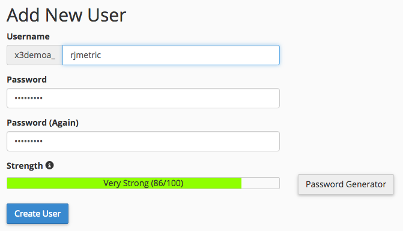

# 連線 [!DNL MySQL] via [!DNL cPanel]

* [建立 [!DNL Commerce Intelligence] [!DNL MySQL] 位使用者在 [!DNL cPanel]](#cpanel)
* [在中輸入連線和使用者資訊 [!DNL Commerce Intelligence]](#finish)

## 跳轉到

* [[!DNL MySQL] 透過SSH通道](../integrations/mysql-via-ssh-tunnel.md)
* [[!DNL MySQL] 透過直接連線](../integrations/mysql-via-a-direct-connection.md)

>[!IMPORTANT]
>
>[!DNL Adobe] 建議您使用SSH或其他加密形式來保護您的資料！ 如果這不是選項，您仍然可以直接連線 [!DNL Commerce Intelligence] 使用本主題中的指示至您的資料庫。

本主題將引導您瞭解如何直接連線 [!DNL MySQL] 資料庫至 [!DNL Commerce Intelligence] 使用 [!DNL cPanel]. 此程式也可用於連線 [!DNL Adobe Commerce] 以及任何其他以MySQL為基礎的電子商務資料庫 [!DNL Commerce Intelligence].

1. 建立 [!DNL Commerce Intelligence] [!DNL MySQL] 位使用者在 [!DNL cPanel]
1. 在中輸入連線和使用者資訊 [!DNL Commerce Intelligence]

開始使用.

## 建立 [!DNL Commerce Intelligence] [!DNL MySQL] 位使用者在 [!DNL cPanel] {#cpanel}

1. 登入 [!DNL cPanel] 透過您的託管提供者。
1. 按一下 **[!UICONTROL [!DNL MySQL] Databases]**，位於 `Database` 區段。
1. 向下捲動至 `Add New User` 部分和建立使用者 [!DNL Commerce Intelligence]：

   

1. 按一下 **[!UICONTROL Create User]**.
1. 現在您已建立使用者，您需要將其與資料庫建立關聯。 返回 `Add New User` 區段 — 檢視設定 `Add User to Database?` 這正是您所需要的。
1. 在 `User` 在此區段的下拉式清單中，選取您建立的使用者。
1. 在 `Database` 在此段落的下拉式清單中，選取您要連線的資料庫 [!DNL Commerce Intelligence].
1. 按一下 **[!UICONTROL Add]**.
1. 當許可權檢查清單出現時，勾選旁邊的方塊 `SELECT`  — 僅此而已 [!DNL Commerce Intelligence] 需要連線到您的資料庫。

## 將連線和使用者資訊輸入到 [!DNL Commerce Intelligence] {#finish}

若要完成工作，您必須在中輸入連線和使用者資訊 [!DNL Commerce Intelligence]. 您是否離開 [!DNL MySQL] 憑證頁面是否開啟？ 如果沒有，請前往 **[!UICONTROL Manage Data** > **Connections]** 並按一下 **[!UICONTROL Add New Data Source]**，然後 [!DNL MySQL] 圖示。

在此頁面中輸入以下資訊於 `Database Connection` 區段：

* `Username`：的使用者名稱 [!DNL Commerce Intelligence] [!DNL MySQL] 使用者
* `Password`：的密碼 [!DNL Commerce Intelligence] [!DNL MySQL] 使用者
* `Port`：伺服器上的MySQL連線埠(`3306` 預設值)
* `Host`：的公用位址 `MySQL` 伺服器 [!DNL Commerce Intelligence] 連線到。 這通常是您用來登入的URL `[!DNL cPanel]`.

如果您使用 [`SSH tunnel`](../integrations/mysql-via-ssh-tunnel.md)，您必須輸入加密資訊。 設定 `Encrypted` 切換至 `Yes` 以顯示表單。

* `Connection Type`：將此項設為 `SSH Tunnel`
* `Remote Address`：伺服器的IP位址或主機名稱 [!DNL Commerce Intelligence] 將通道至
* `Username`：的使用者名稱 [!DNL Commerce Intelligence] `SSH (Linux)` 使用者，請參閱 [指示](../../../data-analyst/importing-data/integrations/mysql-via-ssh-tunnel.md) 操作說明（如果尚未進行）
* `SSH Port`：伺服器上的SSH連線埠(`22` 預設值)

完成後，按一下 **[!UICONTROL Save & Test]** 以完成設定。

## 相關：

* [重新驗證整合](https://experienceleague.adobe.com/docs/commerce-knowledge-base/kb/how-to/mbi-reauthenticating-integrations.html)
