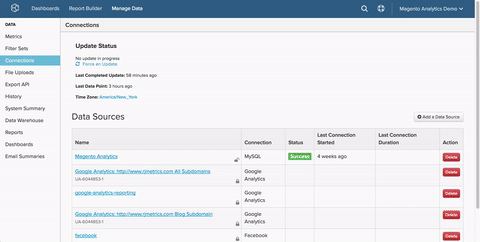

# 透過[!DNL PostgreSQL]連線[!DNL SSH Tunnel]

若要透過[!DNL PostgreSQL]將您的[!DNL Commerce Intelligence]資料庫連線至`SSH tunnel`，您必須執行下列幾個動作：

1. [擷取 [!DNL Commerce Intelligence] 公開金鑰](#retrieve)
1. [允許存取 [!DNL Commerce Intelligence] IP位址](#allowlist)
1. [為 [!DNL Linux] 建立 [!DNL Commerce Intelligence]使用者](#linux)
1. [為 [!DNL PostgreSQL] 建立 [!DNL Commerce Intelligence]使用者](#postgres)
1. [在 [!DNL Commerce Intelligence]中輸入連線和使用者資訊](#finish)

## 正在擷取[!DNL Commerce Intelligence] [!DNL public key] {#retrieve}

`public key`用於授權[!DNL Commerce Intelligence] [!DNL Linux]使用者。 現在，您將建立使用者並匯入金鑰。

1. 移至&#x200B;**[!UICONTROL Manage Data** > **Connections]**&#x200B;並按一下&#x200B;**[!UICONTROL Add a Data Source]**。
1. 按一下[!DNL PostgreSQL]圖示。
1. 在`PostgreSQL credentials`頁面開啟後，將`Encrypted`切換設定為`Yes`。 這會顯示`SSH`設定表單。
1. `public key`位於此表單下方。

在本教學課程中保持此頁面開啟 — 您需要在下一節及結尾使用它。

以下示範如何瀏覽[!DNL Commerce Intelligence]以擷取金鑰：



## 允許存取[!DNL Commerce Intelligence] IP位址 {#allowlist}

為了連線成功，您必須將防火牆設定為允許從IP位址存取。 它是`54.88.76.97/32`，但它也在`PostgreSQL`認證頁面上。 請參閱上方GIF中的藍色方塊。

## 正在建立[!DNL Linux]的[!DNL Commerce Intelligence]使用者 {#linux}

只要包含即時（或經常更新）資料，這可以是生產或次要機器。 您可以用任何您喜歡的方式[限制此使用者](../../../administrator/account-management/restrict-db-access.md)，只要它保留連線至[!DNL PostgreSQL]伺服器的權利。

1. 若要新增使用者，請以root身分在[!DNL Linux]伺服器上執行下列命令：

```bash
        adduser rjmetric -p<password>
        mkdir /home/rjmetric
        mkdir /home/rjmetric/.ssh
```

1. 還記得在第一節中擷取的`public key`嗎？ 若要確保使用者可以存取資料庫，您必須將金鑰匯入`authorized\_keys`。

   將整個金鑰複製到`authorized\_keys`檔案，如下所示：

```bash
        touch /home/rjmetric/.ssh/authorized_keys
        "<PASTE KEY HERE>" >> /home/rjmetric/.ssh/authorized_keys
```

1. 若要完成建立使用者，請變更`/home/rjmetric`目錄上的許可權，以允許透過`SSH`存取：

```bash
        chown -R rjmetric:rjmetric /home/rjmetric
        chmod -R 700 /home/rjmetric/.ssh
```

>[!IMPORTANT]
>
>如果與伺服器相關聯的`sshd\_config`檔案未設定為預設選項，則只有特定使用者具有伺服器存取權 — 這會防止成功連線到[!DNL Commerce Intelligence]。 在這些情況下，必須執行`AllowUsers`之類的命令，才能允許rjmetric使用者存取伺服器。

## 正在建立[!DNL Commerce Intelligence] [!DNL Postgres]使用者 {#postgres}

您的組織可能需要不同的流程，但建立此使用者最簡單的方法是在以有權授予許可權的使用者身分登入Postgres時執行以下查詢。 使用者也應擁有[!DNL Commerce Intelligence]被授予存取權的結構描述。

```sql
    GRANT CONNECT ON DATABASE <database name> TO rjmetric WITH PASSWORD <secure password>;GRANT USAGE ON SCHEMA <schema name> TO rjmetric;GRANT SELECT ON ALL TABLES IN SCHEMA <schema name> TO rjmetric;ALTER DEFAULT PRIVILEGES IN SCHEMA <schema name> GRANT SELECT ON TABLES TO rjmetric;
```

以您自己的安全密碼取代`secure password`，此密碼可能與SSH密碼不同。 此外，請確定您用資料庫中適當的名稱取代`database name`和`schema name`。

如果要連線多個資料庫或結構描述，請視需要重複此程式。

## 正在將連線和使用者資訊輸入[!DNL Commerce Intelligence] {#finish}

若要完成工作，您必須在[!DNL Commerce Intelligence]中輸入連線和使用者資訊。 您是否讓[!DNL PostgreSQL]認證頁面保持開啟狀態？ 如果沒有，請移至&#x200B;**[!UICONTROL Manage Data > Connections]**&#x200B;並按一下&#x200B;**[!UICONTROL Add a Data Source]**，然後按一下[!DNL PostgreSQL]圖示。 別忘了將`Encrypted`切換設為`Yes`。

在此頁面中輸入下列資訊，從`Database Connection`區段開始：

* `Username`： RJMetrics Postgres使用者名稱（應為rjmetric）
* `Password`： RJMetrics Postgres密碼
* `Port`：伺服器上的PostgreSQL連線埠（預設為5432）
* `Host`： 127.0.0.1

在`SSH Connection`下：

* `Remote Address`：您要SSH連線的伺服器IP位址或主機名稱
* `Username`：您的SSH登入名稱（應為rjmetric）
* `SSH Port`：伺服器上的SSH連線埠（預設為22）

完成時，按一下&#x200B;**儲存並測試**&#x200B;以完成設定。

### 相關

* [正在重新驗證整合](https://experienceleague.adobe.com/docs/commerce-knowledge-base/kb/how-to/mbi-reauthenticating-integrations.html?lang=zh-Hant)
