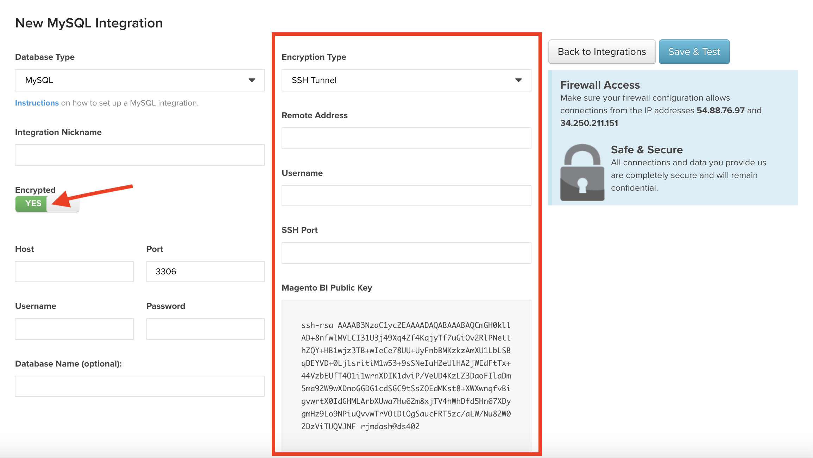

# 新增圖表至儀表板

現有圖表可以使用新增到儀表板 [!UICONTROL Add Report] 函式，位於畫面的右上角區域。 相同圖表可新增至多個儀表板，這表示如果圖表經過編輯，則含有此圖表的所有儀表板都會反映這項變更。

>[!NOTE]
>
>按一下 **[!UICONTROL Add Report]** 與按一下不同 **[!UICONTROL Save As]** 在圖表編輯器中。 `Add Report` 只是將圖表新增到儀表板，而 `Save As` 建立現有圖表的版本。

## 新增圖表

1. 按一下 **[!UICONTROL Add Report]**. 現有圖表清單隨即顯示。

1. 搜尋或按一下您要新增的圖表名稱。

1. 圖表會新增至控制面板。

範例：

