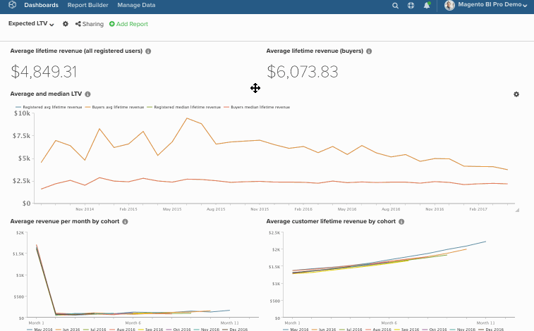
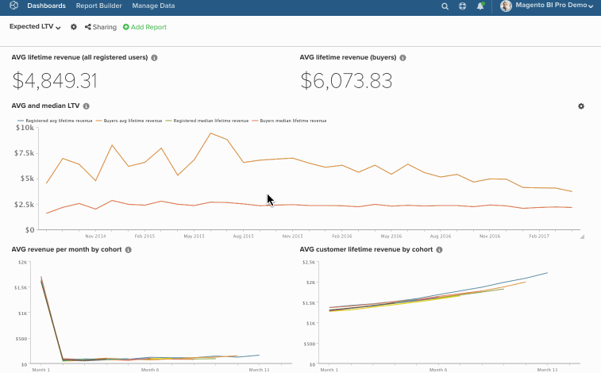

# 在儀表板中大量編輯圖表

大量編輯功能可讓您輕鬆變更儀表板中的圖表名稱和日期。 例如，您希望特定控制面板上的所有圖表每月參考單一商店並報告，而不是每季報告。 與其手動變更所有內容，不如讓 `bulk-editing` 功能完成工作。 在本主題中，您將瞭解如何使用：

* [此 [!DNL Find/Replace] 功能](#findreplace)

* [此 [!DNL Prepend Name] 功能](#prepend)

* [此 [!DNL Change Dates] 功能](#dates)

話雖如此，請考慮以下事項： *這些變更需要永久保留嗎？* 如果沒有，請考慮複製控制面板，然後變更新控制面板中的日期。 這可讓您保留原始儀表板，同時仍可進行所需的變更。

>[!NOTE]
>
>如果您變更許多報表，更新程式可能需要一點時間。

## 使用 [!DNL Find/Replace] {#findreplace}

1. 按一下齒輪()圖示，然後按一下「 」 [!UICONTROL Bulk Edit Reports] 視窗。

1. 按一下 **[!UICONTROL Chart Title Find and Replace]** 在快顯視窗中。

1. 在 `Chart Title Find` 欄位，輸入您要尋找的字詞或字元。

1. 在 `Replace With` 欄位，輸入應該取代 `Find` 欄位。

1. 按一下 **[!UICONTROL Update Reports]**.

範例：

## 前置詞 `Chart Names` {#prepend}

1. 按一下齒輪()圖示，然後按一下「 」 [!UICONTROL Bulk Edit Reports] 視窗。

1. 按一下 **[!UICONTROL Prepend Report Names]** 在快顯視窗中。

1. 輸入您要在圖表前加上的單字或字元。

1. 按一下 **[!UICONTROL Update Reports]**.

範例：

## 變更 `Dates` {#dates}

1. 按一下齒輪()圖示加以選取，然後選取 [!UICONTROL Bulk Edit Reports] 視窗。

1. 按一下 **[!UICONTROL Change Dates]** 在快顯視窗中。

1. 設定新的 `Start/End Date` 和 `Time Interval`. 您也可以保留這些欄位不變。

1. 按一下 **[!UICONTROL Update Reports]**.

範例：

