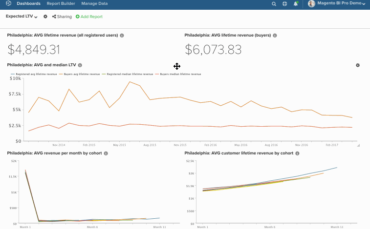

# 在儀表板中大量編輯圖表

大量編輯功能可讓您輕鬆變更儀表板中的圖表名稱和日期。 例如，您希望特定控制面板上的所有圖表每月參照單一商店並報告，而非每季報告。 讓`bulk-editing`功能完成工作，而不用手動變更所有專案。 在本主題中，您將瞭解如何使用：

* [ [!DNL Find/Replace] 功能](#findreplace)

* [ [!DNL Prepend Name] 功能](#prepend)

* [ [!DNL Change Dates] 功能](#dates)

話雖如此，請考慮此事項 — *這些變更需要永久嗎？*&#x200B;如果沒有，請考慮複製儀表板，然後變更新儀表板中的日期。 這可讓您保留原始儀表板，同時仍可進行所需的變更。

>[!NOTE]
>
>如果您變更許多報告，更新程式可能需要一點時間。

## 使用[!DNL Find/Replace] {#findreplace}

1. 按一下儀表板名稱旁的齒輪（）圖示，然後按一下[!UICONTROL Bulk Edit Reports]視窗。

1. 在快顯視窗中按一下&#x200B;**[!UICONTROL Chart Title Find and Replace]**。

1. 在`Chart Title Find`欄位中，輸入您要尋找的單字或字元。

1. 在`Replace With`欄位中，輸入應該取代`Find`欄位中的文字或字元。

1. 按一下&#x200B;**[!UICONTROL Update Reports]**。

範例：

## 前置詞`Chart Names` {#prepend}

1. 按一下儀表板名稱旁的齒輪（）圖示，然後按一下[!UICONTROL Bulk Edit Reports]視窗。

1. 在快顯視窗中按一下&#x200B;**[!UICONTROL Prepend Report Names]**。

1. 輸入您要在圖表前加上的單字或字元。

1. 按一下&#x200B;**[!UICONTROL Update Reports]**。

範例：

## 正在變更`Dates` {#dates}

1. 按一下儀表板名稱旁的齒輪（）圖示，然後選取[!UICONTROL Bulk Edit Reports]視窗。

1. 按一下彈出式視窗中的&#x200B;**[!UICONTROL Change Dates]**。

1. 設定新的`Start/End Date`和`Time Interval`。 您也可以保留這些欄位不變。

1. 按一下&#x200B;**[!UICONTROL Update Reports]**。

範例：

