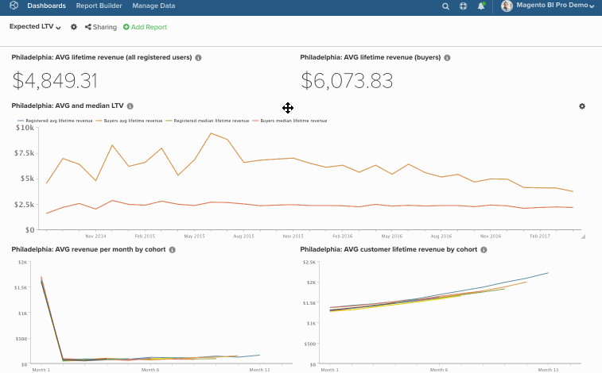

# 在儀表板中批量編輯圖表

批量編輯功能使您能夠輕鬆地更改儀表板中的圖表名稱和日期。 例如，您希望特定儀表板上的所有圖表都引用單個儲存並按月報告，而不是按季度報告。 不要手動更改所有內容， `bulk-editing` 功能完成工作。 在本主題中，您將學習如何使用：

* [的 [!DNL Find/Replace] 功能](#findreplace)

* [的 [!DNL Prepend Name] 功能](#prepend)

* [的 [!DNL Change Dates] 功能](#dates)

話雖如此，請考慮一下。 *這些變化需要永久性嗎？* 如果沒有，請考慮克隆儀表板，然後更改新儀表板中的日期。 這樣，您就可以保留原始儀表板，同時仍然進行所需的更改。

>[!NOTE]
>
>如果您正在更改大量報告，更新過程可能需要一些時間。

## 使用 [!DNL Find/Replace] {#findreplace}

1. 按一下齒輪()表徵圖，然後 [!UICONTROL Bulk Edit Reports] 的子菜單。

1. 按一下 **[!UICONTROL Chart Title Find and Replace]** 的子菜單。

1. 在 `Chart Title Find` 的子菜單。

1. 在 `Replace With` 欄位，鍵入應替換 `Find` 的子菜單。

1. 按一下 **[!UICONTROL Update Reports]**。

示例：

## 預掛起 `Chart Names` {#prepend}

1. 按一下齒輪()表徵圖，然後 [!UICONTROL Bulk Edit Reports] 的子菜單。

1. 按一下 **[!UICONTROL Prepend Report Names]** 的子菜單。

1. 鍵入要用來預置圖表的字詞。

1. 按一下 **[!UICONTROL Update Reports]**。

示例：

## 更改 `Dates` {#dates}

1. 按一下齒輪()表徵圖，然後選擇 [!UICONTROL Bulk Edit Reports] 的子菜單。

1. 按一下 **[!UICONTROL Change Dates]** 在彈出窗口中。

1. 設定新 `Start/End Date` 和 `Time Interval`。 也可以保持這些欄位不變。

1. 按一下 **[!UICONTROL Update Reports]**。

示例：

