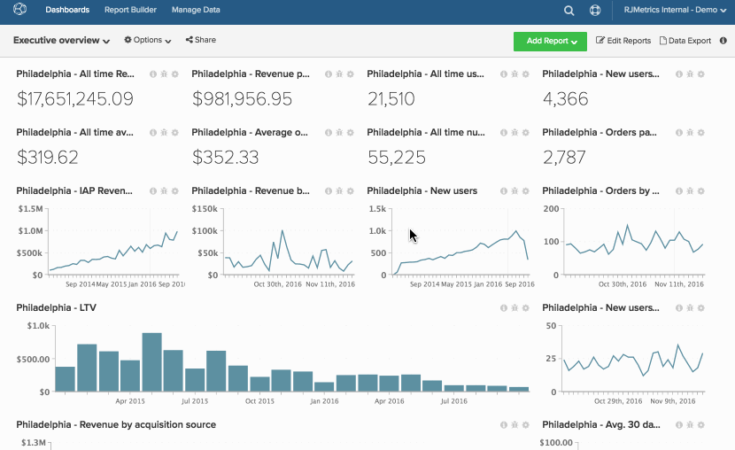

# 原地複製控制面板

複製控制面板可讓您將控制面板中的所有報告複製到新的控制面板中。

如果您想要重新建立現有的一組圖表，但變更視角（例如不同的資料檢視、不同的市場、不同的網站或商店），此功能會很有用。 複製控制面板後，您可以編輯每個新圖表以變更其度量、資料檢視、篩選或分組依據。

1. 若要複製控制面板，請按一下畫面頂端的&#x200B;**[!UICONTROL Options]**。

1. 在下拉式清單中，按一下&#x200B;**[!UICONTROL Save As]**。

1. 出現提示時，請輸入`New Dashboard Name`。 Adobe會推薦可讓您一目瞭然地知道儀表板中包含哪些資訊的名稱。

   例如，您正在複製名為`Customer Activity`的控制面板。 此儀表板包含您費城地點的客戶活動資訊，但現在您想要為紐約市地點建立儀表板。 此儀表板可命名為`New York City - Customer Activity`。

1. 使用`Chart Title Find`和`Chart Title Replace`欄位來尋找標題中包含`Philadelphia`的所有圖表，並將其取代為`New York City`。

   如果您未在這些欄位中輸入任何值，系統會自動將`(2)`附加至新控制面板中所有圖表標題的末尾。

1. 按一下&#x200B;**[!UICONTROL Save]**&#x200B;以複製儀表板。

範例：

