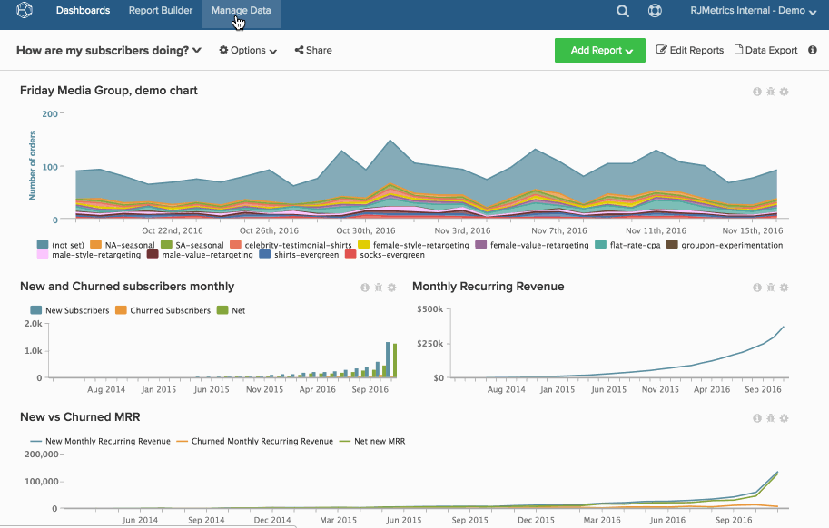

# 永久刪除圖表

即使你 [從控制面板中移除圖表](../../data-user/dashboards/remove-charts-dashboard.md)，您的 [!DNL MBI] 帳戶。

要永久刪除圖表，請執行以下操作：

1. 按一下 **[!UICONTROL Account Setting]** 欄。

1. 按一下 **[!UICONTROL Charts]**.

1. 您可以刪除的圖表（根據使用者權限和圖表所有權）會顯示在畫面右側。

1. 按一下您要刪除的圖表線旁的核取方塊。

1. 按一下 **[!UICONTROL Delete Selected]**.

   >[!NOTE]
   >
   >如果控制面板或電子郵件摘要中使用圖表，則會顯示通知。 若要繼續，您必須確認刪除，然後按一下 **[!UICONTROL Force Deletion]**.

範例：

<!--{: width="630" height="402"}-->
