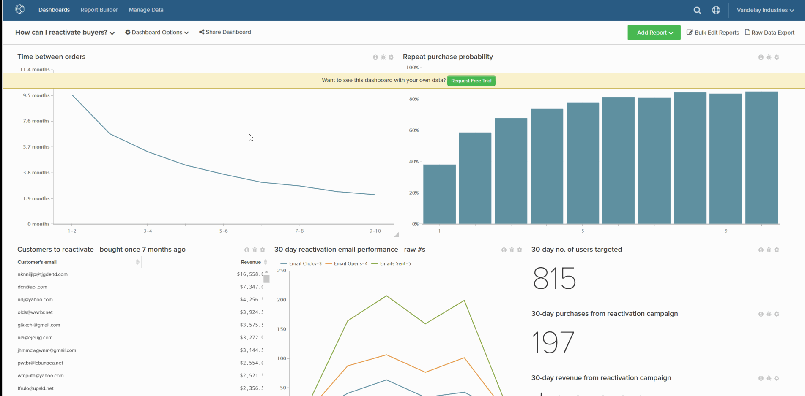
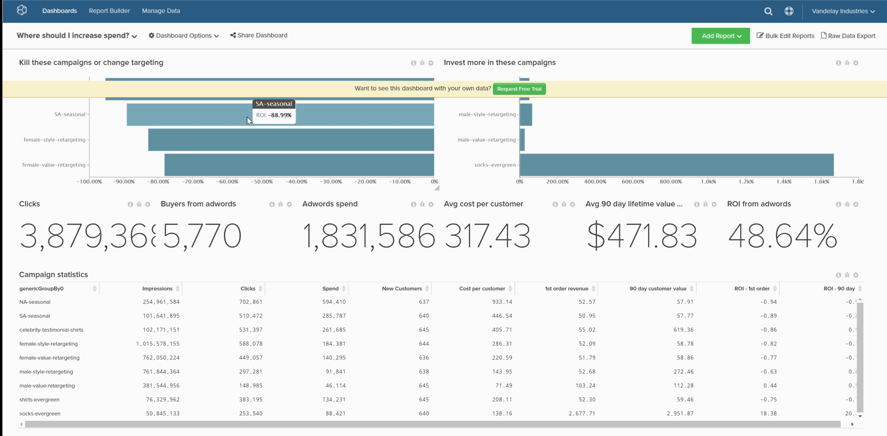

# 刪除儀表板

如果希望控制板清單不會變得太雜亂，則可以刪除不再需要的儀表板。 這可以通過以下兩種方式之一來實現：

1. [通過 `Account Settings` 頁](#account)  — 此方法需要 [管理權限](../../administrator/user-management/user-management.md)。

1. [通過 `Dashboard Options` 菜單](#do)  — 此方法要求您擁有儀表板或 `Edit` 權限。

## 通過 `Account Settings` 頁 {#account}

1. 按一下 **[!UICONTROL Account Settings** > **Dashboards]**。

1. 在儀表板清單中，按一下要刪除的儀表板。

1. 按一下 **[!UICONTROL Delete Dashboard]**。

示例：

<!--{: width="703" height="346"}-->

## 通過 `Dashboard Options` 菜單 {#do}

1. 按一下 **[!UICONTROL Dashboard Options]** 按鈕。

1. 在下拉清單中，按一下 **[!UICONTROL Delete]**。

1. 提示確認時，按一下 **[!UICONTROL Delete]**。

示例：

<!--{: width="703" height="347"}-->
