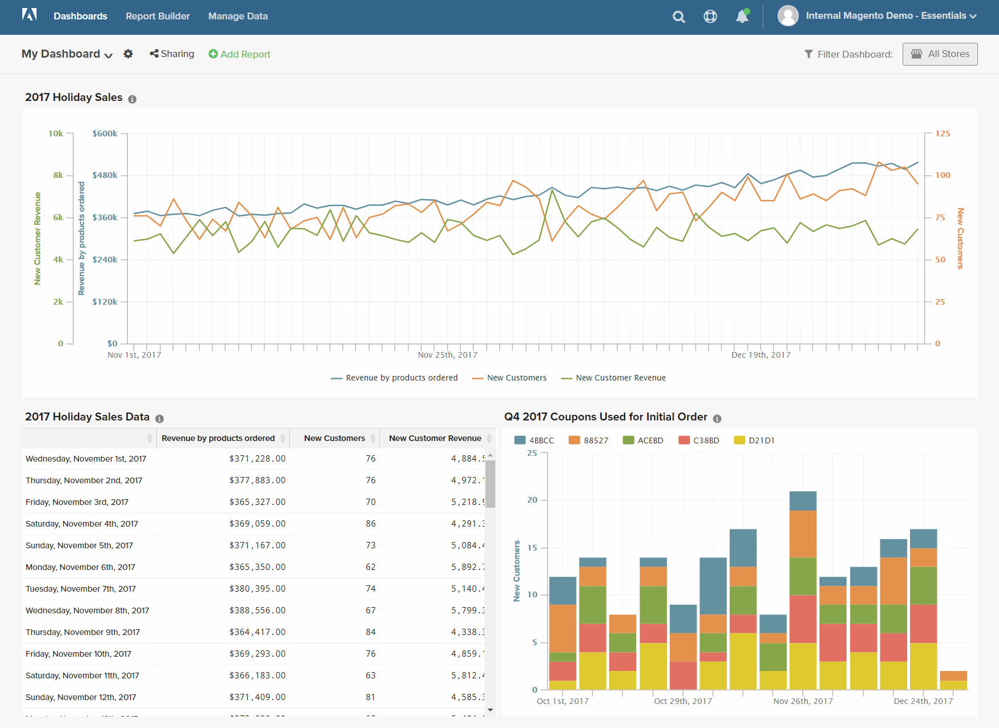
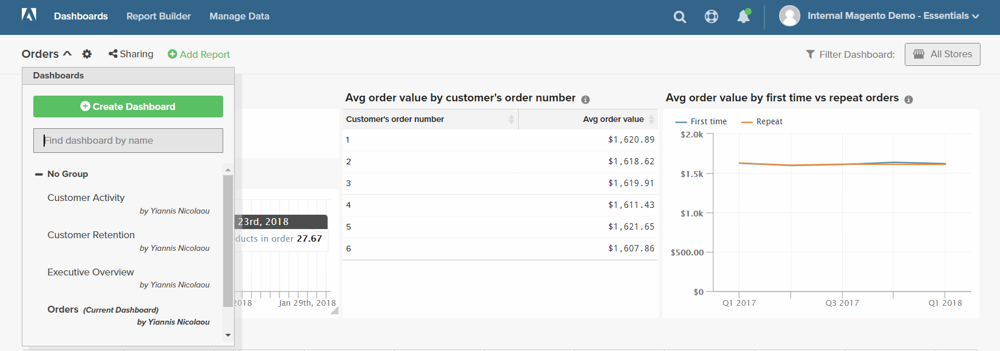
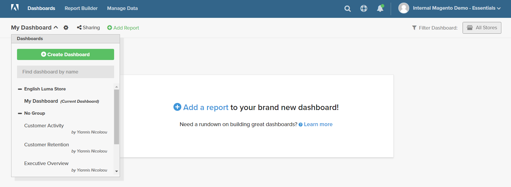
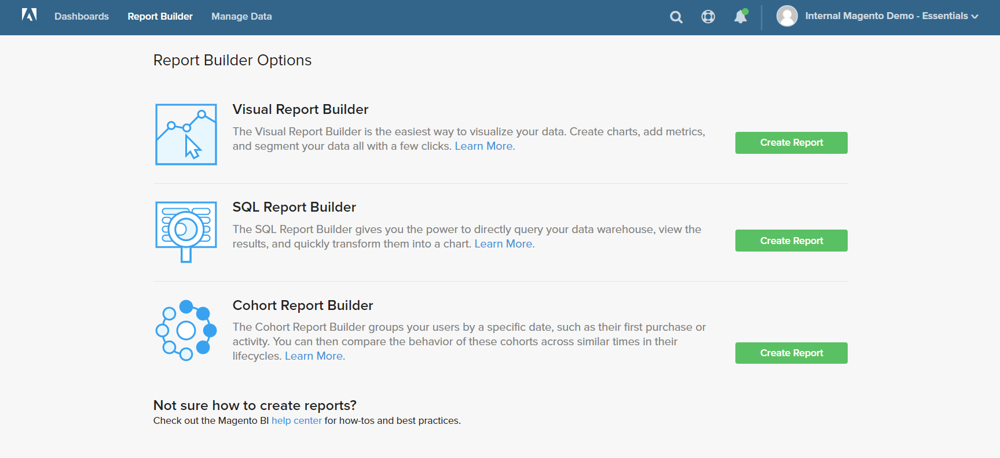
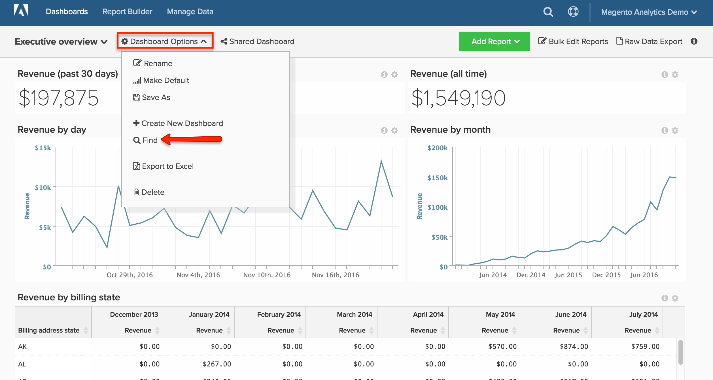

# 控制面板

[!DNL MBI] 控制面板可讓您快速檢視商店的績效和銷售活動。 個別控制面板可與其他使用者共用，並組織成邏輯群組。 您也可以為其他使用者設定不同的權限層級。

您可以輕鬆建立新報表、將其新增至控制面板，以及將資料匯出至Excel。 可以調整圖表和報表的大小，並將其拖放到控制面板上的位置。

## 建立控制面板 {#createdash}

控制面板基本上是可共用的主題貯體，供您在Report Builder中建立的分析之用。 這是您如何鼓勵您的團隊在整個組織中共同合作及維護單一真相來源的方式。

*如果您是管理員或標準使用者*，您可以按一下 `Dashboard Options` 下拉式清單，選擇 `Create New dashboard`.

您建立的控制面板的外觀完全由您決定。 您可以視需要和工作流程，隨意排列控制面板中的元素並調整其大小。

### 建立新控制面板

1. 在功能表上，按一下 **[!UICONTROL Dashboards]**.

1. 預設控制面板的名稱會顯示在控制面板標題的左上角。 按一下向下箭頭()以顯示可用選項。

   

1. 按一下 **[!UICONTROL Create Dashboard]**. 然後，執行下列動作：

   * 輸入 `Name` 的URL。

   * 建立新 `Group` 在控制面板中，輸入群組名稱。

      例如，如果您的商務安裝有多個商店檢視，則可為每個商店檢視建立群組。

   * 按一下 **[!UICONTROL Create]**.

   

   * 新控制面板的名稱會顯示在左上角。 按一下向下箭頭()以顯示選項。 如果您建立了群組，新控制面板會顯示在清單中該群組的下方。

### 新增報表

1. 若要新增報表，請執行下列其中一項操作：

   * 按一下 **[!UICONTROL Add a report]** 在頁面上提示。

   * 在控制面板標題中，按一下 **[!UICONTROL Add Report]**.

      

1. 按一下 **[!UICONTROL Create Report]** 顯示 **[!UICONTROL Report Builder Options]**.

   

## 在控制面板上排列項目

* 要調整圖表或報表的大小，請將右下角拖動到新大小。

* 若要移動圖表或報表，請將滑鼠移至標題或標題上，直到游標變更為交叉點為止。 然後，將其拖曳至位置。

## 管理控制面板 {#managedash}

在 **[!DNL Manage Data** > **Dashboards]**，您可以管理所擁有控制面板的使用者權限、刪除不再需要的控制面板，以及設定預設控制面板。

### 共用控制面板 {#sharingdash}

要真正擴展 [!DNL MBI] 建議您與其他團隊成員共用您建立的控制面板，讓您在整個組織中獲得寶貴的見解。 *您可以共用您擁有的控制面板* 按一下 `Share Dashboard` 選項。

當您共用控制面板時，您可以在組織間指派權限，或依個別來指派，這表示您可以決定誰可以檢視及編輯您的報表。

>[!NOTE]
>
>`Read-Only` 使用者只能存取直接與他們共用的控制面板 — 無法自行搜尋和新增控制面板。 別忘了讓他們回來！

### 存取共用控制面板 {#accessshared}

*如果您是管理員或標準使用者* 而且，您可以按一下「 」，將共用控制面板新增至帳戶 **[!UICONTROL Dashboard Options]** 然後按一下 **[!UICONTROL Find]** 中。

<!--{: width="1000" height="535"}-->

### 管理控制面板設定

1. 在功能表上，按一下 **[!DNL Manage Data** > **Dashboards]**.

1. 如果適用，請輸入新 `Dashboard Name`.

1. 將控制面板指派給特定 `Dashboard Group`，從群組清單中選擇。

   **`Permissions`**

   若要讓所有使用者擁有控制面板的相同存取權等級，請執行下列動作：

   1. 在 **`Shared with`**，請選擇下列任一選項：

      * `View`
      * `Edit`
      * `None`
   1. 提示確認時，按一下 **[!UICONTROL OK]** 以更新每個使用者的權限層級。

   1. 若要變更個人的權限層級，請在清單中尋找使用者，變更權限層級。 變更會自動儲存。

   **`Default`**

   1. 若要將此控制面板設為 [!DNL MBI] 帳戶，按一下 **[!UICONTROL Make Default]**.

   **`Remove`**

   1. 若要移除控制面板，請按一下 **[!UICONTROL Delete Dashboard]**.
