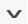
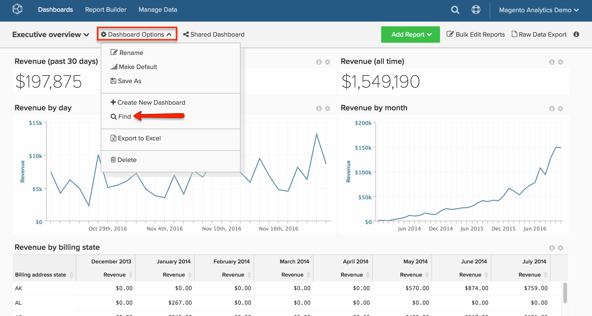

# 儀表板

[!DNL Adobe Commerce Intelligence]儀表板可讓您快速檢視商店的績效和銷售活動。 個別控制面板可以與其他使用者共用，並組織成邏輯群組。 您也可以為其他使用者設定不同等級的許可權。

可以輕鬆建立報表、新增至控制面板，以及將資料匯出至Excel。 圖表和報表可以調整大小，並拖曳到儀表板上的適當位置。

## 建立儀表板 {#createdash}

控制面板是可共用的主題值區，適用於您在Report Builder中建立的分析。 這就是您鼓勵團隊共同作業，並在整個組織中維持單一信任來源的方法。

*如果您是管理員或Standard使用者*，您可以按一下`Dashboard Options`下拉式清單，然後選擇`Create New dashboard`來建立儀表板。

您所建立的控制面板外觀完全由您決定。 您可以依需求和工作流程任意排列控制面板中的元素並調整其大小。

### 建立儀表板

1. 在功能表上，按一下&#x200B;**[!UICONTROL Dashboards]**。

1. 預設圖示板的名稱會出現在圖示板標題的左上角。 按一下向下箭頭（）以顯示可用的選項。

   

1. 按一下&#x200B;**[!UICONTROL Create Dashboard]**。 接著，執行下列動作：

   * 為您的儀表板輸入`Name`。

   * 若要為儀表板建立`Group`，請輸入群組的名稱。

     例如，如果您的Commerce安裝有多個商店檢視，您可能會為每個商店檢視建立一個群組。

   * 按一下&#x200B;**[!UICONTROL Create]**。

   

   * 新圖示板的名稱會出現在左上角。 按一下向下箭頭（）以顯示選項。 如果您已建立群組，新圖示板會顯示在清單中該群組的下方。

### 新增報表

1. 若要新增報表，請執行下列任一項作業：

   * 按一下頁面上的&#x200B;**[!UICONTROL Add a report]**&#x200B;提示。

   * 在儀表板標題中，按一下&#x200B;**[!UICONTROL Add Report]**。

     

1. 按一下&#x200B;**[!UICONTROL Create Report]**&#x200B;以顯示&#x200B;**[!UICONTROL Report Builder Options]**。

   

## 在控制面板上排列專案

* 若要調整圖表或報表的大小，請將右下角拖曳到新大小。

* 若要移動圖表或報表，請將游標移至標題或標題上，直到游標變更為十字形。 然後，將其拖曳到適當位置。

## 管理您的儀表板 {#managedash}

在&#x200B;**[!DNL Manage Data** > **Dashboards]**&#x200B;中，您可以管理自己所擁有之儀表板的使用者許可權、刪除不再需要的儀表板，以及設定預設儀表板。

### 共用您的儀表板 {#sharingdash}

為了真正在整個組織中擴展[!DNL Commerce Intelligence]並提供有價值的深入分析，Adobe鼓勵您與其他團隊成員共用您建立的儀表板。 *您可以按一下頁面頂端的*&#x200B;選項，共用您擁有的控制面板`Share Dashboard`。

當您共用控制面板時，可以指派許可權給整個組織或依個人基礎，這表示您可以決定哪些人可以檢視和編輯您的報告。

>[!NOTE]
>
>`Read-Only`使用者只能存取直接與他們共用的儀表板 — 他們無法自行搜尋和新增儀表板。 別忘了把它們放在回圈中！

### 存取共用控制面板 {#accessshared}

*如果您是Admin或Standard使用者*，並且想要新增共用儀表板至您的帳戶，您可以按一下&#x200B;**[!UICONTROL Dashboard Options]**，然後在下拉式清單中按一下&#x200B;**[!UICONTROL Find]**&#x200B;來執行此操作。

<!--{: width="1000" height="535"}-->

### 管理儀表板設定

1. 在功能表上，按一下&#x200B;**[!DNL Manage Data** > **Dashboards]**。

1. 如果適用，請輸入新的`Dashboard Name`。

1. 若要將儀表板指派給特定`Dashboard Group`，請從群組清單中選擇。

   **`Permissions`**

   若要讓所有使用者擁有控制面板的相同存取層級，請執行下列動作：

   1. 在&#x200B;**`Shared with`**&#x200B;底下，選擇下列其中一個選項：

      * `View`
      * `Edit`
      * `None`

   1. 提示確認時，按一下&#x200B;**[!UICONTROL OK]**&#x200B;以更新每個使用者的許可權等級。

   1. 若要變更個人的許可權等級，請在清單中尋找使用者以變更許可權等級。 變更會自動儲存。

   **`Default`**

   1. 若要將此儀表板設為您[!DNL Commerce Intelligence]帳戶的預設值，請按一下&#x200B;**[!UICONTROL Make Default]**。

   **`Remove`**

   1. 若要移除儀表板，請按一下&#x200B;**[!UICONTROL Delete Dashboard]**。
