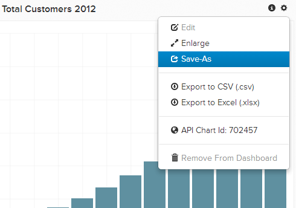

# 從其他使用者匯入圖表

您可能想要編輯另一個使用者擁有的圖表，或建立類似的圖表。 可以輕鬆匯入其他使用者目前擁有的圖表，並將其儲存在您自己的儀表板中。

## 尋找圖表

首先尋找您要從其他使用者複製的圖表。 所有與您共用的儀表板都可在以下網址找到： `Dashboard` 側欄，其中會以共用圖示標示。 按一下所需的儀表板。

## 復製圖表

在共用控制面板中，挑選您要複製到自己帳戶的圖表。 按一下齒輪()圖示，然後按一下 **[!UICONTROL Save As]**.

系統會提示您為圖表副本命名，並將其新增至任何現有儀表板。 如果您未選取儀表板，則會將其新增至現有圖表清單，您可以 [稍後新增](../../data-user/dashboards/add-charts-dashboard.md).

