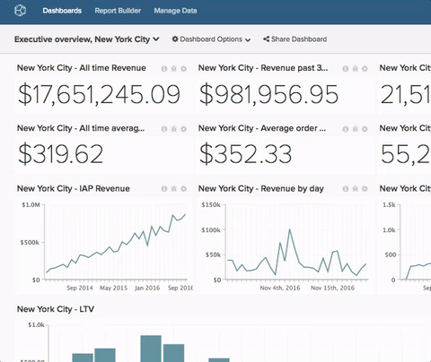

# 從儀表板移除圖表

>[!NOTE]
>
>需要[管理員](../../administrator/user-management/user-management.md)或`Standard`許可權才能執行這些功能。 如果您是`Standard`使用者，您也需要儀表板`Edit`許可權。

有時候，名稱不再適合。 重新命名儀表板既快速又簡單。

1. 在儀表板中，按一下畫面頂端的&#x200B;**[!UICONTROL Dashboard Options]**&#x200B;功能表，位於`Global Search`功能表旁。

1. 在下拉式清單中按一下&#x200B;**[!UICONTROL Rename]**。

1. 出現提示時，為您的儀表板輸入新名稱。

1. 按一下&#x200B;**[!UICONTROL Save Changes]**。

範例：

