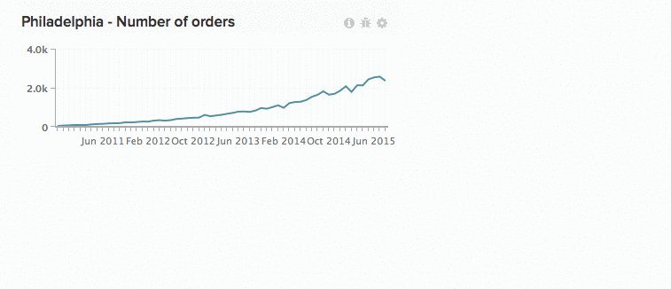
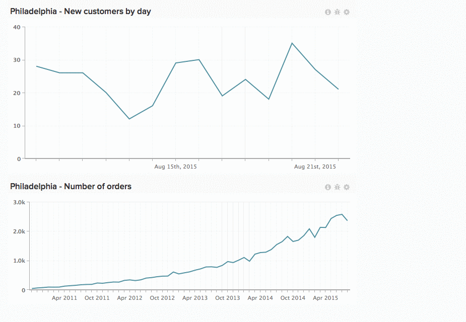

# 在儀表板中使用圖表

純量數字。 條狀圖。 長期延伸的圖表。 每個圖表顯示資訊的方式不同，這表示圖表的大小和位置並非一刀切的解決方案。 在 [!DNL Commerce Intelligence]，您可以調整大小並重新排列圖表，以建立您理想的工作區。

*調整圖表大小*，按一下並拖曳任何圖表的右下角。

*若要移動圖表*，將游標停留在圖表上方，直到 `Move` 游標隨即顯示。 按一下並按住，然後將圖表拖曳至所需位置。 按一下發行說明，即可放置圖表。

