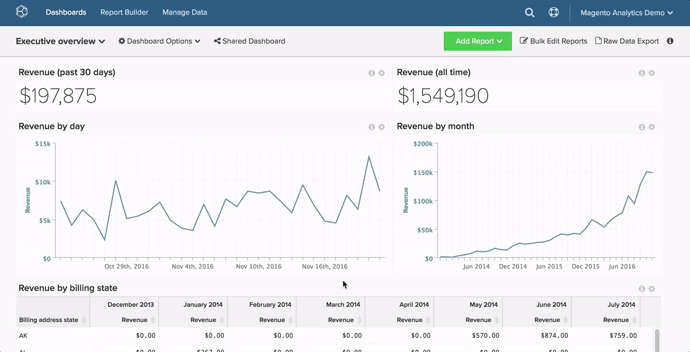

# 搜尋儀表板

此主題說明如何使用[[!DNL Global Search] 功能](#global)來尋找儀表板，以及如何搜尋其他使用者擁有的[儀表板](#other)。

## 全域搜尋 {#global}

[!DNL Global Search]功能表可讓您搜尋並選取要檢視的控制面板。

* *若要檢視現有儀表板的清單*，請按一下儀表板。

* *若要搜尋儀表板*，請在按一下儀表板的下拉式清單後，在搜尋列中輸入一些搜尋條件。 如果有任何控制面板符合條件，就會先在清單中顯示。

範例：

## 尋找其他使用者擁有的儀表板 {#other}

正在尋找其他使用者擁有的儀表板？ 如果其他人可以檢視該儀表板，您可以按一下&#x200B;**[!UICONTROL Find]**&#x200B;下拉式清單中的`Dashboard Options`進行搜尋。

