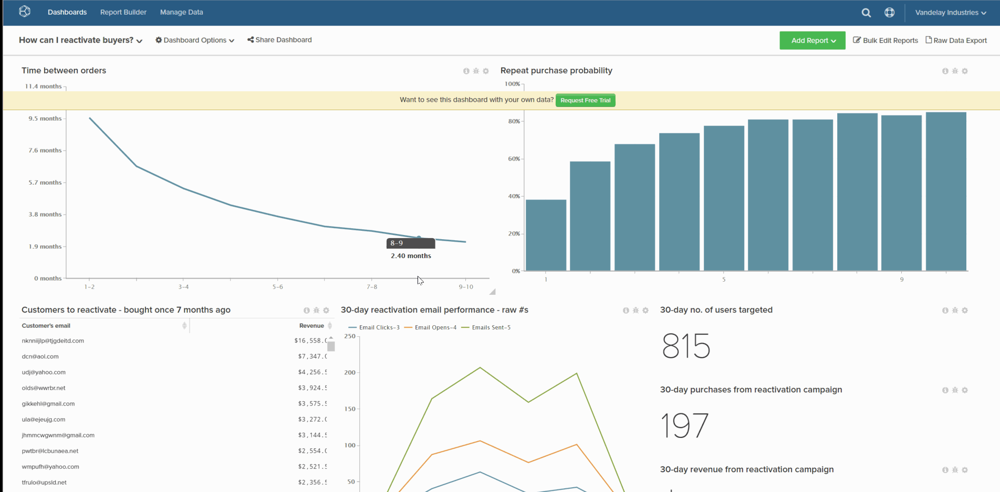

# 設定預設控制面板

預設控制面板是您在開啟 [!DNL MBI].

1. 在控制面板中，按一下 **[!UICONTROL Dashboard Options]** 位於畫面頂端。

1. 按一下 **[!UICONTROL Make Default]** 中。

1. 顯示確認提示時，按一下 **[!UICONTROL Yes]** 來更改預設儀表板。

這現在是您的新預設控制面板。

範例：

