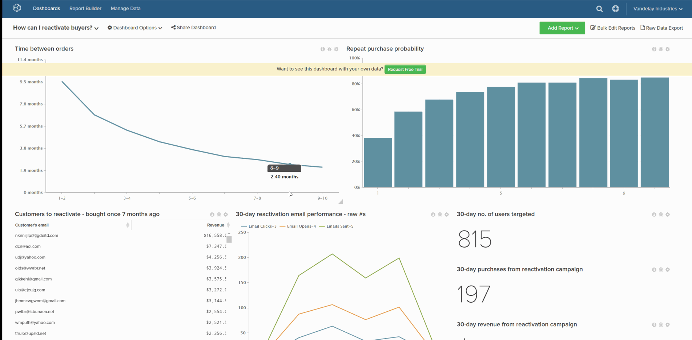

# 設定預設儀表板

預設儀表板是您在開啟[!DNL Commerce Intelligence]時看到的第一個儀表板。

1. 在儀表板中，按一下位於熒幕上方的&#x200B;**[!UICONTROL Dashboard Options]**。

1. 在下拉式清單中按一下&#x200B;**[!UICONTROL Make Default]**。

1. 顯示確認提示時，按一下&#x200B;**[!UICONTROL Yes]**&#x200B;以變更預設儀表板。

現在這是您的新預設儀表板。

範例：

