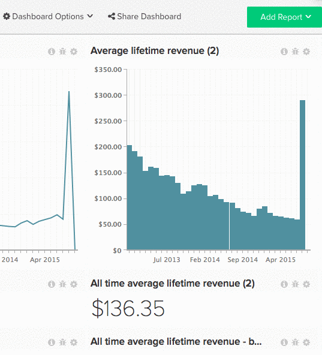

# 與其他使用者共用控制面板

共用控制面板是讓團隊保持循環狀態，並鼓勵協作討論的絕佳方式。 透過建立和共用中央控制面板，您可以為您的團隊提供所需的資訊，同時仍能維持控制。 [建議](../../best-practices/share-dashboard-best-practice.md){:target=&quot;_blank&quot;} `Edit` 對少數項的權限，可將意外變更最小化。

>[!NOTE]
>
>如果您要共用的控制面板包含以特定使用者無權存取的量度所建立的報表，則報表會顯示 `Error Loading Data` 訊息。 如果您希望資料對特定使用者顯示，則 [管理員使用者](../../administrator/user-management/user-management.md) 必須授予這些報表中所使用所有量度的存取權。

## 共用控制面板

1. 按一下 **[!UICONTROL Share Dashboard]** 在畫面頂端。

   您的 [!DNL MBI] 帳戶隨即顯示。

1. 若要選取要共用控制面板的使用者，請核取其名稱左側的方塊。

   若要選取/取消選取所有使用者，請按一下 **[!UICONTROL Select]** 選取 `Everyone` 或 `None`，分別為。

1. 權限可依使用者設定，或全部設定。

   *若要設定個別權限*，按一下 **[!UICONTROL None]** 右側。 在此下拉式清單中，選取使用者應擁有的權限類型。

   *集體設定權限*，按一下 **[!UICONTROL Set Permissions]**. 在此下拉式清單中，選取選取的使用者應擁有的權限類型。

   >[!NOTE]
   >
   >您也可以使用此功能來更新先前設定的權限。 例如，如果您想停止與某人共用控制面板，請將其權限設為 `None`.

1. 若要共用控制面板，請按一下 **[!UICONTROL Save Changes]**. 選取的使用者會收到電子郵件，邀請他們檢視控制面板。

範例：

