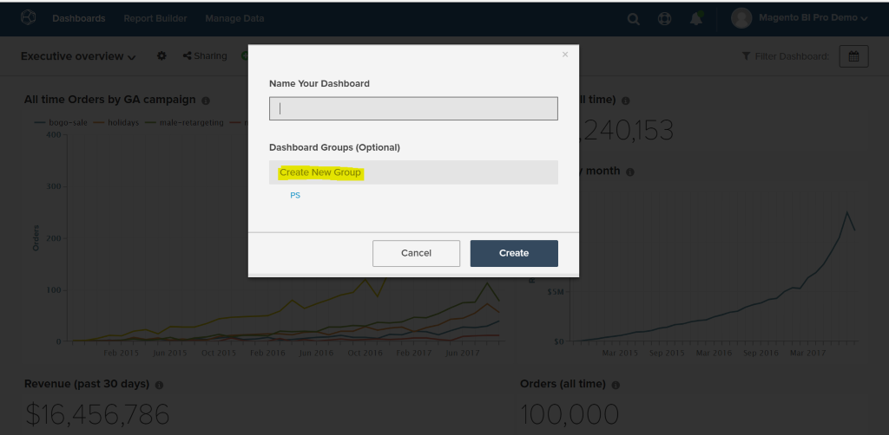
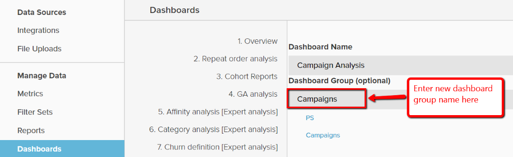
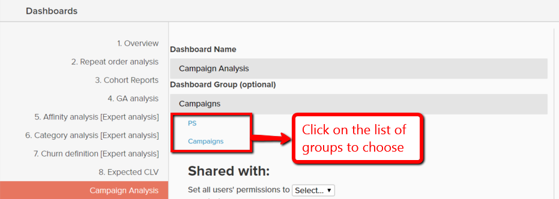

# 使用儀表板群組

控制面板群組可讓控制面板的組織方式更有效率。 最常見的使用案例是將類似的儀表板分組在相同的「群組」下。 例如，與行銷相關的所有儀表板都可以分組在儀表板群組「行銷」下。

在儀表板選取下拉式清單中，儀表板群組會依字母順序顯示，而「無群組」下的所有儀表板則會顯示在最後。 相同群組下的儀表板會一起顯示，並在每個群組中按字母順序顯示。

## 儀表板群組共用

儀表板群組無法直接在使用者之間共用。 與使用者共用儀表板時，如果不存在，系統會自動為這些使用者建立該儀表板所在儀表板群組。 如果控制面板群組存在，控制面板會附加至清單。

當控制面板的群組由其擁有者變更時，該變更會自動反映給與控制面板共用過的所有使用者。 使用者無法變更他們不擁有的儀表板的儀表板群組。

## 建立儀表板群組

控制面板群組可透過下列兩種方式之一建立：

1. 建立控制面板時：

   

1. 變更現有儀表板的群組時，從 `Manage Data > Dashboards` 頁面：

   1. 按一下您要建立群組的控制面板。

   1. 在 `Dashboard Group (optional)`，就會顯示目前的儀表板群組。

   1. 若要建立群組，請輸入新群組的名稱，然後按一下方塊外部。

      

## 將現有儀表板新增到現有群組

1. 在 `Manage Data > Dashboards` 頁面，選擇要變更群組的儀表板。

1. 底下的文字 `Dashboard Group (optional)` 顯示儀表板目前的儀表板群組。

1. 若要變更儀表板的群組，請從清單中選擇另一個群組 — 在此案例中為 `PS`， `Campaigns`.

   

## 刪除儀表板群組

當儀表板群組下方沒有儀表板時，系統會自動將其刪除。
