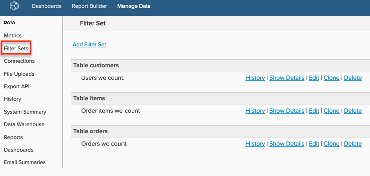

# 建立篩選器集

如果您在 [!DNL Commerce Intelligence] 需要以類似方式篩選的篩選器集(例如，篩選出test訂單)，您可以建立已保存的篩選器集並將其應用於度量。 這可節省您的時間，因為在建立或編輯度量時不必添加單個篩選器。

查看 [培訓視頻](https://experienceleague.adobe.com/docs/commerce-knowledge-base/kb/how-to/mbi-training-video-filter-sets.html) 的子菜單。

>[!NOTE]
>
>需要 [管理權限](../../administrator/user-management/user-management.md)。

1. 按一下 **[!DNL Manage Data** > **Filter Sets]** 欄。

   

1. 按一下 **[!UICONTROL Add Filter Set]** 頁面頂部。

1. 選擇包含要篩選的度量的表。

   例如，如果要篩選 `Total number of orders` 指標，它建立在 `orders` 的子菜單。

1. 命名 `Filter Set`。

1. 添加所有相關篩選器。

   例如，如果您只想在您的 `Total number of orders` 度量，您將應用一個篩選器，該篩選器將排除所有沒有狀態=的訂單 `complete`。

1. 驗證篩選器邏輯以及括弧和運算子的放置是否正確：比如說， `\[A\] AND \[B\]; (\[A\] OR \[B\]) AND \[C\]`。

   錯誤的篩選器通常是資料之間差異的原因 [!DNL Commerce Intelligence] 報告和預期結果。

1. 保存 `Filter Set`。

保存篩選器集後，可以將其應用於使用相同表的任何度量。 例如，如果您建立了 `Filter Set` 的 `orders` 表，可將其應用於 *任何指標* 建在這張桌子上，例如 `Revenue`。

>[!NOTE]
>
>`Filter Sets` 也可應用於中的計算列 [!DNL Commerce Intelligence]。 您可以請求將篩選器集應用到在 [!DNL Commerce Intelligence] 聯繫支援人員。

## 相關

* [分段和過濾的最佳做法](../../best-practices/segment-filter.md)
