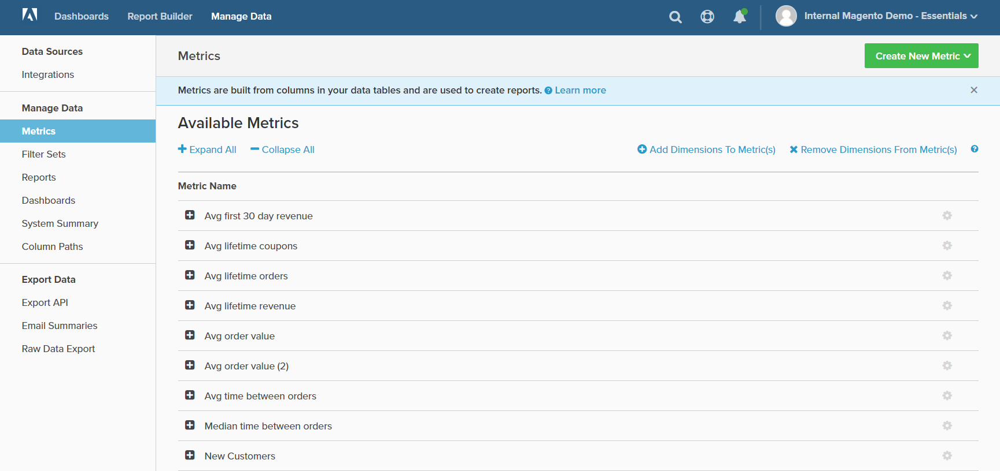

# 管理資料

「管理資料」可讓您存取多種工具，以管理整合、報告和圖表資料、儀表板和匯出。

## 若要存取 [!DNL Manage Data]：

1. 在功能表中，按一下 **[!DNL Manage Data]**.

1. 在側邊欄中，選取下列標題底下您要的主題：

   * `Data Sources`
   * `Manage Data`
   * `Export Data`

   <!--{: .zoom}-->
