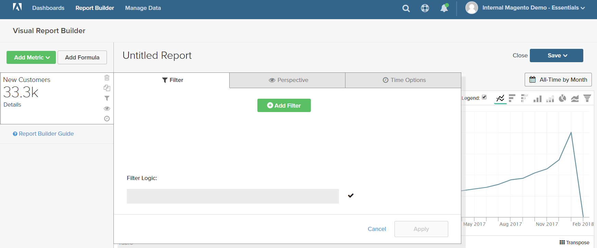
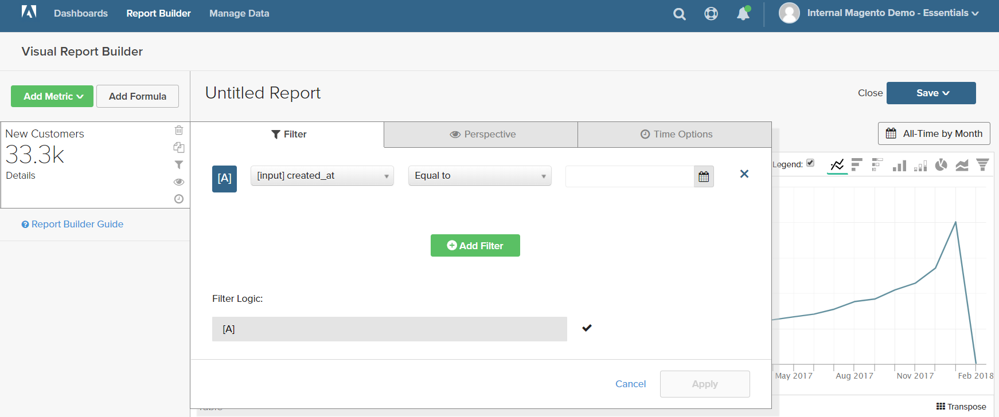
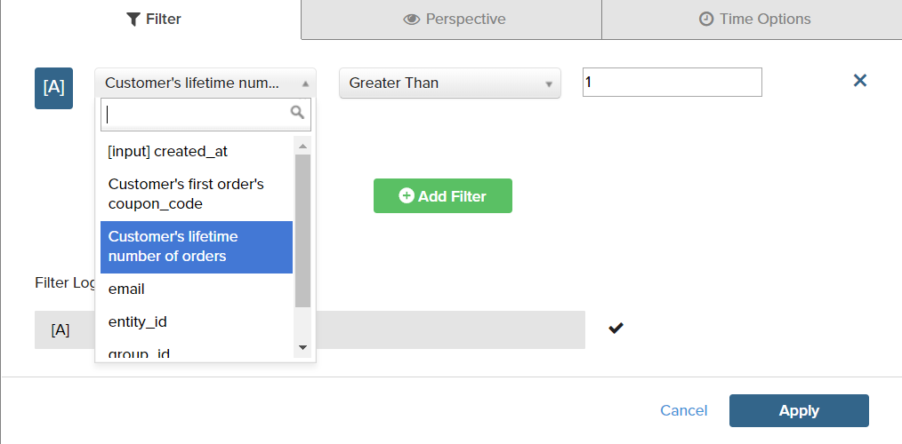
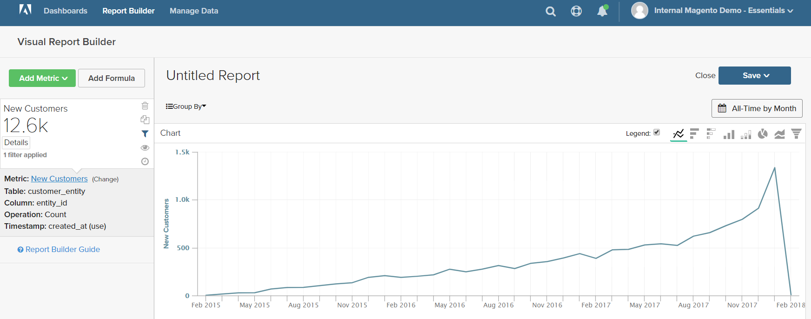
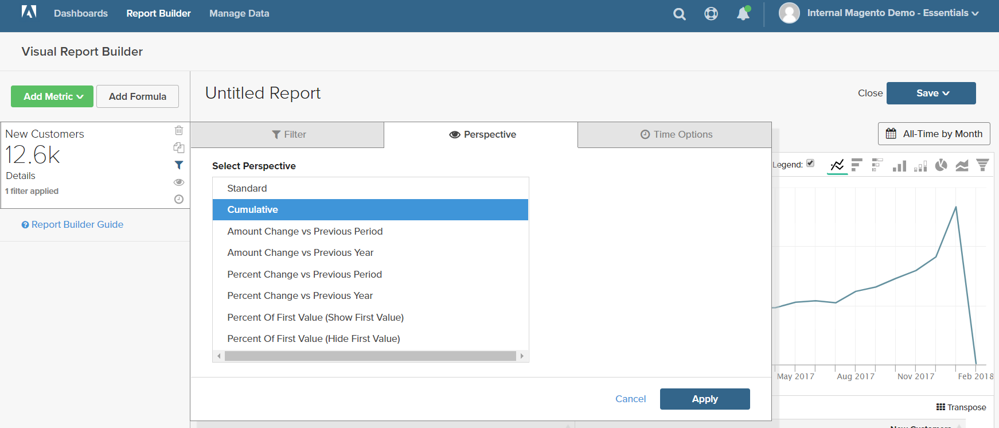
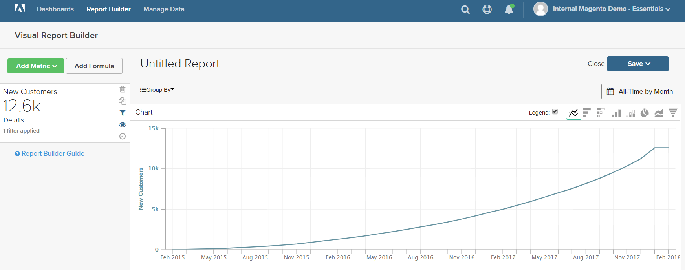
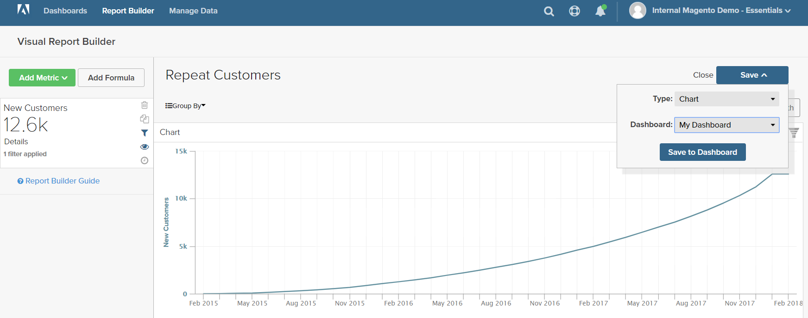

# 篩選器

可新增一或多個篩選器，以限制用於製作報表的資料。 每個篩選器都是一個運算式，包含關聯表格、運算子和值的欄。 例如，若要僅包含重複客戶，您可以建立篩選條件，僅包含已下多個訂單的客戶。 多個篩選器可與邏輯 `AND/OR` 運算子來新增邏輯至報表。

>[!TIP]
>
>報表最多可以有3,500個資料點。 若要減少資料點數，請使用篩選器來減少用於產生報表的資料量。

MBI包含一系列篩選器，您可以使用「現成可用(OOTB)」或修改以滿足您的需求。 您可以建立的篩選器數量沒有限制。

## 若要新增篩選器：

1. 在圖表中，將滑鼠移至每個資料點上。

   在此報表中，每個資料點顯示當月的客戶總數。

1. 在左側面板中，按一下「篩選」()圖示。

   

1. 按一下 **[!UICONTROL Add Filter]**.

   篩選器依字母順序編號，第一個為 `[A]`. 篩選器的前兩個部分是下拉式選項，第三個部分是值。

   

   * 按一下篩選器的第一部分，並選取您要作為運算式主旨的欄。

      

   * 按一下篩選器的第二部分，然後選擇運算子。

      

   * 在篩選器的第三部分，輸入完成運算式所需的值。

      

   * 篩選完成時，按一下 **[!UICONTROL Apply]**.

      報表現在僅包含重複客戶，而為報表擷取的客戶記錄數已從33,000減少至12,600。

      <!--{: .zoom}-->

1. 在側欄中，按一下透視( )圖示。

   <!--{: .zoom}-->

1. 在設定清單中，選擇 `Cumulative`. 然後，按一下 **[!UICONTROL Apply]**.

   

   此 `Cumulative` 透視會隨時間分配變更，而非每月顯示起伏的變化。

1. 輸入 `Title` ，然後按一下 **[!UICONTROL Save]** a `Chart` 到控制面板。

   
