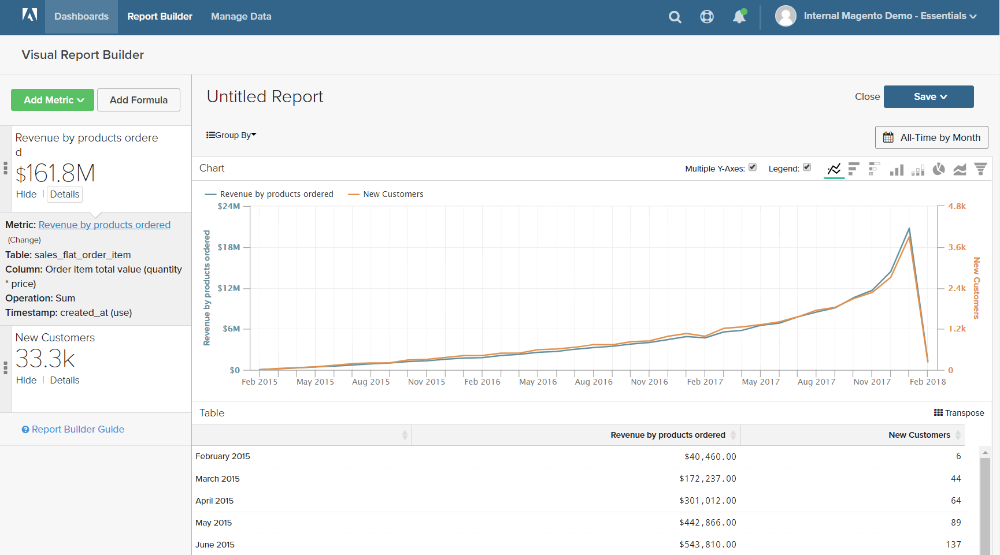
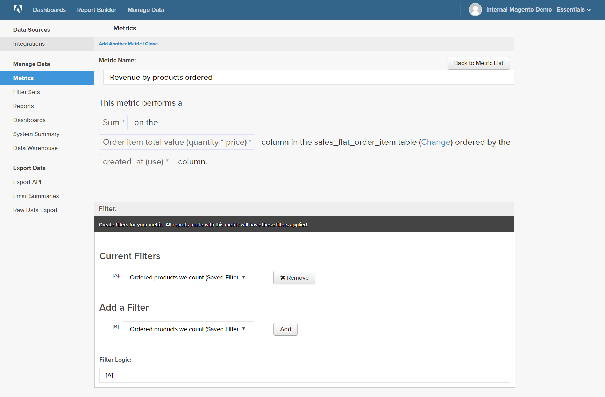
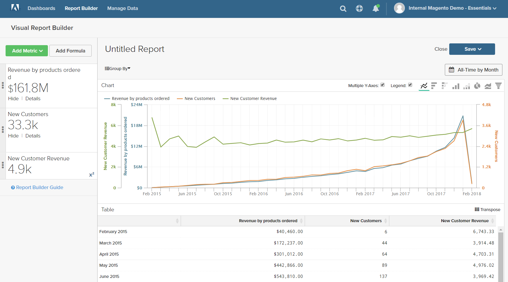
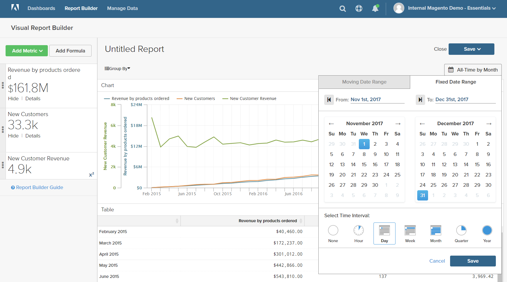
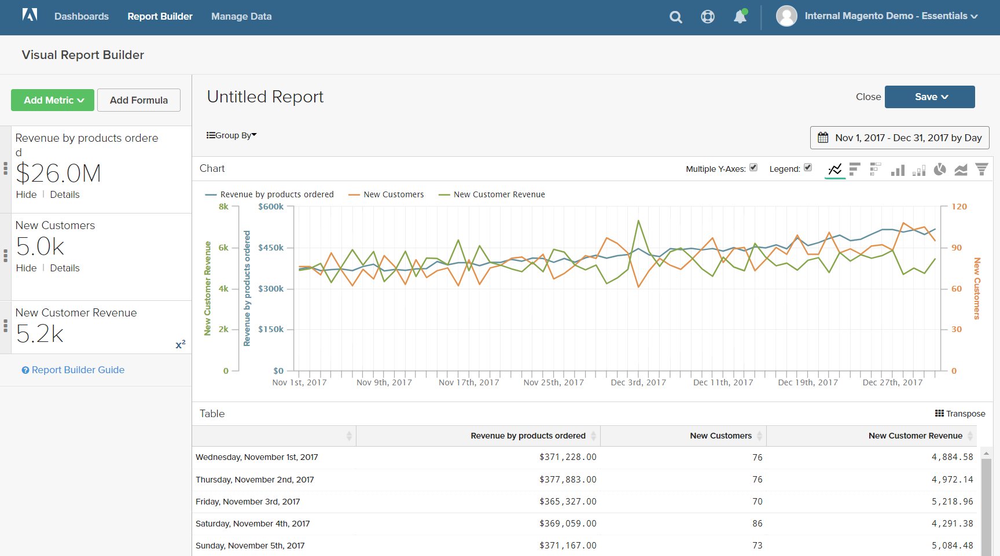

# 公式

公式結合多個量度和數學邏輯來回答問題。 例如，新客戶在假日季節每件產品會產生多少收入？

## 步驟1：建立基本報表

1. 在功能表中，選擇 `Report Builder`.

1. 按一下 **[!UICONTROL Add Metric]** 並選取報表的第一個量度。

   在此範例中， `Revenue by products ordered` 量度已使用。

1. 按一下 **[!UICONTROL Add Metric]** 並再次選擇報表的第二個量度。

   在此範例中， `New Customers` 量度已使用。

1. 在側邊欄中，按一下 **[!UICONTROL Details]** 顯示每個量度的相關資訊。

   

1. 在側邊欄中，按一下每個量度的名稱，以在新的瀏覽器分頁中開啟設定頁面。 向下捲動以檢視量度的每個元件，包括量度查詢、篩選器和維度。

   

1. 若要返回您的報表，請按一下前一個瀏覽器索引標籤。

1. 在圖表中，將滑鼠游標停留在每條線上的幾個資料點上，即可檢視與每個量度關聯的金額。

## 步驟2：新增公式

1. 在側邊欄頂端，按一下 **[!UICONTROL Add Formula]**.

   公式方塊會將量度顯示為可用的輸入 `A` 和 `B`，並包含輸入方塊，您可在其中輸入公式。

   執行下列動作：

   * 在 `Enter your Formula` 輸入方塊，輸入 `A/B`.

     這會將收入除以新客戶數量訂購的產品。

   * 設定 `Select format` 至 `123Number`.

   * 在側邊欄中，取代 `Untitled` 具有公式的名稱。

   

1. 完成後，按一下 **[!UICONTROL Apply]**.

   報表現在有公式的新行， `New Customer Revenue`，而側邊欄會顯示新客戶所產生的收入總額。

   

## 步驟3：新增日期範圍

1. 按一下 **[!UICONTROL Date Range]** 位於右上角。

1. 在 `Fixed Date Range` 標籤中，執行下列動作：

   * 在行事曆上，選擇日期範圍。

     在此範例中，假日季節來自 `November 1` 到 `December 31`.

   * 在 `Select Time Interval`，選擇 `Day`.

     

   * 完成後，按一下 **[!UICONTROL Apply]**.

   報表現在僅限於假日季節，每天會有資料點。

   

## 步驟4：儲存報表

在此步驟中，您可將報表另存為圖表和表格。

1. 按一下 `Untitled Report` 在頁面頂端並輸入描述性標題。 在此範例中，報告標題為 `2017 Holiday Sales`.

   接著，執行下列動作：

   * 在右上角，按一下 **[!UICONTROL Save]**.

   * 的 `Type`，接受預設值 `Chart` 設定。

   * 選擇 `Dashboard` 報表可用位置。

   * 按一下 **[!UICONTROL Save to Dashboard]**.

1. 按一下報告標題並變更名稱。 在此範例中，報表標題會變更為 `2017 Holiday Sales Data`.

   接著，執行下列動作：

   * 在右上角，按一下 **[!UICONTROL Save a Copy]**.

   * 設定 `Type` 至 `Table`.

   * 選擇 `Dashboard` 報表可用位置。

   * 按一下 **[!UICONTROL Save a Copy to Dashboard]**.

1. 若要在控制面板中檢視報表，請執行下列任一項作業：

   * 按一下 **[!UICONTROL Go to Dashboard]** 在頁面頂端的訊息中。

   * 在功能表中，選擇 **[!UICONTROL Dashboards]**. 按一下目前圖示板的名稱以顯示清單。 然後，按一下儲存報表之控制面板的名稱。
