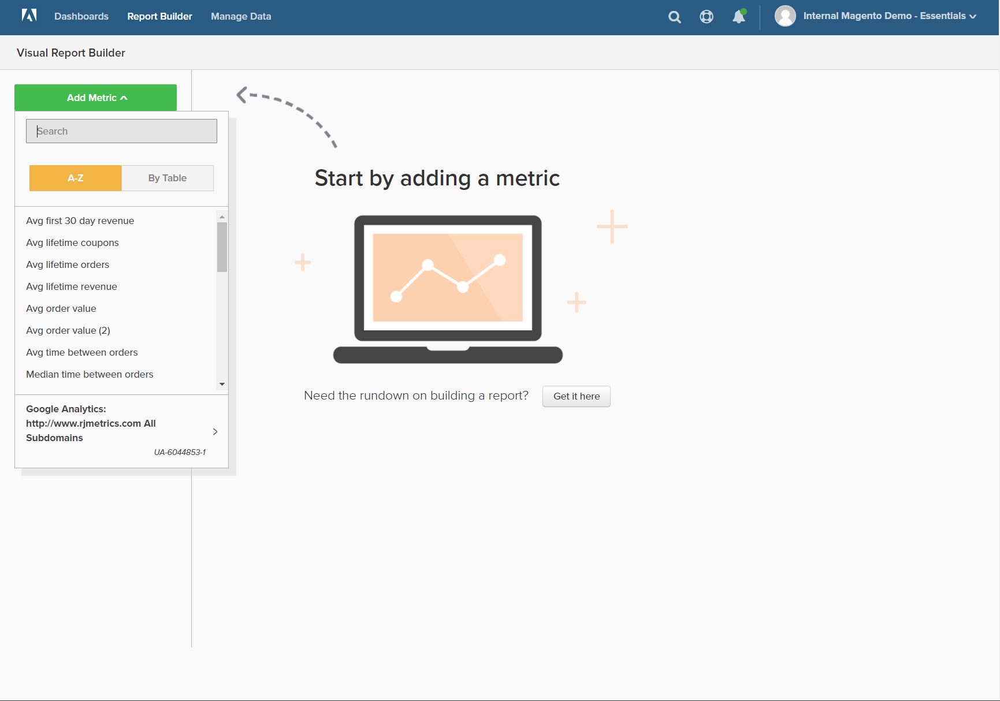
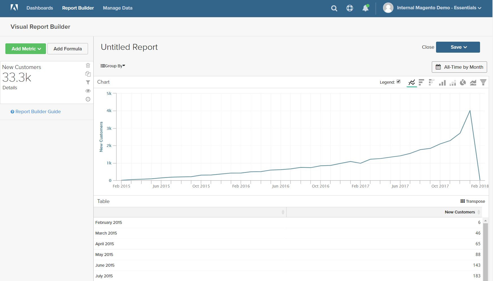
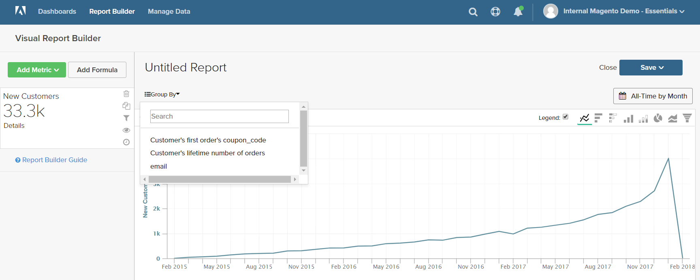
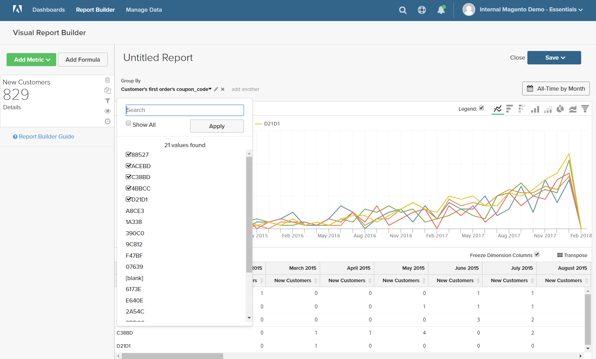
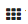
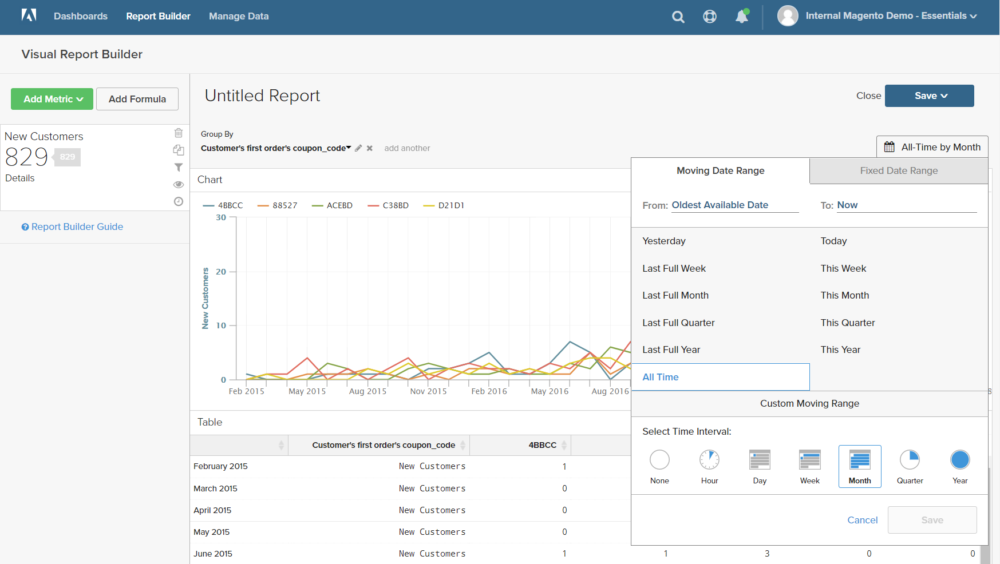
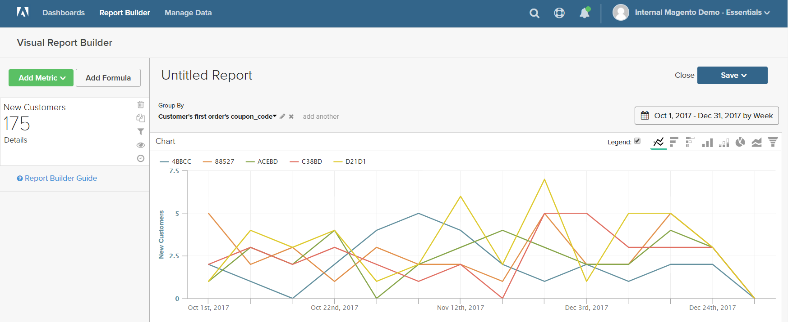
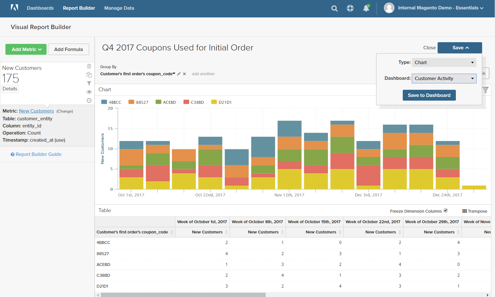
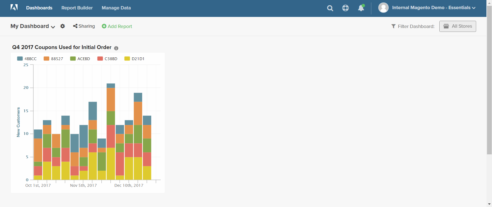

# `Visual Report Builder`

`Visual Report Builder` 讓您能輕鬆根據預先定義的量度建立快速報表。 每個量度都包含一個查詢，用於定義報表的資料集。

以下範例說明如何建立簡單報表、以其他維度將資料分組、設定日期和時間間隔、變更圖表類型，以及將報表儲存至控制面板。

## 若要建立簡單報表：

1. 在 [!DNL MBI] 按一下 **[!UICONTROL Report Builder]**.

1. 在 `Visual Report Builder`，按一下 **[!UICONTROL Create Report]** 並執行下列動作：

   * 按一下 **[!UICONTROL Add Metric]**.

      可用量度可依字母順序或表格列出。

      

   * 選擇 [量度](../../data-user/reports/ess-manage-data-metrics.md) 說明您要用於報表的資料集。

      此 `New Customers` 此範例中使用的量度會計算所有客戶，並依客戶註冊帳戶的日期對清單排序。 初始報表包含簡單的折線圖，後面接著資料表。

      左側的摘要會顯示目前量度的名稱，以及量度中指定之欄資料的任何計算結果。 在此範例中，摘要會顯示客戶總數。

      

1. 在圖表中，將滑鼠移至線條上的每個資料點上。 每個資料點顯示該月註冊的新客戶總數。

1. 請依照下列指示將資料分組、變更日期範圍和圖表類型。

   **`Group By`**

   此 `Group By` 控制項可讓您依群組或區段新增多個維度。 Dimension是表格中可用於分組資料的欄。

   * 從 `Group By` 選項。

      在此範例中，系統找到客戶在下第一筆訂單時所使用的五個抵用券代碼。

      

      此 `Group By` 詳細資訊會列出客戶使用的每個抵用券。 用來下初始訂單的抵用券會標示為核取方塊。 圖表現在有多條彩色線，代表用於首次訂購的每個抵用券。 圖例會以色彩編碼，以對應至每一列資料。

   * 按一下 **[!UICONTROL Apply]** 以關閉「組依據」詳細資訊。

      

   * 將滑鼠指標暫留在每行的幾個資料點上，查看當月在下第一筆訂單時使用該抵用券的客戶數量。

   * 資料表現在有新增維度，每個月各列，每個抵用券代碼各列。

      

   * 按一下轉譯()控制項，以變更資料方向。

      資料的軸會翻轉，表格現在會有每個抵用券代碼的欄，以及每個月的列。 您可能會發現此方向更容易閱讀。

      
   **`Date Range`**

   此 `Date Range` 控制項顯示當前日期範圍和時間間隔設定，位於圖表的右上方。

   * 按一下 `Date Range` control，在此範例中，此 `All-Time by Month`.

      

   * 進行下列變更：

      * 若要放大以查看更詳細的視圖，請將日期範圍變更為 `Last Full Quarter`.
      * 在 `Select Time Interval`，選擇 `Week`.
      * 完成後，按一下 **[!UICONTROL Save]**.

      報表現在僅包含上一季的資料（依周）。

      
   **圖表類型**

   * 按一下右上角的控制項，以尋找資料的最佳圖表。

      某些圖表類型與多維資料不相容。

      |  |  |
      |-----|-----|
      |  | 折線圖 |
      |  | 水準條 |
      |  | 堆疊橫條圖 |
      |  | 垂直條 |
      |  | 垂直堆疊長條 |
      |  | 派 |
      |  | 區域 |
      |  | 漏斗 |

      {style=&quot;table-layout:auto&quot;}

1. 為報表提供 `title`，取代 `Untitled Report` 文字，並附上描述性標題。

1. 在右上角，按一下 **[!UICONTROL Save]** 並執行下列動作：

   * 針對 `Type`，接受預設設定， `Chart`.

   * 選擇 `Dashboard` 報表可供使用的位置。

   * 按一下 **[!UICONTROL Save to Dashboard]**.

      

1. 若要在控制面板中檢視圖表，請執行下列其中一項操作：

   * 按一下 **[!UICONTROL Go to Dashboard]** 在頁面頂端的訊息中。

   * 在功能表中，選擇 `Dashboards` 並按一下目前控制面板的名稱以顯示清單。 然後，按一下儲存報表的控制面板名稱。

      
