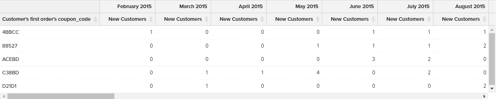

# [!DNL Visual Report Builder]

[!DNL Visual Report Builder] 可讓您根據預先定義的量度輕鬆建立快速報表。 每個量度都包含定義報表資料集的查詢。

下列範例說明如何建立簡單報表、依其他維度將資料分組、設定日期和時間間隔、變更圖表型別，以及將報表儲存至控制面板。

## 若要建立簡單報表：

1. 在 [!DNL Commerce Intelligence] 功能表，按一下 **[!UICONTROL Report Builder]**.

1. 下 [!UICONTROL Visual Report Builder]，按一下 **[!UICONTROL Create Report]** 並執行下列動作：

   * 按一下 **[!UICONTROL Add Metric]**.

     可用的量度可以按字母順序或表格列出。

     

   * 選擇 [量度](../../data-user/reports/ess-manage-data-metrics.md) 說明您要用於報表的資料集。

     此 `New Customers` 此範例中使用的量度會計算所有客戶，並根據客戶註冊帳戶的日期來排序清單。 初始報告包含一個簡單的線圖，後面接著資料表。

     左側的摘要會顯示目前量度的名稱，後面接著該量度中指定的欄資料的任何計算結果。 在此範例中，摘要會顯示客戶總數。

     

1. 在圖表中，將滑鼠指標暫留在折線上的每個資料點上。 每個資料點都會顯示該月註冊的新客戶總數。

1. 依照這些指示將資料分組、變更日期範圍和圖表型別。

   **`Group By`**

   此 `Group By` 控制項可讓您依群組或區段新增多個維度。 Dimension是表格中可用來將資料分組的欄。

   * 從清單中選擇一個可用的維度 `Group By` 選項。

     在此範例中，系統在客戶第一次訂購時發現五個優惠券代碼。

     

     此 `Group By` 詳細資訊會列出客戶使用的每個抵用券。 用來放置初始訂單的優惠券會以核取方塊標示。 圖表現在有多條彩色線條，代表用於第一筆訂單的每個抵用券。 圖例會以不同顏色編碼，以對應至每列資料。

   * 按一下 **[!UICONTROL Apply]** 以關閉「分組依據」詳細資訊。

     

   * 將滑鼠游標停留在每行上的幾個資料點上，可檢視當月初次下訂單時使用該抵用券的客戶人數。

   * 資料表現在具有新增維度，每個月各有一欄，每個抵用券代碼各一列。

     

   * 按一下調換()控制項，以變更資料的方向。

     資料軸會翻轉，表格現在會有一個欄用於顯示每個抵用券代碼，以及一個列用於顯示每個月。 您可能會發現此方向更易於閱讀。

     

   **`Date Range`**

   此 `Date Range` 控制項顯示目前的日期範圍和時間間隔設定，並位於圖表正上方右側。

   * 按一下 `Date Range` 控制項，在此範例中設定為 `All-Time by Month`.

     

   * 進行下列變更：

      * 若要放大放大檢視，請將日期範圍變更為 `Last Full Quarter`.
      * 下 `Select Time Interval`，選擇 `Week`.
      * 完成後，按一下 **[!UICONTROL Save]**.

     報表現在僅包含上一季的資料（依周）。

     

   **圖表型別**

   * 按一下右上角的控制，尋找最適合該資料的圖表。

     某些圖表型別與多維資料不相容。

     | | |
     |-----|-----|
     |  | 折線圖 |
     |  | 橫條圖 |
     |  | 水準棧疊長條圖 |
     |  | 垂直條 |
     |  | 垂直棧疊長條圖 |
     |  | 圓形圖 |
     |  | 區域 |
     |  | 漏斗 |

     {style="table-layout:auto"}

1. 為報表提供 `title`，取代 `Untitled Report` 具有描述性標題的頁面頂端文字。

1. 在右上角，按一下 **[!UICONTROL Save]** 並執行下列動作：

   * 對象 `Type`，接受預設設定， `Chart`.

   * 選擇 `Dashboard` 報表可用位置。

   * 按一下 **[!UICONTROL Save to Dashboard]**.

     

1. 若要在儀表板中檢檢視表，請執行下列任一項作業：

   * 按一下 **[!UICONTROL Go to Dashboard]** 在頁面頂端的訊息中。

   * 在功能表中，選擇 `Dashboards` 並按一下目前圖示板的名稱以顯示清單。 然後，按一下儲存報告的儀表板名稱。

     
